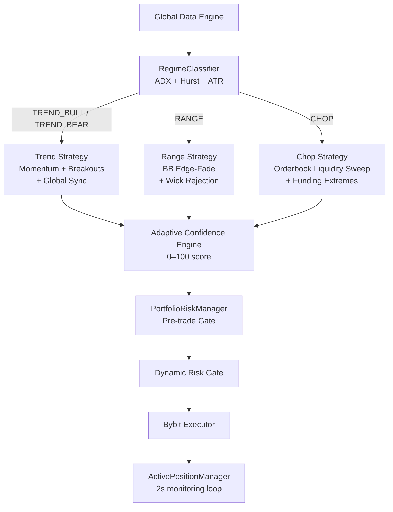

# Project Context
**Project Name:** `karsa-auto-session-manager`
**Purpose of this doc:** A single place to get oriented — what this is, why it's built this way, what's still unresolved, and where to look for detail. Read this before `ARCHITECTURE.md` or `PRD.md` if you're new (human or AI).

---

## 1. TL;DR

An autonomous crypto perpetuals trading bot that reads market data from multiple exchanges (Binance, OKX, Bybit) to build a "true" global price picture, but only ever *trades* on Bybit — because Bybit requires a proxy (geo-restriction) and multi-venue execution would compound that latency into a fatal flaw. To make the proxy latency irrelevant, the strategy trades 15m–4h swing/intraday structure instead of HFT. Everything runs as a single Python `asyncio` process (not microservices) specifically to avoid internal state-sync bugs on top of an already-fragile external proxy dependency.

Currently: **Phase 6 — Adaptive Multi-Strategy Upgrade in progress.** Phase 5 code is complete and deployed. The system is being upgraded from a static trend-following strategy into an Institutional-Grade Adaptive Multi-Strategy Bot using a Hub-and-Spoke architecture.

---

## 2. Core Thesis: "Read Global, Execute Local"

- **Read Pipeline:** CCXT Pro WebSockets ingest L2 books, trades, funding from multiple exchanges → normalized into a `GlobalState`.
- **Write Pipeline:** Trades are placed *only* on Bybit, using `GlobalState` as a leading indicator — e.g., if global sentiment turns bullish before Bybit's local price reflects it, go long on Bybit anticipating convergence.
- **Why not HFT:** The VPN proxy path (formerly Cloudflare WARP, now a self-hosted WireGuard VPN via `gluetun` — see Issue #12) adds ~100–300ms. Millisecond-level scalping through that latency is a guaranteed loser. The team deliberately moved up the timeframe (15m–4h) so that latency becomes noise relative to the trade's holding period.

---

## 3. The 7 Keys (Architecture's Component Map)

| # | Component | Responsibility | Code Location |
| :-- | :--- | :--- | :--- |
| 1 | Global Data Engine | CCXT Pro WS ingestion, normalization, bad-tick filtering | `app/data/` |
| 2 | Alpha Bridge *(expanded)* | Regime classification (Hub), strategy routing (Spokes), VWAP/Skew/Lead-Lag, AI analyst, multi-TF | `app/alpha/` |
| 3 | Risk Gate *(expanded)* | 3-layer liquidity/spread/circuit-breaker + new `PortfolioRiskManager` (correlation, exposure) | `app/risk/` |
| 4 | Bybit Executor + APM | SOR (Post-Only → Reprice → Market) + `ActivePositionManager` (continuous post-trade lifecycle) | `app/execution/` |
| 5 | State Manager | Postgres sync, startup reconciliation | `app/core/state.py` |
| 6 | Watchdog & Telemetry | Heartbeats, latency tracking, dead man's switch, Prometheus | `app/watchdog/` |
| 7 | Telegram Bot | Command interface, alerts, kill switch | `app/bot/` |

Note: `app/core/session.py` (Session Orchestrator, UTC time-block regime logic) exists in the folder structure but is **not** one of the primary Keys — see Open Issue #5 below.

### Alpha Bridge Expansion (Key 2 Detail)

The Alpha Bridge now operates as a **Hub-and-Spoke** system. The `RegimeClassifier` is the central hub; the `StrategyRouter` applies regime-specific confidence scoring:



---

## 4. Key Architectural Decisions

| Decision | Rationale | Rejected Alternative |
| :--- | :--- | :--- |
| Single-process monolith | Proxy already adds ~150ms; internal IPC/Redis pub-sub between services would compound it and risks state divergence on partial failure | Microservices (Orchestrator + Bot split via Redis pub/sub) |
| Swing/Intraday (15m–4h), not HFT | Proxy latency is mathematically irrelevant at this timeframe; HFT through a proxy guarantees negative alpha | Millisecond lead-lag scalping |
| Bybit-only execution | Avoids cross-exchange arbitrage complexity and multi-venue proxy/auth overhead in V1 | Multi-exchange execution/arbitrage |
| `Decimal` everywhere for money | Float precision loss is unacceptable for PnL-bearing calculations | `float` |
| Mandatory exchange-side Stop-Loss on every fill | Bot's in-memory SL is worthless if the process or proxy dies; exchange-side SL survives a crash | Relying on bot-managed SL only |
| "Trust nothing" startup reconciliation | Postgres and Bybit can diverge after any crash; reconciliation is the only way to safely resume | Trusting last known DB state on restart |
| LLM mandatory in safe positions, forbidden in hot path | AI CryptoAnalyst (pre-entry) and AI PositionJudge (post-entry) are mandatory — not optional toggles. LLM calls via 9router proxy only. Strictly forbidden in execution path (SOR/risk gate) where latency and determinism matter. See `docs/review/ai_layer_analysis.md` for latency math. | LLM-assisted real-time entry/exit ("9 Router" in hot path) |
| Hub-and-Spoke strategy routing | A single static strategy bleeds money in regime changes. Regime-specific scoring and risk profiles maximize edge per market condition. | Single-strategy with regime filter only |
| `ActivePositionManager` as a continuous async loop | Position management (breakeven, trailing, regime shifts) is 90% of the alpha. A fire-and-forget entry without post-trade management leaves money on the table and increases drawdown. | One-time SL/TP placement only |
| `PortfolioRiskManager` as a mandatory pre-trade gate | Prevents correlation traps (e.g., 3 simultaneous altcoin longs) and enforces gross/net exposure limits before any capital is deployed. | Rely solely on individual position risk |

---

## 5. Glossary

| Term                         | Meaning                                                                                                                     |
| :-----------------------------| :----------------------------------------------------------------------------------------------------------------------------|
| **WARP** *(superseded)*      | Cloudflare WARP SOCKS5 proxy — original proxy for Bybit access due to geo-restriction. Replaced by a self-hosted WireGuard VPN (DigitalOcean droplet) via `gluetun` sidecar; see `docs/SETUP.md` and Issue #12 |
| **gluetun**                  | Docker sidecar that routes the app's (and 9router's) outbound traffic through the WireGuard VPN tunnel; current mandatory single point of failure for Bybit access, replacing WARP |
| **SOR**                      | Smart Order Routing — the 3-step Post-Only Limit → Reprice → Market/IOC execution logic                                     |
| **GlobalState**              | Normalized, aggregated market snapshot across read exchanges (VWAP, skew, funding, per-exchange prices/volumes)             |
| **Skew**                     | Aggregate bid vs. ask order book volume ratio across read exchanges                                                         |
| **Lead-Lag**                 | Comparing a "leader" exchange's (usually Binance) price movement against Bybit's to infer directional pull                  |
| **Bad Tick**                 | A price spike >5% in <1s, treated as an exchange glitch and filtered out                                                    |
| **Dead Man's Switch**        | External health ping (e.g., Healthchecks.io) — if it stops, an outside system alerts a human that the bot has frozen        |
| **Reconciliation**           | Startup process that treats Bybit's actual position/order state as ground truth over the local DB                           |
| **STALE**                    | Status flag for an exchange feed with no update in >15s; excluded from Alpha calculations                                   |
| **Circuit Breaker**          | Deterministic hard-stop rule (drawdown, latency, margin, stale data) that halts trading without human input                 |
| **RegimeClassifier**         | The Hub — classifies market state into TREND_BULL, TREND_BEAR, RANGE, or CHOP using ADX, Hurst Exponent, and ATR percentile |
| **StrategyRouter**           | The Spokes — applies regime-specific scoring rules to generate a 0–100 confidence score                                     |
| **MarketRegime**             | Enum: `TREND_BULL`, `TREND_BEAR`, `RANGE`, `CHOP`                                                                           |
| **R-Multiple**               | How many "R" (initial risk units) the trade is currently in profit or loss: `(live_price - entry) / initial_risk_per_unit`  |
| **APM**                      | Active Position Manager — the continuous 2-second async loop managing trades after execution                                |
| **Breakeven Lock**           | Moving the exchange-side SL to entry price + fees once the trade reaches +1R profit                                         |
| **Regime Shift Kill Switch** | APM rule: if the market regime changes after entry, the position is closed at market (thesis invalidated)                   |
| **PortfolioRiskManager**     | Pre-trade gate checking correlation exposure, gross/net limits, and circuit breaker state                                   |
| **Correlation Trap**         | Entering a 3rd simultaneous position in the same correlated sector, concentrating losses if that sector dumps               |

---

## 6. Document Map

| Doc | Purpose | Status |
| :--- | :--- | :--- |
| `docs/PRD.md` | Product vision, full V1.0/V1.1 target state, "6 Keys" as originally conceived | Draft/Approved |
| `docs/ARCHITECTURE.md` | System design, component breakdown, tech stack, folder structure | Approved/Locked |
| `docs/DATA_MODEL.md` | Exact schemas — Postgres DDL, Redis keys, Pydantic models | Approved/Locked |
| `docs/MVP_SCOPE.md` | What's actually being built first, phased delivery plan, explicit out-of-scope list | Approved/Locked |
| `docs/DEFINITION_OF_DONE.md` | Quality gates every PR must pass | Approved/Locked |
| `docs/RISK_AND_RUNBOOK.md` | Kill switch, circuit breakers, failover, disaster recovery, operator playbook | Approved/Locked |
| `docs/ROADMAP.md` | Phased delivery plan (Phase 0–8), AI integration sub-phases | Draft |
| `docs/TELEGRAM_INTERFACE.md` | Telegram bot command specs, alert system, security model | Draft |
| `docs/TESTING_STRATEGY.md` | How each safety/behavior claim gets verified | Draft |
| `docs/architecture/adaptive_multi_strategy.md` | Hub-and-Spoke design, RegimeClassifier math, StrategyRouter scoring logic | **New — Phase 6** |
| `docs/execution/active_position_manager.md` | APM loop, Breakeven rule, Regime Shift Kill Switch, Exchange-Side Mandate | **New — Phase 6** |
| `docs/risk/portfolio_risk_manager.md` | Correlation trap prevention, exposure limits, CircuitBreaker thresholds | **New — Phase 6** |
| `CLAUDE.md` | AI-agent working rules for this repo | Updated — Phase 6 |

---

## 7. Open Issues & Doc Conflicts (Needs Resolution)

These are genuine contradictions found across the "Approved/Locked" docs during review. None are stylistic — each one changes what gets built or what a test should assert. Flag, don't silently pick a side.

### Issue #1 — Redis: in scope or not? → RESOLVED
Redis is de facto in scope (7+ keys in code). Docs updated to reflect this.
**Status:** Resolved. No further action needed.

### Issue #2 — Circuit breaker drawdown threshold: 2% or 3%? → RESOLVED
Code authoritative at **-2%** (`Decimal("-0.02")`). All docs now updated to match: `RISK_AND_RUNBOOK.md` §2 and §6, `PRD.md` §9.
**Additionally:** `gates.py:18` uses `Decimal` (Issue #7 resolved).
**Status:** Resolved. Code and docs aligned at -2%.

### Issue #3 — Read-exchange universe inconsistency → RESOLVED
`PRD.md` §3 previously listed Coinbase as a read source. Removed — all docs now consistently reference Binance/OKX/Bybit only.
**Status:** Resolved. No further action needed.

### Issue #4 — `ROADMAP.md` is empty → RESOLVED
`ROADMAP.md` now has full content: Phase Map (0–8), Phase 4.5 AI Integration sub-phases, Phase 5 graduation gate, Phase 6-8 live capital progression.
**Status:** Resolved. No further action needed.

### Issue #5 — "6 Keys" defined differently in two docs
`PRD.md` §6 lists the 6 Keys as: Global Read Engine, **Session Orchestrator**, Alpha Bridge, Local Execution, **9-Layer Risk Gate**, Telemetry & Reconciliation. `ARCHITECTURE.md` §2/§4 lists them as: Data Engine, Alpha Bridge, Risk Gate, Executor, **State Manager**, **Watchdog** — Session Orchestrator is demoted to a sub-module (`app/core/session.py`) and State Manager/Watchdog are split into two keys instead of one ("Telemetry & Reconciliation").
**Impact:** Low — mostly naming/documentation drift, since `MVP_SCOPE.md` and `DEFINITION_OF_DONE.md` both follow the `ARCHITECTURE.md` version. Worth a pass to make `PRD.md` consistent so it doesn't read as a different system.

### Issue #6 — Symbol count: 5 (MVP) vs 35 (config) vs 60 (current) — STILL OPEN, docs disagree with each other
`MVP_SCOPE.md` §3.B still specifies Top 5 (BTC, ETH, SOL, BNB, XRP) and its own text still flags "config.py defaults to 35 pairs — needs alignment with MVP scope" — i.e. `MVP_SCOPE.md` has not actually been edited. Meanwhile `SYSTEM_CONSTANTS.md` §14 ("Resolved Conflicts") claims: *"Symbol count | 60 | Config.py confirmed. MVP_SCOPE.md updated. (Issue #6)"* — this is inaccurate; `MVP_SCOPE.md` was not updated. Current code (`crypto_universe.py`) has expanded further to ~60 symbols with TradFi-perp exclusion and new-listing-age filters, which neither `MVP_SCOPE.md` nor this issue log had previously accounted for.
**Impact:** Three different symbol counts (5 / 35 / 60) now live across docs with no single source of truth, and `SYSTEM_CONSTANTS.md` asserts a resolution that didn't happen — exactly the kind of silent-pick this doc set is supposed to prevent. Regime detection is BTC-only regardless, so no *safety* impact, but universe scope affects REST call volume, sector-cap math (`sector_cap.py`), and correlation-trap logic in `PortfolioRiskManager`.
**Status:** OPEN. Needs: (1) `MVP_SCOPE.md` §3.B actually rewritten to reflect the ~60-symbol dynamic universe, or a decision to scale back; (2) `SYSTEM_CONSTANTS.md` §14 claim corrected once (1) is done, not before.

### Issue #7 — `daily_drawdown_limit` is `float`, not `Decimal` → RESOLVED
`app/risk/gates.py:18` now uses `Decimal("-0.02")`. `app/risk/circuit_breaker.py:18` also uses `Decimal("-0.02")`.
**Status:** Resolved. No further action needed.

### Issue #8 — AI layer status: optional toggles vs mandatory → RESOLVED
`ai_analyst_enabled` and `ai_position_judge_enabled` removed from `config.py`. `CryptoAnalyst` and `PositionJudge` now always created in `main.py`. AI is mandatory, not toggleable.
**Status:** Resolved. Toggles removed, AI always initialized.

### Issue #9 — `executor_task` never calls `sor.execute()` → RESOLVED
`executor_task` in `app/main.py` now calls `sor.execute()` with signal-derived parameters (symbol, side, amount, price). Includes FLAT skip, duplicate position check via `position_store.has_position()`, price lookup via `_get_price()`, and position registration via `position_store.save()`.
**Status:** Resolved. Full 6-stage lifecycle now wired end-to-end.

### Issue #10 — Consecutive loss threshold conflict (NEW)
`docs/RISK_AND_RUNBOOK.md` §2 defines the **Soft Stop** at **3 consecutive losses** (halts new entries for 60 minutes). The new `PortfolioRiskManager` `CircuitBreaker` design (see `docs/risk/portfolio_risk_manager.md`) uses **4 consecutive losses** as its trigger.
**Impact:** These are documented as separate mechanisms with separate counters. However, the numeric gap is intentional (3 = soft stop on signal gen; 4 = portfolio-level hard CB) and must be confirmed by the team before implementation. Do not reconcile silently.
**Status:** OPEN — needs team ratification of both thresholds.

### Issue #11 — Portfolio CircuitBreaker daily loss %: 3% vs existing 2% hard stop (NEW)
The new `PortfolioRiskManager` `CircuitBreaker` proposes a **3% daily portfolio loss** as its trigger. The existing `RISK_AND_RUNBOOK.md` hard stop is at **-2%**. These are treated as separate mechanisms (the 2% hard stop closes all positions; the 3% portfolio CB considers unrealized exposure differently), but the numeric ordering (3% > 2%) must be reviewed — the portfolio-level CB should logically trigger *before* the hard stop, not after.
**Impact:** As documented (3% > 2%), the portfolio CB can never trigger before the hard stop fires. This may be intentional (hard stop is primary) or a design error.
**Status:** OPEN — needs team review of intended ordering.

### Issue #12 — Proxy migration (WARP → WireGuard/gluetun) not reflected in most docs (NEW)
The infra actually running today is a self-hosted WireGuard VPN (DigitalOcean Sydney droplet) routed through a `gluetun` Docker sidecar — `docs/SETUP.md` describes this correctly and in detail (VPN setup, env vars, troubleshooting, `karsa-gluetun` container). However, every other doc that discusses the proxy still describes the original Cloudflare WARP SOCKS5 proxy as if it were current: `docs/PRD.md`, `docs/ARCHITECTURE.md`, `docs/MVP_SCOPE.md`, `docs/RISK_AND_RUNBOOK.md` §3 ("Proxy Failover / WARP Degradation Protocol"), `docs/TESTING_STRATEGY.md` (WARP proxy verification test, `test_warp_proxy.py`), `docs/SYSTEM_CONSTANTS.md`, `docs/EVENTS.md`, `docs/DEFINITION_OF_DONE.md`, `docs/METRICS_DICTIONARY.md` (`karsa_proxy_latency_ms` described as "WARP proxy round-trip"), `docs/ROADMAP.md`, `docs/IDEAS_BACKLOG.md`, `docs/review/ai_layer_analysis.md`, and ADR-001, ADR-002, ADR-005, ADR-006 (each cites the WARP SOCKS5 proxy as load-bearing rationale).
**Impact:** Medium-high. `RISK_AND_RUNBOOK.md` §3 is an operator runbook — if the actual failure mode is now "gluetun/WireGuard tunnel drops" rather than "WARP proxy drops," an operator following the current runbook verbatim during an incident may check/restart the wrong thing. `test_warp_proxy.py`'s intent (assert egress IP differs from host IP, or fails closed rather than silently going direct) is still valid, but its name and any WARP-specific assertions should be re-pointed at the gluetun tunnel.
**Not done silently:** these are "Approved/Locked" docs per §6 below, and the ADRs are decision *records* — superseding them is a real edit, not a typo fix, so it isn't done as part of this pass. Recommended next step: one new ADR (e.g. ADR-009) documenting the WARP → WireGuard/gluetun migration and its rationale, then a coordinated find-and-replace pass across the docs listed above, treating `docs/SETUP.md` as the source of truth for the new terminology.
**Status:** OPEN — needs a dedicated docs pass, not a silent edit.

---

## 8. Current Status

- **Phase:** Phase 6 — Adaptive Multi-Strategy upgrade. Phase 5 code complete and deployed live.
- **Test suite:** 250+ tests passing, 0 failures (Phase 5 baseline).
- **AI Layer:** MANDATORY. Pre-entry CryptoAnalyst + post-entry PositionJudge via 9router proxy. Not optional toggles.
- **Multi-exchange:** Binance + OKX + Bybit via CCXT Pro WebSocket. Cross-exchange VWAP + lead-lag are ASM's structural edge.
- **Full trade lifecycle (6 stages):** Universe Selection → Regime Detection → Signal Generation (with AI) → Risk Gate → SOR Execution → Post-Entry (trailing stop + checkpoints + AI judge).
- **Watchdog:** Per-exchange heartbeat, execution latency tracker, event loop lag monitor, Dead Man's Switch.
- **Phase 5 additions:**
  - `scripts/init_db.sql` — trades + ai_decisions Postgres tables
  - `app/core/trade_store.py` — Postgres CRUD for trade history + AI audit trail
  - `BYBIT_TESTNET` config flag was added in Phase 5 but is not used in deployment — **Bybit main URL (live) is the only configured endpoint. Testnet is not accessible and not used.**
  - Position sizing: balance-based (available * risk_pct / price)
  - SL hard cap: $1 max loss per position (SL price = fill_price +/- $1/amount)
  - Trade store wired into executor_task + CheckpointManager
  - PositionStore uses json.loads/dumps (replaced ast.literal_eval)
- **Phase 6 target (in progress):**
  - `RegimeClassifier` (Hub) — ADX/Hurst/ATR classification
  - `StrategyRouter` (Spokes) — regime-specific confidence scoring
  - `DynamicRiskGate` — regime-specific risk profiles
  - `ActivePositionManager` — 2s post-trade lifecycle loop
  - `PortfolioRiskManager` — pre-trade correlation/exposure gate
- **Next step:** Implement `RegimeClassifier` + `StrategyRouter` in shadow mode (log only, no execution change). See `docs/architecture/adaptive_multi_strategy.md`.
- **Blocking items:** Issue #10 and Issue #11 (consecutive loss threshold and portfolio CB daily loss % need team ratification before implementation).

---

## 9. Post-Execution Lifecycle (Active Position Manager)

Once the Bybit Executor fills an order, the system does not simply wait for exchange-side SL/TP to trigger. A continuous **Active Position Manager (APM)** loop takes ownership of the trade.

### APM Loop Design

```python
# Runs every 2 seconds — MUST include error handling and asyncio.sleep()
async def start_monitoring(self):
    while True:
        try:
            positions = await self.state.get_open_positions()
            for pos in positions:
                live_price = await self.executor.get_mark_price(pos['symbol'])
                await self._manage_single_position(pos, live_price)
            await asyncio.sleep(2)
        except Exception as e:
            self.logger.error(f"APM loop error: {e}")
            await asyncio.sleep(5)  # Back-off on error to prevent CPU starvation
```

### R-Multiple Calculation

The APM tracks position health in terms of **R-Multiples** — multiples of the initial risk taken:

```python
# For LONG positions:
current_pnl_r = (live_price - entry_price) / initial_risk_per_unit

# For SHORT positions:
current_pnl_r = (entry_price - live_price) / initial_risk_per_unit
```

Where `initial_risk_per_unit = abs(entry_price - initial_sl_price)`.

### +1R Breakeven Lock (Universal Rule)

When `current_pnl_r >= 1.0` for the first time:
1. APM calculates `new_sl = entry_price ± (entry_price × 0.001)` (0.1% fee buffer).
2. APM calls `await executor.amend_stop_loss(symbol, new_sl)` — **exchange-side amendment**.
3. APM marks `moved_to_breakeven = True` in Postgres/Redis state.
4. For RANGE and CHOP regimes: additionally closes 50% of the position at market.

### Regime-Specific Management

| Regime | SL Style | TP Style | Time Exit | Trailing |
|:---|:---|:---|:---|:---|
| TREND_BULL / TREND_BEAR | Wide (1x ATR below swing low) | None (trailing) | 24h | 3x ATR Chandelier (activates at +1.5R) |
| RANGE | Tight (0.1–0.2% outside BB edge) | Fixed (opposite range edge / VWAP) | 4h | None |
| CHOP | Micro (beyond local liquidity wick) | Fixed (1:1 R:R) | 30min | None |

### Regime Shift Kill Switch

Every APM cycle checks the current market regime against the entry regime:

```python
current_regime = await self.regime_classifier.get_current_regime(pos['symbol'])
if current_regime != pos['entry_regime']:
    # Thesis invalidated — market personality changed
    await self._force_close_position(pos, reason="regime_shift")
```

This is the system's most important adaptive mechanism: it prevents a trend trade from bleeding out slowly when the market transitions to range/chop.

### APM Reconciliation (Ghost Position Detection)

Every 5 minutes, the APM compares internal state against Bybit REST API actual positions. If a discrepancy is found (Bybit says flat, internal state says open), the local DB is immediately corrected and a Telegram alert is sent.

**Full specification:** `docs/execution/active_position_manager.md`

---

## 10. Portfolio & Systemic Risk

In addition to the existing **3-Layer Risk Gate** (liquidity, spread, circuit breaker), the new architecture adds a **Portfolio Risk Manager** as a mandatory pre-trade gate.

### PortfolioRiskManager (Pre-Trade Gate)

Runs *after* the Alpha Bridge generates a signal but *before* the Bybit Executor is called. Checks:

1. **Correlation Trap Prevention:** Blocks a new trade if it would create a 3rd simultaneous position in the same correlated sector (e.g., 3 altcoin longs). Max 2 correlated positions per sector.
2. **Gross Exposure Limit:** Total notional value of all open positions (long + short) must not exceed X% of account equity.
3. **Net Exposure Limit:** Net directional exposure (longs - shorts) must not exceed Y% of equity.
4. **Circuit Breaker State:** If the CircuitBreaker has fired for the day, all new entries are blocked.

### CircuitBreaker (Systemic)

A portfolio-level circuit breaker separate from the existing per-position hard stop:

| Trigger | Condition | Action |
|:---|:---|:---|
| **Daily Portfolio Loss** | Unrealized + realized PnL drops below **-3%** from start-of-day equity (⚠️ see Issue #11) | HALT: Block all new entries. Alert Telegram. |
| **Consecutive Losses** | **4** consecutive losing trades closed (⚠️ see Issue #10) | SOFT STOP: Halt new entries for 60 minutes. Existing positions managed normally. |

> ⚠️ **Issue #10 & #11 are OPEN.** The thresholds above (3%, 4 losses) require team ratification before implementation. Do not code them as literals — use `SYSTEM_CONSTANTS.md` references. See §7 above.

### Integration with Existing Risk Gate

The execution order is:

```text
Signal generated (Alpha Bridge)
    ↓
PortfolioRiskManager.check(signal)   ← NEW: pre-trade portfolio gate
    ↓ (passes)
Risk Gate (3-Layer: liquidity, spread, circuit breaker)  ← existing
    ↓ (passes)
Sector Cap check (max 2 per sector)  ← existing
    ↓ (passes)
BybitExecutor.execute()              ← existing
```

**Full specification:** `docs/risk/portfolio_risk_manager.md`