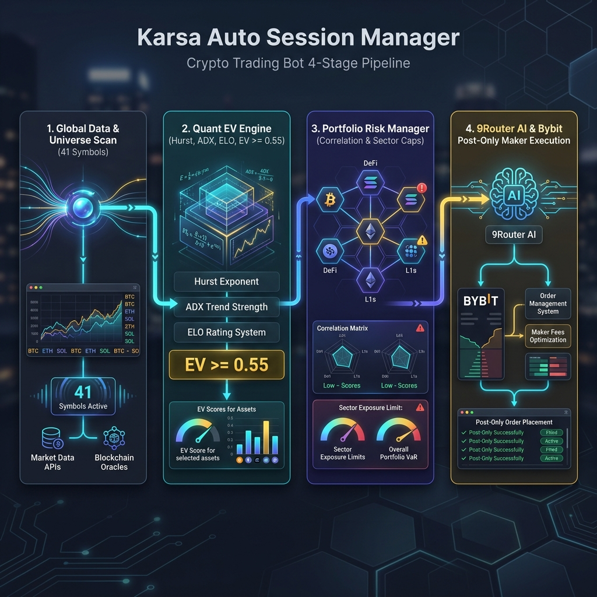

<div align="center">
  
  
# Karsa Auto Session Manager
  
  **Autonomous Crypto Perpetuals Trading Bot**  
  *"Read Global, Execute Local"*
</div>

---

## 📖 TL;DR

An autonomous crypto perpetuals trading bot that reads market data from multiple exchanges (Binance, OKX, Bybit) to build a "true" global price picture, but only ever *trades* on Bybit. By reading global sentiment and trading on a single venue via a 15m–4h swing/intraday timeframe, we mitigate proxy latency while capturing alpha.

Everything runs as a single Python `asyncio` process specifically designed to prioritize execution safety and state integrity over High-Frequency Trading (HFT) speed.

## 🏗 System Architecture (Core Components)



Our architecture is split into critical paths ensuring robustness and modularity:

| Component | Responsibility | Location |
|---|---|---|
| **Global Data Engine** | CCXT Pro WS ingestion, normalization, bad-tick filtering | `app/data/` |
| **Alpha Bridge** | Multi-signal composite, regime classification, strategy routing, AI analysis | `app/alpha/` |
| **Risk Gate** | Liquidity, spread health, circuit breaker, portfolio risk, correlation, vol surface | `app/risk/` |
| **Bybit Executor** | SOR (Post-Only → Reprice → Market), APM (SL 5% cap, breakeven lock), shadow execution | `app/execution/` |
| **Core Services** | State Manager (Postgres sync), Session Orchestrator, Config | `app/core/` |
| **Watchdog & Telemetry** | Heartbeats, latency tracking, dead man's switch, system health | `app/watchdog/` |
| **Telegram Bot** | External command interface and alerting | `app/bot/` |
| **Market Consumer** | Live/shadow loops, candle buffering, decision engine (ELO, sector scoring) | `app/consumer/` |
| **Backtest Engine** | Historical candle replay, multi-symbol orchestration, walk-forward optimization | `app/backtest/` |
| **Commander** | CLI interface for bot management | `app/commander/` |
| **Analytics** | Performance metrics (Sharpe, Sortino, drawdown), trade reconciliation | `app/analytics/` |
| **Data Engine Service** | Standalone data ingestion container (gluetun VPN) | `app/data_engine/` |
| **Research Platform** | Ranking engine, experiment registry, metrics engine, CLI with autocomplete | `app/research/` |
| **Statistical Learning**| Expected edge calculation, trade similarity engine | `app/learning/` |
| **AI Integration** | 9router proxy interface and LLM parsing | `app/ai/` |

## 🛡 Key Architectural Decisions

- **Single-process monolith:** Avoids internal IPC/Redis pub-sub latency and state divergence on partial failures.
- **CI/CD Promotion Pipeline:** Strategies must be mathematically proven and statistically validated (e.g., Bootstrapping, Mann-Whitney U) in the offline Research Engine before touching live capital.
- **Policy-Driven Gates:** Rejection of opaque scoring in favor of strict, explainable `PromotionPolicy` thresholds (Max DD < 15%, p-value < 0.05).
- **Lineage-Aware Tracking:** Every experiment is tracked with a parent ID, Git Commit Hash, and full artifact suite for permanent reproducibility.
- **Bybit-only execution:** Avoids cross-exchange arbitrage complexity in V1.
- **Mandatory Exchange-side Stop-Loss:** Guarantees protection even if the process or proxy dies.

## 📚 Documentation Map

The project is heavily documented to ensure safety and clarity. Please read the core documents before contributing:

- [CONTEXT.md](CONTEXT.md) - Project context, glossary, and open issues. Start here.
- [docs/ARCHITECTURE.md](docs/ARCHITECTURE.md) - System design and component breakdown.
- [docs/ROADMAP.md](docs/ROADMAP.md) - The Quantitative Research OS roadmap (Epics 1-4).
- [docs/DATA_MODEL.md](docs/DATA_MODEL.md) - Exact schemas, Postgres DDL, Redis keys, Pydantic models.
- [docs/MVP_SCOPE.md](docs/MVP_SCOPE.md) - Project scope, phased delivery plan.
- [docs/RISK_AND_RUNBOOK.md](docs/RISK_AND_RUNBOOK.md) - Kill switch, circuit breakers, disaster recovery.
- [AGENTS.md](AGENTS.md) - Instructions and rules for AI agents.

**Adaptive Strategy Docs (Phase 6+):**
- `docs/architecture/adaptive_multi_strategy.md` — Hub-and-Spoke Regime Classifier.
- `docs/execution/active_position_manager.md` — APM loop and Breakeven Lock.
- `docs/risk/portfolio_risk_manager.md` — Correlation trap and exposure limits.

## 🚀 Getting Started

The bot is designed to run via Docker Compose, handling the Python application, Postgres database, Redis store, and the WireGuard VPN network stack (via `gluetun`, see `docs/SETUP.md`).

```bash
# Clone the repository
git clone git@github.com:skeithnight/karsa-auto-session-manager.git
cd karsa-auto-session-manager

# Set up environment variables
cp .env.example .env

# Run the live stack (infra + apps)
make up
```

To interact with the Quantitative Research OS (Experiment Registry, ELO, Validation):
```bash
# Run Research CLI commands
python -m app.research.cli --help
```

## ⚠️ Safety Warning

This bot operates with real capital in live environments. Any changes to the **PortfolioRiskManager**, **ActivePositionManager**, or the **Promotion Gate** must undergo rigorous review and pass the `TESTING_STRATEGY.md` requirements. Never weaken the Kill Switch, Circuit Breakers, or bypass the Ranking Engine for development convenience.

## 🧠 Adaptive Strategy Features (Phase 6 / Research Epics)

| Feature | Description | Redis Key |
|---------|-------------|-----------|
| **Regime Confidence** | HMM probabilities blended into scoring | `system:hmm:regime` |
| **Dynamic Threshold** | Gate calibrated from historical EV | `karsa:gate:dynamic_threshold` |
| **ELO Rating** | Per-strategy win/loss tracking | `karsa:elo:{strategy}` |
| **Correlation Sizing** | Score penalty for correlated positions | `karsa:correlation:{symbol}` |
| **Sector Scoring** | Bonus/penalty based on sector momentum | (computed in-memory) |
| **Rebalance Trigger** | Alert when pending signal beats open position | `karsa:alert:rebalance` |
| **Spread Detection** | Multi-leg spread risk evaluation | (computed in PRM) |
| **Volatility Surface** | BTC/ETH term structure and vol regime | `karsa:vol_surface:*` |
| **Walk-Forward Optimization** | Robustness scoring for strategy validation | (CLI output) |
| **Research CLI** | `python -m app.research.cli {ranking,elo,gate,vol,trades,metrics}` | (various) |
