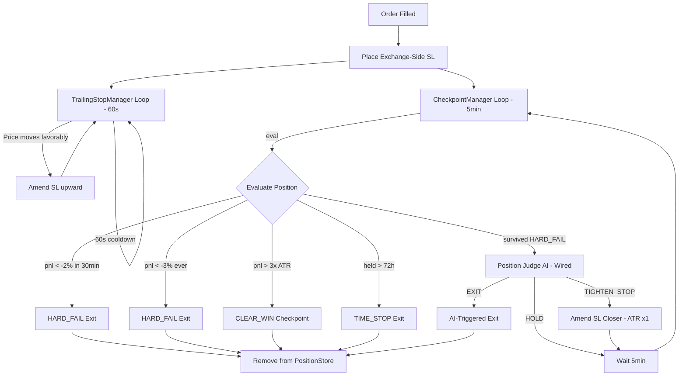
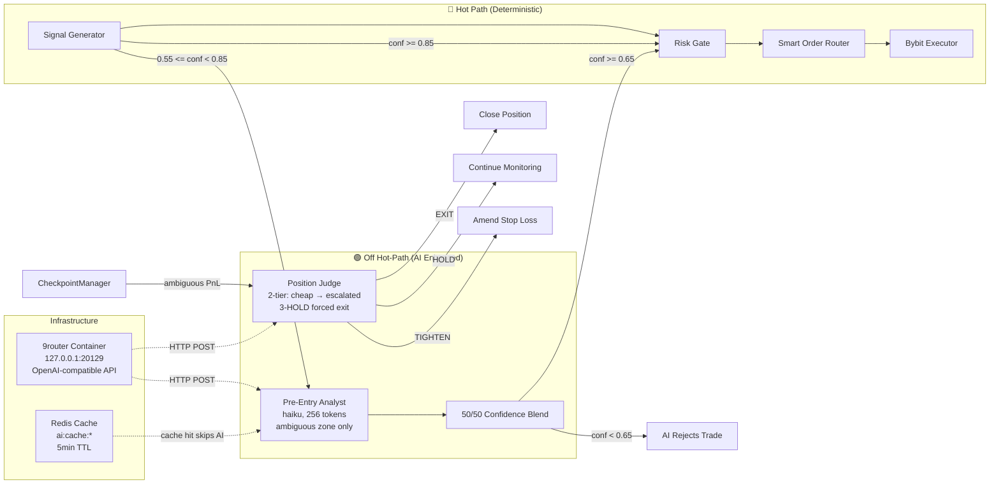

# Architecture Document
**Project Name:** `karsa-auto-session-manager`  
**Document Status:** Approved / Locked  

---

## 1. Architectural Philosophy
The system is built on a strict **"Read Global, Execute Local"** paradigm. It ingests aggregated market data from the broader crypto universe to establish the "true" market state, and executes directional trades exclusively on Bybit. 

Because Bybit execution must be routed through a Cloudflare WARP (SOCKS5) proxy due to geo-restrictions, the system introduces unavoidable network latency. To mitigate this, the architecture deliberately abandons microservices in favor of a **Single-Process Monolith** and shifts the trading timeframe to Intraday/Swing (15m - 4h), where proxy latency is mathematically irrelevant to the alpha.

---

## 2. High-Level System Diagram

```mermaid
graph TD
    %% External Exchanges
    subgraph EXCHANGES [The Crypto Universe]
        BINANCE[(Binance Public WS)]
        OKX[(OKX Public WS)]
        BYBIT_DATA[(Bybit Public WS)]
        BYBIT_EXEC[(Bybit Private WS / REST)]
    end

    %% Docker Infrastructure
    subgraph DOCKER [Local Docker Environment]
        
        subgraph SINGLE_PROCESS [Single Python Process (asyncio)]
            direction TB
            DATA[Key 1: Global Data Engine <br/> CCXT Pro]
            ALPHA[Key 2: Alpha Bridge <br/> VWAP, Skew, Lead-Lag]
            RISK[Key 3: 3-Layer Risk Gate]
            EXEC[Key 4: Bybit Executor <br/> Local SOR]
            STATE[Key 5: State Manager <br/> Postgres Sync]
            WATCHDOG[Key 6: Watchdog & Telemetry <br/> Heartbeats, Dead Man's Switch]
            
            DATA --> ALPHA --> RISK --> EXEC
            EXEC --> STATE
            WATCHDOG -.->|Monitors Health| DATA
            WATCHDOG -.->|Monitors Latency| EXEC
        end

        POSTGRES[(PostgreSQL <br/> Trade & State Logs)]
        PROM[(Prometheus <br/> Metrics Scraping)]
    end

    %% External Alerts
    TELEGRAM[Telegram API <br/> Alerts & Dead Man's Switch]

    %% Connections
    BINANCE & OKX & BYBIT_DATA -->|Public WebSockets| DATA
    DATA -->|Normalized Global State| ALPHA
    
    EXEC <-->|Private WebSockets <br/> via WARP SOCKS5 Proxy| BYBIT_EXEC
    
    STATE <-->|Persistent Audit Trail| POSTGRES
    WATCHDOG -->|Exposes /metrics| PROM
    
    WATCHDOG -->|Sends Critical Alerts| TELEGRAM
```

---

## 3. The "Single Process" Mandate
In traditional enterprise software, separating the "Signal Generator" (Orchestrator) and the "Order Executor" (Bot) into different containers communicating via Redis Pub/Sub is best practice. **In this system, it is a fatal flaw.**

### Why we merged them:
1. **Proxy Latency Mitigation:** The WARP proxy adds ~150ms to Bybit execution. If we add a 5ms-10ms network hop for Redis Pub/Sub between internal containers, we compound the latency. A single process shares memory; passing a signal from the Alpha Bridge to the Executor takes `< 0.01ms`.
2. **State Divergence Prevention:** If the Bot fails to fill an order on Bybit, a microservice architecture requires complex two-phase commits to update the Orchestrator. In a single process, the Executor updates the in-memory state immediately and synchronously.
3. **Event Loop Efficiency:** Python's `asyncio` is highly efficient at handling hundreds of concurrent WebSockets in a single thread. Splitting them forces context switching and IPC (Inter-Process Communication) overhead.

---

## 4. Core Components & Data Flow

### A. Global Data Engine (Key 1)
*   Uses `ccxt.pro` to maintain persistent WebSockets to Binance, OKX, and Bybit (public feeds).
*   Normalizes disparate exchange schemas into a unified `GlobalState` dictionary.
*   Applies **Bad Tick Filtering** (rejecting price spikes > 5% in < 1s).

### B. Alpha Bridge (Key 2)
*   Calculates structural metrics: Global VWAP, Aggregate Order Book Skew, and Funding Rate Divergence.
*   Generates raw directional signals (`LONG`, `SHORT`, `FLAT`) based on multi-signal composite formula: `regime_mult * (0.4*S_skew + 0.3*S_lead_lag + 0.2*S_funding + 0.1*S_oi)`.
*   **Regime Detection:** Hurst Exponent + ADX(14) + EMA(200) classifies market into TREND_BULL, TREND_BEAR, MEAN_REVERSION, or CHOP (no trades).
*   **Lead-Lag Buffer:** 15-minute rolling window tracks Binance vs Bybit price lead for timing entries.
*   **Entry Filter:** Pre-entry checklist rejects CHOP regime, wide spreads, imbalanced depth, dead hours (00:00-01:00 UTC), and duplicate positions.
*   **TA Tools:** Deterministic indicators (RSI, Bollinger Bands, MACD, ATR, EMA) for AI context — pure math, no network.

### C. 3-Layer Risk Gate (Key 3)
*   **Liquidity Check:** Ensures aggregated global volume meets minimum thresholds.
*   **Spread Health:** Halts trading if the Binance/Bybit price spread exceeds abnormal limits (indicates proxy/exchange glitch).
*   **Circuit Breaker:** Hard stops the bot if daily drawdown hits -2%.

### D. Bybit Executor (Key 4)
*   Connects to Bybit **Private WebSockets** via the WARP SOCKS5 proxy.
*   Executes the Smart Order Routing (SOR): Post-Only Limit $\rightarrow$ Reprice $\rightarrow$ Market/IOC.
*   **Position Lifecycle:** TrailingStopManager amends SL when price moves favorably (60s cooldown). CheckpointManager evaluates HARD_FAIL (-2% in 30min, -3% ever), CLEAR_WIN (>3x ATR), and TIME_STOP (>72h).

### E. State Manager (Key 5)
*   Writes all trade events, risk decisions, and state changes to PostgreSQL via `asyncpg`.
*   Handles **Startup Reconciliation**: Queries Bybit REST API on boot to ensure local DB matches actual exchange positions.

### G. AI Layer (Off Hot-Path)
*   **Pre-Entry Analyst** (`app/alpha/analyst.py`): Runs AFTER deterministic signal generation, BEFORE order placement. Only activates in ambiguous confidence zone (0.55-0.85). Fetches 200 1H candles, computes TA indicators, sends structured prompt to AI via 9router. Blends AI confidence 50/50 with deterministic.
*   **Position Judge** (`app/alpha/position_judge.py`): Runs in CheckpointManager when position is in ambiguous zone. 2-tier: cheap pass (fast, no TA) -> escalate if ambiguous. 3 consecutive HOLDs on losing position -> forced EXIT.
*   **9router Proxy** (`app/core/ai_client.py`): Async HTTP client to 9router container at `127.0.0.1:20129`. OpenAI-compatible format. Returns None on any failure (graceful degradation — deterministic layer continues).
*   **Safety:** AI is NEVER in the hot execution path. Risk gate, SOR, and order execution remain fully deterministic. AI can only *reject* entries (lower confidence below threshold) or *flag* positions for exit — it cannot force trades.
*   Uses `python-telegram-bot` (PTB) with `ApplicationBuilder` and an `asyncio`-native polling loop.
*   Full command specs, alert system, and security model defined in `TELEGRAM_INTERFACE.md`.
*   All handlers are gated by `_is_authorized()` — a single security boundary that checks `TELEGRAM_CHAT_ID` from `Settings`.
*   Accesses `BybitClient` and `RedisClient` via `bot_data` injected at startup — no globals.
*   Unported subsystems (ASM, UniverseEngine, PerformanceTracker) degrade gracefully with a user-visible warning rather than raising an exception.
*   Kill switch: the PTB application stops when the global `kill_switch` asyncio Event is set.

---

## 5. The Watchdog Implementation (Key 6)
Because this bot runs autonomously, it must be able to detect when it is "going blind" or "going rogue" and take defensive action. The Watchdog runs as a concurrent background task in the main `asyncio` loop.

### Watchdog Responsibilities:
1. **WebSocket Heartbeat Monitor:**
   * Tracks per-exchange heartbeat timestamps in Redis hash (`system:heartbeats`).
   * *Action:* If any exchange WS receives no data for > 10 seconds, it sets an `asyncio.Event` that pauses the Alpha Bridge to prevent trading on stale data. Resumes automatically when heartbeats recover.
2. **Execution Latency Tracker:**
   * Measures the time delta between `Signal Generated` and `Bybit Fill Confirmation` using a rolling deque (last 20 samples).
   * *Action:* If average latency spikes > 1500ms (proxy degradation), it sets `SmartOrderRouter.skip_to_market = True` — SOR skips Post-Only/Reprice and goes straight to Market orders to ensure fills. Recovers automatically when latency drops.
3. **The "Dead Man's Switch" (External Ping):**
   * Every 60 seconds, sends an HTTP ping to an external service (e.g., Healthchecks.io). Runs as a separate asyncio task.
   * *Action:* If the external service doesn't receive a ping for 3 minutes, it triggers an SMS/Email to the developer indicating the bot has completely frozen. Ping success/failure tracked via Prometheus counters.
4. **Event Loop Lag Monitor:**
   * Checks if the `asyncio` event loop is blocking (lag > 100ms) on every 10s watchdog cycle.
   * *Action:* If lag exceeds 100ms for 3 consecutive checks (30s sustained), it flattens all open positions via `SmartOrderRouter.cancel_all_positions()` and triggers graceful shutdown via the kill switch.

---

## 6. Trade Lifecycle Sequence Diagram


### 6B. Position Lifecycle Flowchart



> **Note:** Position Judge AI is wired into `CheckpointManager._evaluate()`. It runs between HARD_FAIL and CLEAR_WIN checks. The 3-HOLD forced exit is handled inside `PositionJudge.judge()` itself (returns EXIT after 3 consecutive HOLDs on a losing position).

### 6C. AI Interaction Engine



**Key design principles:**
1. **AI never blocks execution.** If 9router is down or slow, `AIClient.complete()` returns `None` and the deterministic layer continues.
2. **AI can only reject, not create.** Analyst lowers confidence below threshold (rejects trade). Judge flags exit on ambiguous positions. Neither can force a new entry.
3. **Fail-safe defaults.** Parse failure → FLAT/EXIT (never HOLD). AI unavailable → conservative HOLD (don't exit without AI). 3 consecutive HOLDs on loser → forced EXIT.
4. **Redis-backed cache.** Analyst results cached in Redis (`ai:cache:*`) with 5min TTL, shared across process restarts. Position Judge has no cache (evaluates fresh each time).

---

## 7. Technology Stack

| Component | Technology | Justification |
| :--- | :--- | :--- |
| **Language** | Python 3.11+ | Best ecosystem for crypto (`ccxt`), excellent `asyncio` support. |
| **Concurrency** | `asyncio` | Required to handle multiple WebSockets and non-blocking DB writes in a single process. |
| **Market Data** | `ccxt.pro` | Unified API for WebSockets across 100+ exchanges. |
| **Database** | PostgreSQL 15 + `asyncpg` | Relational integrity for trade logs; `asyncpg` is the fastest async Python DB driver. |
| **Metrics** | `prometheus-client` | Exposes `/metrics` endpoint for Dockerized Prometheus to scrape. |
| **Proxy** | Cloudflare WARP (SOCKS5) | Mandatory for bypassing Bybit geo-restrictions. |
| **Containerization**| Docker & Docker Compose | Ensures identical environments for local dev and future cloud deployment. |
| **Cache Layer** | Redis 7 | High-speed state caching (`global:state`, `system:heartbeat`, `system:circuit_breaker`, `system:config:regime`). Session state. Already implemented. |

---

## 8. Directory / Folder Structure

```text
karsa-auto-session-manager/
│
├── app/                            # Main application code
│   ├── __init__.py
│   ├── main.py                     # Entry point: initializes asyncio loop, starts all tasks
│   │
│   ├── core/                       # Core orchestration & configuration
│   │   ├── config.py               # Pydantic settings (loads .env)
│   │   ├── session.py              # Session Orchestrator (UTC time blocks, regime logic)
│   │   ├── state.py                # In-memory state management & Postgres sync
│   │   ├── redis_client.py         # Redis connection + key operations
│   │   └── position_store.py       # Redis-backed position lifecycle state (Phase 4)
│   │
│   ├── data/                       # Key 1: Global Read Engine
│   │   ├── ccxt_manager.py         # WebSocket connections, auto-reconnect logic
│   │   ├── normalizer.py           # Standardizes exchange payloads
│   │   ├── filters.py              # Bad tick & outlier rejection
│   │   └── ohlcv_fetcher.py        # Cached OHLCV REST fetcher (Phase 1, execution plan)
│   │
│   ├── alpha/                      # Key 2: Signal Generation
│   │   ├── metrics.py              # Global VWAP, Skew, Funding calculations
│   │   ├── signals.py              # Signal generation (multi-signal composite, Phase 2)
│   │   ├── regime.py               # Hurst + ADX regime classifier (Phase 1, execution plan)
│   │   ├── lead_lag_buffer.py      # 15-min rolling price buffer (Phase 2)
│   │   └── entry_filter.py         # Pre-entry structural checklist (Phase 3)
│   │
│   ├── execution/                  # Key 4: Local Write Engine
│   │   ├── bybit_client.py         # Bybit Private WS & REST via WARP proxy (+ SL methods, Phase 0B)
│   │   ├── sor.py                  # Smart Order Routing (Limit -> Reprice -> Market)
│   │   └── position_lifecycle.py   # Trailing stop + performance checkpoints (Phase 4)
│   │
│   ├── risk/                       # Key 3: Risk Management
│   │   ├── gates.py                # The 3-Layer Risk Gate logic
│   │   └── circuit_breaker.py      # Daily drawdown limits, hard stops
│   │
│   ├── watchdog/                   # Key 6: Telemetry & Health
│   │   ├── monitor.py              # Heartbeat tracking, loop lag detection
│   │   ├── dead_mans_switch.py     # External ping logic (Healthchecks/Telegram)
│   │   └── metrics.py              # Prometheus metric definitions
│   │
│   └── bot/                        # Key 7: Telegram Command Interface
│       ├── handlers.py             # All command & callback handlers (ported from karsa-claude-trading)
│       ├── runner.py               # PTB ApplicationBuilder, handler registration, bot_data wiring
│       └── utils/
│           ├── format.py           # HTML composable formatters (bold, italic, code, pre, fmt)
│           ├── telegram_helpers.py # send_or_edit_message, send_toast, format_pre_table
│           └── formatters/
│               ├── __init__.py     # format_position_card, format_risk_button_text, regime display
│               └── trade_history_formatter.py  # TradeHistoryFormatter (paginated)
│
├── tests/                          # Unit and integration tests
│   ├── test_alpha_math.py
│   ├── test_risk_gates.py
│   └── bot/                        # Bot layer tests
│       ├── test_auth.py
│       ├── test_format.py
│       └── test_decimal_safety.py
│
├── docs/                           # All documentation (PRD, MVP, etc.)
├── docker-compose.yml              # Full stack: app, gluetun, db, redis, prometheus, grafana, 9router
├── Dockerfile                      # Python 3.11 slim image + entrypoint.sh DNS fix
├── entrypoint.sh                   # Writes gluetun DNS to /etc/resolv.conf at container startup
├── prometheus.yml                  # Scrapes gluetun:8001 (app metrics proxy)
├── grafana/                        # Dashboards: data-ingestion, operations, signal-confidence
├── requirements.txt                # Python dependencies
├── .env.example                    # Template for secrets
└── README.md                       # Project overview
```

---

## 9. Deployment & VPN Configuration
*   **VPN:** All outbound traffic routes through a WireGuard VPN tunnel via the `gluetun` Docker service. The app shares gluetun's network namespace (`network_mode: "service:gluetun"`).
*   **Server:** DigitalOcean droplet running WireGuard (port 51820). Config in `.env`: `WIREGUARD_*`, `VPN_ENDPOINT_*`.
*   **DNS:** ISP DNS poisoning bypassed via Python-level DNS override in `app/main.py`. Queries gluetun DNS (127.0.0.1 → Cloudflare 1.1.1.1) for external domains, Docker DNS (127.0.0.11) for internal names.
*   **Prometheus:** App exposes metrics on port 8001 (not 8000 — gluetun uses 8000). Prometheus scrapes `gluetun:8001`.
*   **CCXT Implementation:** Direct connection through VPN tunnel (no explicit proxy config needed):
    ```python
    exchange = ccxt.pro.bybit({
        'enableRateLimit': True,
        'options': {'defaultType': 'swap'},
    })
    ```