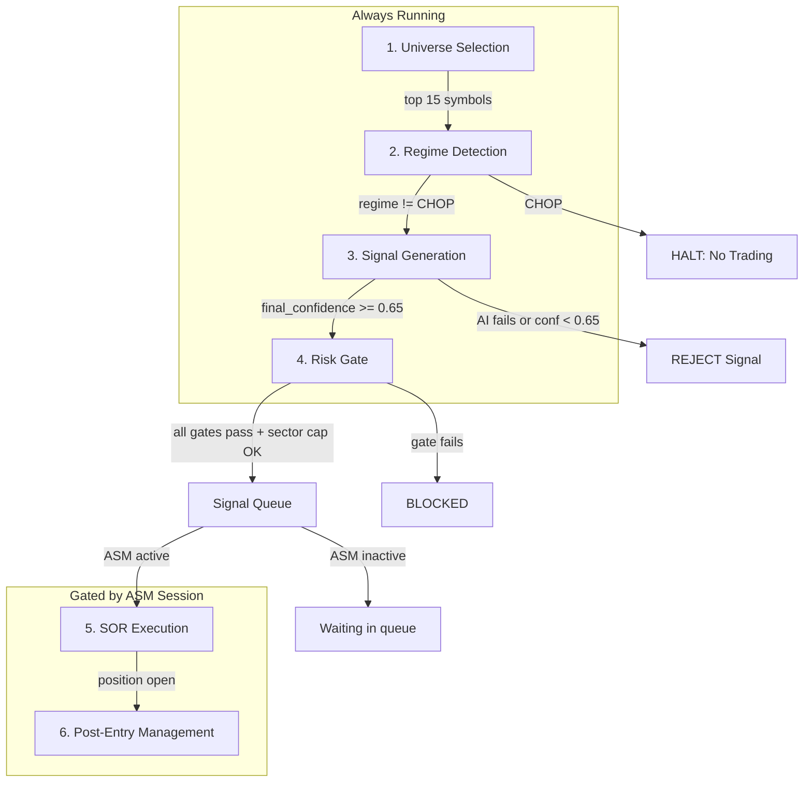
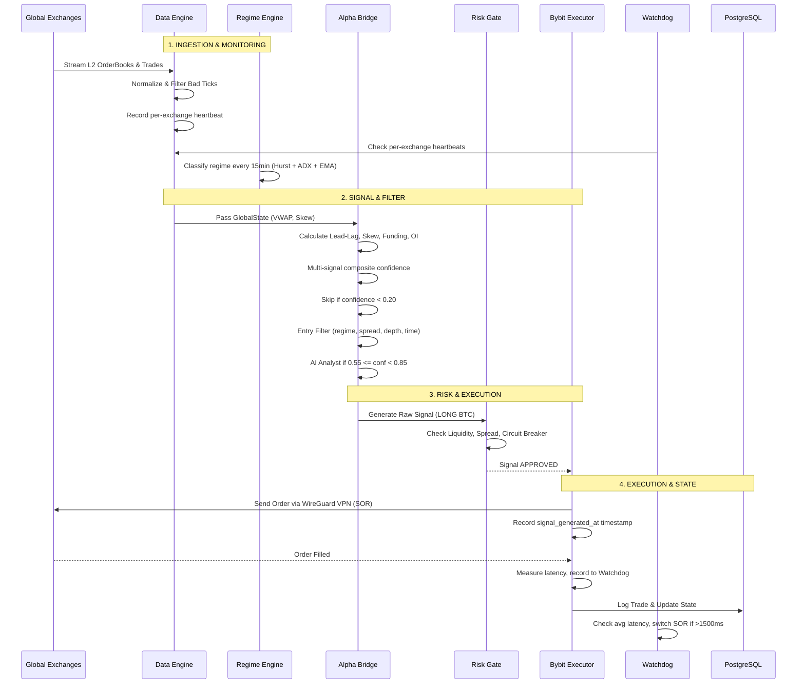
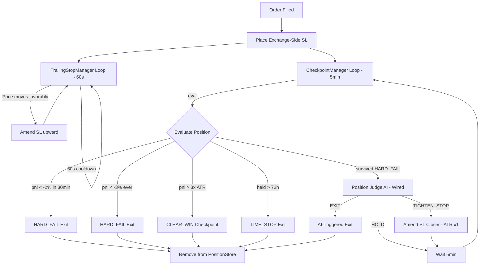
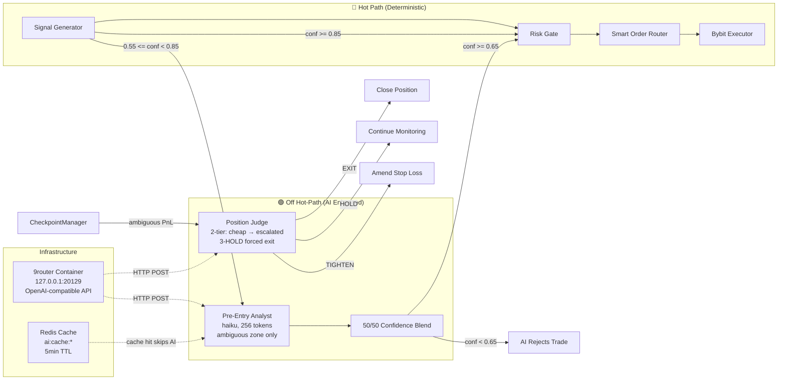

# Architecture Document
**Project Name:** `karsa-auto-session-manager`  
**Document Status:** Approved / Locked  
**Last Revised:** 2026-07-17 — WARP→WireGuard cleanup, Shadow Mode section added (§4.E)

---

## 1. Architectural Philosophy
The system is built on a strict **"Read Global, Execute Local"** paradigm. It ingests aggregated market data from the broader crypto universe to establish the "true" market state, and executes directional trades exclusively on Bybit. 

Because Bybit execution must be routed through a WireGuard VPN tunnel (gluetun sidecar) due to geo-restrictions, the system introduces unavoidable network latency. To mitigate this, the architecture deliberately abandons microservices in favor of a **Single-Process Monolith** and shifts the trading timeframe to Intraday/Swing (15m - 4h), where proxy latency is mathematically irrelevant to the alpha.

---

## 2. High-Level System Diagram

```mermaid
graph TD
    %% External Exchanges
    subgraph EXCHANGES [The Crypto Universe]
        BINANCE[(Binance Public WS)]
        OKX[(OKX Public WS)]
        BYBIT_DATA[(Bybit Public WS)]
        BYBIT_EXEC[(Bybit Private WS / REST)]
    end

    %% Docker Infrastructure
    subgraph DOCKER [Local Docker Environment]
        
        subgraph SINGLE_PROCESS [Single Python Process (asyncio)]
            direction TB
            DATA[Key 1: Global Data Engine <br/> CCXT Pro]
            ALPHA[Key 2: Alpha Bridge <br/> VWAP, Skew, Lead-Lag]
            RISK[Key 3: 3-Layer Risk Gate]
            EXEC[Key 4: Bybit Executor <br/> Local SOR]
            STATE[Key 5: State Manager <br/> Postgres Sync]
            WATCHDOG[Key 6: Watchdog & Telemetry <br/> Heartbeats, Dead Man's Switch]
            
            DATA --> ALPHA --> RISK --> EXEC
            EXEC --> STATE
            WATCHDOG -.->|Monitors Health| DATA
            WATCHDOG -.->|Monitors Latency| EXEC
        end

        POSTGRES[(PostgreSQL <br/> Trade & State Logs)]
        PROM[(Prometheus <br/> Metrics Scraping)]
    end

    %% External Alerts
    TELEGRAM[Telegram API <br/> Alerts & Dead Man's Switch]

    %% Connections
    BINANCE & OKX & BYBIT_DATA -->|Public WebSockets| DATA
    DATA -->|Normalized Global State| ALPHA
    
    EXEC <-->|Private WebSockets <br/> via WireGuard VPN (gluetun)| BYBIT_EXEC
    
    STATE <-->|Persistent Audit Trail| POSTGRES
    WATCHDOG -->|Exposes /metrics| PROM
    
    WATCHDOG -->|Sends Critical Alerts| TELEGRAM
```

---

## 3. The "Single Process" Mandate
In traditional enterprise software, separating the "Signal Generator" (Orchestrator) and the "Order Executor" (Bot) into different containers communicating via Redis Pub/Sub is best practice. **In this system, it is a fatal flaw.**

### Why we merged them:
1. **Proxy Latency Mitigation:** The VPN proxy adds ~100-300ms to Bybit execution. If we add a 5ms-10ms network hop for Redis Pub/Sub between internal containers, we compound the latency. A single process shares memory; passing a signal from the Alpha Bridge to the Executor takes `< 0.01ms`.
2. **State Divergence Prevention:** If the Bot fails to fill an order on Bybit, a microservice architecture requires complex two-phase commits to update the Orchestrator. In a single process, the Executor updates the in-memory state immediately and synchronously.
3. **Event Loop Efficiency:** Python's `asyncio` is highly efficient at handling hundreds of concurrent WebSockets in a single thread. Splitting them forces context switching and IPC (Inter-Process Communication) overhead.

---

## 4. Core Components & Data Flow

### A. Global Data Engine (Key 1)
*   Uses `ccxt.pro` to maintain persistent WebSockets to Binance, OKX, and Bybit (public feeds).
*   Normalizes disparate exchange schemas into a unified `GlobalState` dictionary.
*   Applies **Bad Tick Filtering** (rejecting price spikes > 5% in < 1s).

### B. Alpha Bridge (Key 2)
*   Calculates structural metrics: Global VWAP, Aggregate Order Book Skew, and Funding Rate Divergence.
*   Generates raw directional signals (`LONG`, `SHORT`, `FLAT`) based on multi-signal composite formula: `regime_mult * (0.4*S_skew + 0.3*S_lead_lag + 0.2*S_funding + 0.1*S_oi)`.
*   **Regime Detection:** Hurst Exponent + ADX(14) + EMA(200) classifies market into TREND_BULL, TREND_BEAR, MEAN_REVERSION, or CHOP (no trades).
*   **Lead-Lag Buffer:** 15-minute rolling window tracks Binance vs Bybit price lead for timing entries.
*   **Entry Filter:** Pre-entry checklist rejects CHOP regime, wide spreads, imbalanced depth, dead hours (00:00-01:00 UTC), and duplicate positions.
*   **TA Tools:** Deterministic indicators (RSI, Bollinger Bands, MACD, ATR, EMA) for AI context — pure math, no network.

### C. 3-Layer Risk Gate (Key 3)
*   **Liquidity Check:** Ensures aggregated global volume meets minimum thresholds.
*   **Spread Health:** Halts trading if the Binance/Bybit price spread exceeds abnormal limits (indicates proxy/exchange glitch).
*   **Circuit Breaker:** Hard stops the bot if daily drawdown hits -2%.

### D. Bybit Executor (Key 4)
*   Connects to Bybit **Private WebSockets** via the WireGuard VPN via gluetun.
*   Executes the Smart Order Routing (SOR): Post-Only Limit $\rightarrow$ Reprice $\rightarrow$ Market/IOC.
*   **Position Lifecycle:** TrailingStopManager amends SL when price moves favorably (60s cooldown). CheckpointManager evaluates HARD_FAIL (-2% in 30min, -3% ever), CLEAR_WIN (>3x ATR), and TIME_STOP (>72h).

### E. Shadow Mode (Phase 3.1 — Built)

Shadow Mode simulates the full trade lifecycle on live market data without placing real orders. It validates strategy math, fee impact, and slippage assumptions before going live.

**Architecture:**
A conditional component substitution layer in `main.py`. When `SHADOW_MODE_ENABLED=true`:
- `ShadowExecutor` replaces `SmartOrderRouter` for entry/exit calls
- `ShadowAPM` replaces `ActivePositionManager` for post-trade position monitoring
- `ShadowExchangeClient` (Redis-backed mock) replaces `BybitClient` for APM's live price reads
- Startup reconciliation is skipped (shadow positions have no exchange counterpart)
- Position reconciler task is not started

**Key components:**
- `ShadowExecutor` (`app/execution/shadow.py`): Simulated order routing with asymmetric fees (maker 0.02% vs taker 0.055%) based on `is_post_only` flag, plus 0.05% simulated slippage. Returns `PENDING_VIRTUAL_FILL` status for post-only limit orders.
- `ShadowAPM` (`app/execution/shadow.py`): 2-second monitoring loop with:
  - **Wick miss prevention:** Tracks `worst_price_seen` in Redis. SL detection uses worst price, not current price.
  - **Funding rate drag:** Deducts 8-hour funding fee on held positions.
  - **Pending limit fills:** Activates `PENDING` orders when live price crosses virtual entry. Expires after 600s TTL.
- `ShadowPositionStore` (`app/core/shadow_store.py`): Redis position state under `shadow:position:{symbol}:{side}` keys.
- `ShadowTradeStore` (`app/core/shadow_store.py`): Postgres CRUD targeting `shadow_trades` table.

**State isolation (non-negotiable):**
- Shadow Redis keys use `shadow:position:*` prefix — never `position:*`
- Shadow trades write to `shadow_trades` table — never `trades`
- Switching from shadow to live mode does not clean up orphaned shadow state (intentional)

**4 refinements applied (from `docs/review/refinement_shadom_plan.md`):**
1. Fee asymmetry (maker vs taker based on order type)
2. Wick miss prevention (worst_price_seen)
3. Funding rate drag (8-hour deduction)
4. Pending limit order state machine (PENDING_VIRTUAL_FILL)

**Monitoring:** 10 Prometheus metrics track virtual PnL, fees, funding, SL hits, pending expiry, and position counts.

### F. State Manager (Key 5)
*   Writes all trade events, risk decisions, and state changes to PostgreSQL via `asyncpg`.
*   Handles **Startup Reconciliation**: Queries Bybit REST API on boot to ensure local DB matches actual exchange positions.

### G. AI Layer (Off Hot-Path, MANDATORY)
*   **Pre-Entry CryptoAnalyst** (`app/alpha/analyst.py`): MANDATORY step in signal pipeline. Runs after deterministic signal generation, before risk gate. Fetches 200 1H candles, computes TA indicators (RSI, BB, MACD, ATR, EMA), sends structured prompt to AI via 9router. Final confidence = quant_confidence × 0.5 + ai_confidence × 0.5. Gate: final_confidence >= 0.65. If AI call fails, signal is **rejected** (not bypassed).
*   **Position Judge** (`app/alpha/position_judge.py`): MANDATORY in CheckpointManager when position is in ambiguous zone (between HARD_FAIL and CLEAR_WIN). 2-tier: cheap pass (haiku, no TA) → escalate to stronger model if ambiguous. 3 consecutive HOLDs on losing position → forced EXIT.
*   **Trade Memory** (`app/alpha/trade_memory.py`): Before AI analyst call, retrieves last 3 similar trades (same symbol + regime) from Redis sorted set and injects into prompt context. Stores PnL, hold duration, regime, exit reason on position close.
*   **9router Proxy** (`app/core/ai_client.py`): Async HTTP client to 9router container at `127.0.0.1:20129`. OpenAI-compatible format. Returns None on any failure — but since AI is mandatory, signal is rejected on failure.
*   **Safety:** AI is NEVER in the hot execution path (SOR/risk gate). AI can reject entries (lower confidence below threshold) or flag positions for exit — it cannot force trades or bypass risk gates.
*   **Models:** Pre-entry analyst: `claude-haiku-3-5` (~400ms). Position judge cheap: `claude-haiku-3-5`. Position judge escalated: `claude-sonnet-4-5`. Estimated cost: ~$0.60–1.20/day at 5 symbols.

### H. Dynamic Universe Scoring (`app/data/universe_scorer.py`)
*   **Purpose:** Replace static symbol list with dynamic scoring based on market conditions. Adapts KCT's UniverseScorer pattern.
*   **Scoring model (cross-exchange advantage):**
    *   Volume score (0-30): aggregate 24h volume across Binance+OKX+Bybit from Redis `global:state:{symbol}`.
    *   Momentum score (0-40): 1H price change % from `ohlcv_fetcher`. Positive momentum = higher score.
    *   Overextension penalty (-40 to -10): penalize >30% 24h moves (avoid chasing tops).
    *   Squeeze detection (0-30): BB width narrowing on 1H = squeeze building.
*   **Output:** Top N symbols (configurable, default 15) above minimum score (default 55), respecting sector cap (max 2 per sector). Shared via Redis key `system:universe:symbols`.
*   **Refresh:** Every 4 hours (configurable). Data engine picks up changes naturally.
*   **Sector mapping** (`app/data/sector_mapping.py`): Static classification — BTC/ETH, L1, L2, DeFi, Meme, AI, RWA. Stablecoins excluded.

### I. Multi-Timeframe Confirmation (`app/alpha/multi_tf.py`)
*   **Purpose:** Prevent entering against the 4H trend. KCT requires 1H trigger + 4H trend agreement.
*   **Logic:** Fetch 4H OHLCV via `ohlcv_fetcher` (TTL=3600s, ~1 REST call/symbol/hour). Compute EMA(20) on 4H using `ta_tools.calculate_ema()`. If signal direction contradicts 4H EMA trend: apply 0.5x confidence penalty. Graceful degradation: no penalty if 4H data unavailable.
*   **Integration:** Wired in `alpha_bridge_task` between `signal_generator.generate()` and AI analyst call.

### J. Sector Diversity Cap (`app/risk/sector_cap.py`)
*   **Purpose:** Prevent concentrated losses when correlated crypto sectors dump together.
*   **Logic:** Uses `sector_mapping.py` to classify. Counts active positions per sector via `position_store.list_all()`. If target sector already at cap (default 2), reject signal.
*   **Integration:** Checked in `executor_task` before `sor.execute()`.

---

## 5. Full Trade Lifecycle (6 Stages)

The system follows a 6-stage pipeline matching KCT's architecture, enhanced with ASM's multi-exchange data advantage (Binance + OKX + Bybit).

### Lifecycle Gating — Data Always On, ASM Gates Execution

**Always running (when app starts):**
- Stages 1-3: Data Engine (WebSocket streams), Regime Engine (15min classification), Alpha Bridge (signal generation)
- Stage 4: Risk Gate (evaluates signals)
- Post-Entry: Trailing Stop + Checkpoint Manager (manage existing positions)
- Watchdog (health monitoring)

**Gated by ASM (Launch Session):**
- Stage 5: Executor only places trades when ASM session is active
- Stage 6: Post-Entry management is active for any open position (ASM or manual)

**Key insight:** The data pipeline runs continuously regardless of ASM state. Signals are generated and queued. The executor only processes them when ASM is active. This means the system is always "warm" — no cold-start delay when launching a session.



### Stage 1 — Universe Selection (`app/data/universe_scorer.py`)
UniverseScorer runs every 4 hours. Scores all configured symbols 0–100:
- **Volume** (0–30): aggregate 24h volume across Binance+OKX+Bybit from Redis `global:state:{symbol}`.
- **Momentum** (0–40): 1H price change % from `ohlcv_fetcher`. Positive momentum = higher score.
- **Overextension** penalty (-40 to -10): penalize >30% 24h moves (avoid chasing tops).
- **Squeeze** (0–30): BB width narrowing on 1H = squeeze building.

Output: Top 15 symbols above score 55, respecting sector cap (max 2 per sector). Shared via Redis `system:universe:symbols`. Cross-exchange aggregate volume gives more accurate liquidity picture than single-venue.

### Stage 2 — Regime Detection (`app/alpha/regime.py`)
Runs every 15 minutes on BTC/USDT 1H candles (200 bars). Three indicators:
- **Hurst Exponent** (R/S method, windows 10/20/40): H > 0.55 = trending, H < 0.45 = mean-reverting.
- **ADX(14)**: > 25 = strong trend, < 20 = choppy.
- **EMA(200)**: price above = bullish, below = bearish.

Output: TREND_BULL, TREND_BEAR, MEAN_REVERSION, or CHOP. **CHOP halts all signal generation.** Stored in Redis `system:config:regime`.

### Stage 3 — Signal Generation (AI-Mandatory Pipeline)
Sequential pipeline in `alpha_bridge_task`:

1. **Deterministic composite** (`signals.py`): `regime_mult × (0.4×S_skew + 0.3×S_lead_lag + 0.2×S_funding + 0.1×S_oi)`. Regime modifier: TREND=1.2×, MR=0.8×, CHOP=0.0×.
2. **Entry filter** (`entry_filter.py`): 5 checks — regime (CHOP blocks), spread (<0.3%), depth ratio, time-of-day (block 00:00–01:00 UTC), existing position.
3. **Multi-timeframe confirmation** (`multi_tf.py`): 4H EMA(20) trend check. Contradicts 1H signal → 0.5× confidence penalty.
4. **AI CryptoAnalyst** (`analyst.py`, MANDATORY): Structured prompt with TA indicators + trade memory context. Final confidence = `quant_confidence × 0.5 + ai_confidence × 0.5`. Gate: >= 0.65. **If AI call fails, signal is rejected.**

### Stage 4 — Risk Gate (Deterministic Only)
Sequential gates in `risk_gate_task`:
1. **Circuit breaker:** `is_halted()` / `is_paused()` check.
2. **Liquidity:** 24h volume >= $1M.
3. **Spread health:** bid-ask spread <= 0.5%.
4. **Sector cap** (`sector_cap.py`): Check position count per sector before allowing new entry.

### Stage 5 — SOR Execution (Deterministic Only)
Smart Order Router in `executor_task`:
1. Post-Only Limit at current price.
2. Reprice (up to 2 attempts, moving toward market).
3. Market/IOC fallback.
4. **Exchange-side SL placed immediately on every fill** via `bybit_client.place_stop_loss()`. No AI in this path.

### Stage 6 — Post-Entry Management
- **Trailing Stop** (`TrailingStopManager`): ATR-based, amends exchange-side SL when price moves favorably. 60s cooldown per symbol.
- **Checkpoint Manager** (`CheckpointManager`): Every 5 minutes:
  - HARD_FAIL: -2% in 30min or -3% ever → immediate exit (no AI).
  - CLEAR_WIN: gain > 3× ATR → activate trailing (no AI).
  - AMBIGUOUS zone → AI Position Judge (MANDATORY).
  - TIME_STOP: held > 72h → forced exit.
- **AI Position Judge** (`position_judge.py`): 2-tier escalation (haiku → sonnet). 3 consecutive HOLDs on losing position → forced EXIT.
- **Trade Memory** (`trade_memory.py`): On exit, store PnL, hold duration, regime, exit reason to Redis sorted set for future AI context.

---

### Telegram Bot (Key 7)
*   Uses `python-telegram-bot` (PTB) with `ApplicationBuilder` and an `asyncio`-native polling loop.
*   Full command specs, alert system, and security model defined in `TELEGRAM_INTERFACE.md`.
*   All handlers are gated by `_is_authorized()` — a single security boundary that checks `TELEGRAM_CHAT_ID` from `Settings`.
*   Accesses `BybitClient` and `RedisClient` via `bot_data` injected at startup — no globals.
*   Unported subsystems (ASM, UniverseEngine, PerformanceTracker) degrade gracefully with a user-visible warning rather than raising an exception.
*   Kill switch: the PTB application stops when the global `kill_switch` asyncio Event is set.

---

## 6. The Watchdog Implementation (Key 6)
Because this bot runs autonomously, it must be able to detect when it is "going blind" or "going rogue" and take defensive action. The Watchdog runs as a concurrent background task in the main `asyncio` loop.

### Watchdog Responsibilities:
1. **WebSocket Heartbeat Monitor:**
   * Tracks per-exchange heartbeat timestamps in Redis hash (`system:heartbeats`).
   * *Action:* If any exchange WS receives no data for > 10 seconds, it sets an `asyncio.Event` that pauses the Alpha Bridge to prevent trading on stale data. Resumes automatically when heartbeats recover.
2. **Execution Latency Tracker:**
   * Measures the time delta between `Signal Generated` and `Bybit Fill Confirmation` using a rolling deque (last 20 samples).
   * *Action:* If average latency spikes > 1500ms (proxy degradation), it sets `SmartOrderRouter.skip_to_market = True` — SOR skips Post-Only/Reprice and goes straight to Market orders to ensure fills. Recovers automatically when latency drops.
3. **The "Dead Man's Switch" (External Ping):**
   * Every 60 seconds, sends an HTTP ping to an external service (e.g., Healthchecks.io). Runs as a separate asyncio task.
   * *Action:* If the external service doesn't receive a ping for 3 minutes, it triggers an SMS/Email to the developer indicating the bot has completely frozen. Ping success/failure tracked via Prometheus counters.
4. **Event Loop Lag Monitor:**
   * Checks if the `asyncio` event loop is blocking (lag > 100ms) on every 10s watchdog cycle.
   * *Action:* If lag exceeds 100ms for 3 consecutive checks (30s sustained), it flattens all open positions via `SmartOrderRouter.cancel_all_positions()` and triggers graceful shutdown via the kill switch.

---

## 7. Trade Lifecycle Sequence Diagram



### 6B. Position Lifecycle Flowchart



> **Note:** Position Judge AI is wired into `CheckpointManager._evaluate()`. It runs between HARD_FAIL and CLEAR_WIN checks. The 3-HOLD forced exit is handled inside `PositionJudge.judge()` itself (returns EXIT after 3 consecutive HOLDs on a losing position).

### 6C. AI Interaction Engine



**Key design principles:**
1. **AI never blocks execution.** If 9router is down or slow, `AIClient.complete()` returns `None` and the deterministic layer continues.
2. **AI can only reject, not create.** Analyst lowers confidence below threshold (rejects trade). Judge flags exit on ambiguous positions. Neither can force a new entry.
3. **Fail-safe defaults.** Parse failure → FLAT/EXIT (never HOLD). AI unavailable → conservative HOLD (don't exit without AI). 3 consecutive HOLDs on loser → forced EXIT.
4. **Redis-backed cache.** Analyst results cached in Redis (`ai:cache:*`) with 5min TTL, shared across process restarts. Position Judge has no cache (evaluates fresh each time).

---

## 8. Technology Stack

| Component | Technology | Justification |
| :--- | :--- | :--- |
| **Language** | Python 3.11+ | Best ecosystem for crypto (`ccxt`), excellent `asyncio` support. |
| **Concurrency** | `asyncio` | Required to handle multiple WebSockets and non-blocking DB writes in a single process. |
| **Market Data** | `ccxt.pro` | Unified API for WebSockets across 100+ exchanges. |
| **Database** | PostgreSQL 15 + `asyncpg` | Relational integrity for trade logs; `asyncpg` is the fastest async Python DB driver. |
| **Metrics** | `prometheus-client` | Exposes `/metrics` endpoint for Dockerized Prometheus to scrape. |
| **Proxy** | WireGuard VPN via gluetun | Mandatory for bypassing Bybit geo-restrictions. |
| **Containerization**| Docker & Docker Compose | Ensures identical environments for local dev and future cloud deployment. |
| **Cache Layer** | Redis 7 | High-speed state caching (`global:state`, `system:heartbeat`, `system:circuit_breaker`, `system:config:regime`). Session state. Already implemented. |

---

## 9. Directory / Folder Structure

```text
karsa-auto-session-manager/
│
├── app/
│   ├── __init__.py
│   ├── main.py                    # Entry point — conditional shadow wiring
│   ├── core/
│   │   ├── config.py              # Pydantic Settings, loads .env
│   │   ├── database.py            # Postgres async pool (asyncpg)
│   │   ├── redis_client.py        # Redis async client (aioredis)
│   │   ├── state.py               # In-memory state + Postgres sync
│   │   ├── position_store.py      # Redis-backed position lifecycle state
│   │   ├── shadow_store.py        # ShadowPositionStore + ShadowTradeStore
│   │   ├── trade_store.py         # Postgres trade CRUD
│   │   ├── ai_client.py           # 9router async HTTP client
│   │   ├── metrics.py             # Prometheus metrics (incl. 10 shadow metrics)
│   │   ├── alert_service.py       # Telegram alert dispatcher
│   │   └── system_constants.py    # System-wide constants
│   ├── data/                      # Global Data Engine (Key 1)
│   │   ├── ccxt_manager.py        # CCXT Pro WS + load_markets()
│   │   ├── normalizer.py          # Raw exchange dict normalization
│   │   ├── filters.py             # Bad tick rejection
│   │   ├── ohlcv_fetcher.py       # Cached OHLCV REST fetcher
│   │   ├── universe_scorer.py     # Dynamic universe scoring
│   │   └── sector_mapping.py      # Static sector classification
│   ├── alpha/                     # Alpha Bridge (Key 2)
│   │   ├── signals.py             # Multi-signal composite
│   │   ├── regime.py              # Original Hurst + ADX classifier
│   │   ├── regime_classifier.py   # [BUILT] Hub: ADX+Hurst+ATR classifier
│   │   ├── strategy_router.py     # [BUILT] Spokes: per-regime scoring
│   │   ├── entry_filter.py        # Pre-entry structural checklist
│   │   ├── ta_tools.py            # Deterministic TA indicators
│   │   ├── analyst.py             # MANDATORY AI pre-entry analyst
│   │   ├── position_judge.py      # MANDATORY AI position judge
│   │   ├── multi_tf.py            # Multi-timeframe confirmation
│   │   ├── lead_lag_buffer.py     # 15-min rolling price buffer
│   │   └── trade_memory.py        # Trade history injection
│   ├── risk/                      # Risk Gate (Key 3)
│   │   ├── gates.py               # 3-layer: liquidity, spread, CB
│   │   ├── circuit_breaker.py     # Per-session -2% hard stop
│   │   ├── sector_cap.py          # Max 2 per sector
│   │   ├── portfolio_risk_manager.py  # [BUILT] Pre-trade gate
│   │   └── dynamic_risk_gate.py   # [BUILT] Regime-specific risk profiles
│   ├── execution/                 # Bybit Executor + APM (Key 4)
│   │   ├── bybit_client.py        # Bybit REST/WS client
│   │   ├── sor.py                 # Smart Order Routing
│   │   ├── position_lifecycle.py  # Trailing stop + checkpoints
│   │   ├── position_manager.py    # [BUILT] ActivePositionManager
│   │   └── shadow.py              # [BUILT] ShadowExecutor + ShadowAPM
│   ├── watchdog/                  # Watchdog (Key 6)
│   │   ├── monitor.py             # Heartbeats, latency, event loop
│   │   └── dead_mans_switch.py    # External health ping
│   └── bot/                       # Telegram (Key 7)
│       ├── handlers.py
│       ├── runner.py
│       └── utils/
│           ├── format.py
│           └── telegram_helpers.py
├── tests/
├── scripts/
│   ├── migrations/
│   │   ├── 001_init.sql
│   │   ├── 002_ai_decisions.sql
│   │   └── 003_shadow_trades.sql  # Shadow trades table + indexes
│   └── pipeline-funnel.sh
├── docs/
│   ├── ARCHITECTURE.md
│   ├── DATA_MODEL.md
│   ├── RISK_AND_RUNBOOK.md
│   ├── METRICS_DICTIONARY.md
│   ├── DEFINITION_OF_DONE.md
│   ├── TESTING_STRATEGY.md
│   └── plan/
│       └── backtest-shadow/
│           └── BLUEPRINT_BACKTEST_SHADOW.md
├── grafana/
│   └── dashboards/
│       └── asm-pipeline-funnel.json
├── docker-compose.yml
├── Dockerfile
├── prometheus.yml
└── requirements.txt
```

---

## 10. Deployment & VPN Configuration
*   **VPN:** All outbound traffic routes through a WireGuard VPN tunnel via the `gluetun` Docker service. The app shares gluetun's network namespace (`network_mode: "service:gluetun"`).
*   **Server:** DigitalOcean droplet running WireGuard (port 51820). Config in `.env`: `WIREGUARD_*`, `VPN_ENDPOINT_*`.
*   **DNS:** ISP DNS poisoning bypassed via Python-level DNS override in `app/main.py`. Queries gluetun DNS (127.0.0.1 → Cloudflare 1.1.1.1) for external domains, Docker DNS (127.0.0.11) for internal names.
*   **Prometheus:** App exposes metrics on port 8001 (not 8000 — gluetun uses 8000). Prometheus scrapes `gluetun:8001`.
*   **CCXT Implementation:** Direct connection through VPN tunnel (no explicit proxy config needed):
    ```python
    exchange = ccxt.pro.bybit({
        'enableRateLimit': True,
        'options': {'defaultType': 'swap'},
    })
    ```