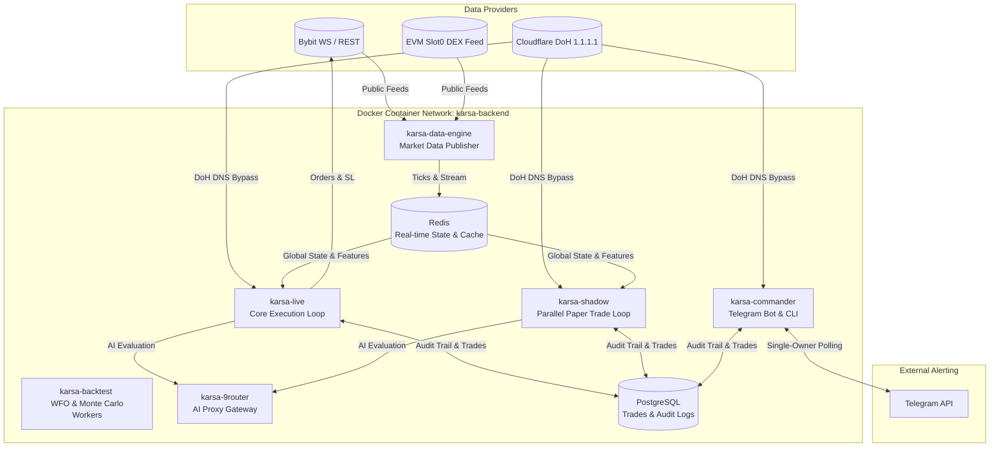

# Architecture Document
**Project Name:** `karsa-auto-session-manager`  
**Document Status:** Approved / Live Specification  
**Last Revised:** 2026-08-11

---

## 1. Architectural Philosophy

Karsa ASM is an autonomous, high-frequency, institutional-grade quantitative trading platform. It is structured around an **adaptive, multi-strategy Hub-and-Spoke design**, combining deterministic statistical signals with mandatory post-signal AI validation and strict multi-layered portfolio risk management.

To guarantee high execution velocity and zero IPC overhead, the core execution path operates as an `asyncio` single-process event loop within containerized deployment modes (`karsa-live` and `karsa-shadow`). Bot command polling, bulk backtesting, and data ingestion are cleanly decoupled into dedicated container services.

---

## 2. Multi-Container System Topology


```mermaid
graph TD
    subgraph DATA_FEEDS [Data Providers]
        BYBIT_WS[(Bybit WS / REST)]
        EVM_RPC[(EVM Slot0 DEX Feed)]
        CLOUDFLARE[(Cloudflare DoH 1.1.1.1)]
    end

    subgraph DOCKER_INFRA [Docker Container Network: karsa-backend]
        LIVE[karsa-live <br/> Core Execution Loop]
        SHADOW[karsa-shadow <br/> Parallel Paper Trade Loop]
        DATA_ENGINE[karsa-data-engine <br/> Market Data Publisher]
        COMMANDER[karsa-commander <br/> Telegram Bot & CLI]
        BACKTEST[karsa-backtest <br/> WFO & Monte Carlo Workers]
        NINE_ROUTER[karsa-9router <br/> AI Proxy Gateway]
        POSTGRES[(PostgreSQL <br/> Trades & Audit Logs)]
        REDIS[(Redis <br/> Real-time State & Cache)]
    end

    subgraph TELEGRAM_API [External Alerting]
        TG_BOT[Telegram API]
    end

    BYBIT_WS & EVM_RPC -->|Public Feeds| DATA_ENGINE
    CLOUDFLARE -->|DoH DNS Bypass| LIVE & SHADOW & COMMANDER
    DATA_ENGINE -->|Ticks & Stream| REDIS
    REDIS -->|Global State & Features| LIVE & SHADOW
    LIVE & SHADOW -->|AI Evaluation| NINE_ROUTER
    LIVE -->|Orders & SL| BYBIT_WS
    LIVE & SHADOW & COMMANDER <-->|Audit Trail & Trades| POSTGRES
    COMMANDER <-->|Single-Owner Polling| TG_BOT
```

---

## 3. Directory Map & Module Breakdown

```text
app/
├── main.py                     # Live execution loop entrypoint
├── core/
│   ├── config.py               # Pydantic Settings (.env secrets)
│   ├── database.py              # PostgreSQL async engine (asyncpg)
│   ├── redis_client.py          # Redis async client (aioredis)
│   ├── dns_fallback.py          # Standard-library DoH DNS fallback
│   ├── session.py               # Autonomous session manager
│   ├── state.py                 # In-memory state & Postgres sync
│   ├── trade_store.py           # Trade CRUD operations
│   ├── position_store.py        # Redis-backed position store
│   ├── shadow_store.py          # ShadowPositionStore & ShadowTradeStore
│   ├── trade_reconciler.py      # Trade reconciliation engine
│   ├── ai_client.py             # 9router async HTTP client
│   └── metrics.py               # Prometheus metrics collection
├── data/                        # Key 1 — Global Data Engine
│   ├── ccxt_manager.py          # CCXT Pro WS connection manager
│   ├── normalizer.py            # Exchange payload normalizer
│   ├── filters.py               # Bad tick & anomaly filter
│   ├── ohlcv_fetcher.py         # Multi-timeframe OHLCV fetcher
│   ├── onchain_feed.py          # EVM pool slot0 price fetcher
│   ├── universe_scorer.py       # Dynamic symbol scoring
│   └── universe_scanner.py      # Periodic symbol scanner
├── alpha/                       # Key 2 — Alpha Bridge (Hub & Spoke)
│   ├── regime_classifier.py     # The Hub: ADX + Hurst + ATR percentile
│   ├── multi_resolution_regime.py # 15m/1h/4h multi-resolution matcher
│   ├── strategy_router.py       # The Spokes: Regime-specific scoring
│   ├── signals.py               # Multi-signal composite generator
│   ├── ev_scorer.py             # EV composite scorer + DEX divergence
│   ├── ev_threshold.py          # Dynamic EV threshold manager
│   ├── lead_lag_buffer.py       # 15-min rolling price buffer
│   ├── entry_filter.py          # Pre-entry structural filter
│   ├── ta_tools.py              # TA indicator calculations
│   ├── analyst.py               # MANDATORY AI pre-entry analyst
│   ├── position_judge.py        # MANDATORY AI post-entry judge
│   └── multi_tf.py              # 4H trend filter & macro anchor
├── risk/                        # Key 3 — Risk Management
│   ├── portfolio_risk_manager.py # Pre-trade correlation, exposure & CB
│   ├── circuit_breaker.py       # Daily portfolio circuit breaker
│   ├── dynamic_risk_gate.py     # Regime-specific risk profiles
│   ├── sector_cap.py            # Sector diversity caps (max 2)
│   └── gates.py                 # Liquidity & spread health gates
├── execution/                   # Key 4 — Bybit Execution & APM
│   ├── bybit_client.py          # Bybit REST/WS client & exchange SL
│   ├── sor.py                   # Smart Order Router (Post-Only -> Market)
│   ├── position_manager.py      # Active Position Manager (APM loop)
│   └── shadow.py                # ShadowExecutor & ShadowAPM
├── consumer/                    # Pipeline Engine Loops
│   ├── market_consumer.py       # CCXT WS normalizer loop
│   ├── decision_engine.py       # Live pipeline orchestrator
│   ├── live_loop.py             # Live mode consumer loop
│   └── shadow_loop.py           # Shadow mode consumer loop
├── commander/                   # CLI & Bot Interface
│   └── main.py                  # Typer CLI & PTB bot container entry
├── backtest/                    # Backtesting System
│   ├── engine.py                # Replay backtest runner
│   ├── orchestrator.py          # Multi-symbol backtest coordinator
│   └── walk_forward.py          # Walk-forward optimizer
└── bot/                         # Key 7 — Telegram Command Bot
    ├── handlers/                # Telegram command & callback handlers
    ├── runner.py                # Single-owner PTB bot builder
    └── alert_service.py         # Push alert service
```

---

## 4. Key Subsystem Architectural Specifications

### A. Standard-Library DoH DNS Bypass (`app/core/dns_bypass.py`)
To overcome ISP UDP 53 DNS poisoning (e.g. Telkomsel/Indihome blocking exchange domain names), `setup_dns_bypass()` patches `socket.getaddrinfo` at container boot.
- Queries Cloudflare DoH (`https://1.1.1.1/dns-query`) over encrypted HTTPS (port 443).
- Uses standard-library `urllib.request` and `json` with zero external dependencies.
- Includes reentrancy protection (`_in_doh`) and numeric IP bypass. Resolves CloudFront IPs in ~50ms.

### B. Hub-and-Spoke Regime & Strategy System (`app/alpha/`)
- **The Hub (`RegimeClassifier`)**: Computes ADX(14), Hurst Exponent (R/S analysis), and ATR percentile to classify market state into `TREND_BULL`, `TREND_BEAR`, `RANGE`, or `CHOP`.
- **Multi-Resolution (`MultiResolutionRegimeClassifier`)**: Matches strategy holding periods across 15m, 1h, and 4h resolutions.
- **The Spokes (`StrategyRouter`)**: Evaluates regime-specific scoring branches:
  - **Trend**: Momentum + breakout validation + global sync.
  - **Range**: Bollinger Band edge-fade + wick rejection.
  - **Chop**: Orderbook sweeps + funding extremes. Forced confidence `0.0` on CHOP.

### C. Expected Value Composite Scorer & DEX Alpha (`app/alpha/ev_scorer.py`)
- Fuses 9 weighted technical and market indicators into a unified EV score.
- **DEX Lead-Lag Divergence**: Queries Redis `onchain:symbol:{symbol}` (populated by `OnChainFeed`). When DEX slot0 pool price leads Bybit CEX price in the trade direction, score receives up to a `+0.05` boost.
- **Dynamic Thresholding (`EVThreshold`)**: Dynamically shifts the base EV threshold ($0.55$) based on drawdown, session quality, and streak state.

### D. Mandatory AI Integration Layer (`app/core/ai_client.py`, `9router`)
- AI evaluation occurs at two safe points outside the hot execution path:
  1. Pre-entry `CryptoAnalyst`: Validates trade setup with historical `TradeMemory`.
  2. Post-entry `PositionJudge`: Assesses open positions for early exit or hold recommendations.
- Prompts are dispatched via `AIClient` to the local `9router` proxy (`http://karsa-9router:20129`).
- **Fail-Closed Safety**: Any AI HTTP error or timeout immediately defaults to `0.0` confidence, guaranteeing deterministic signal rejection.

### E. Portfolio Risk Manager (`app/risk/portfolio_risk_manager.py`)
Mandatory pre-trade filter that enforces four strict gates:
1. **Correlation Trap**: Max 2 concurrent open positions per sector.
2. **Gross Exposure Limit**: Notional position size cap relative to equity.
3. **Net Exposure Limit**: Directional imbalance cap (longs vs shorts).
4. **Daily Circuit Breaker**: Disables new entries if daily drawdown limit is breached.

### F. Active Position Manager (`app/execution/position_manager.py`)
Continuously monitors open positions in an async loop with crash-safe try/except handling:
- **Exchange-Side Stop Loss**: Hard Stop Loss placed on Bybit server immediately upon order fill.
- **Hard 5% SL Cap Lock**: Caps maximum risk to 5%.
- **Breakeven Lock**: Locks SL to breakeven once price reaches +1R profit.
- **Orphan Minimum Clean-up**: Automatically closes tiny residual positions (< 5 USDT notional).
- **Regime Shift Kill Switch**: Market-closes position immediately if market regime changes unfavorably.

### G. Single-Owner Telegram Bot Interface (`karsa-commander`)
To eliminate Telegram API long-polling conflicts (`Conflict: terminated by other long poll`), bot polling is assigned **exclusively** to the `karsa-commander` container (`KARSA_ROLE=commander`). Live trading containers (`karsa-live`) perform execution and push notifications via `AlertService` without running polling updaters.