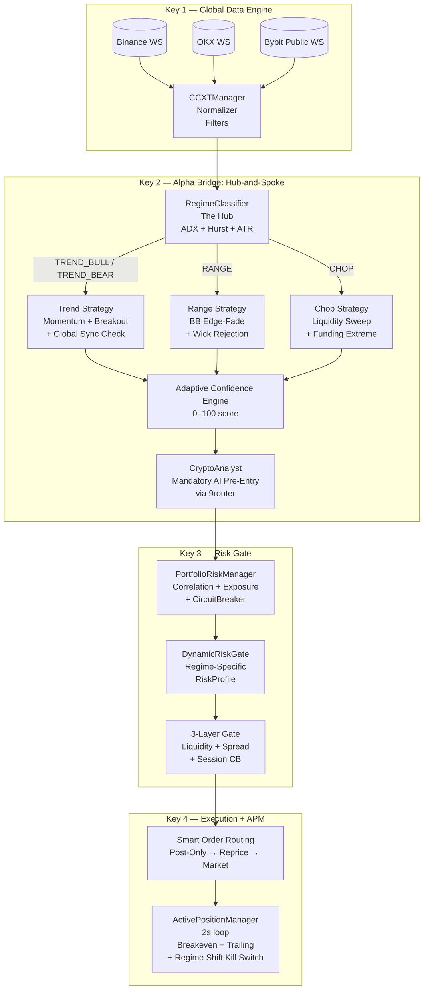

# Adaptive Multi-Strategy Engine: Hub-and-Spoke Design
**Document:** `docs/architecture/adaptive_multi_strategy.md`  
**Status:** Draft — Phase 6  
**Supersedes:** `docs/plan/adaptive_multi_strategy.md` (promoted from plan to authoritative spec)

---

## 1. Overview

ASM's Phase 5 architecture used a **single, static strategy** with a regime filter: if the market was CHOP, no trade was taken; otherwise, the same signal model and risk profile applied regardless of whether the market was trending or ranging.

This works, but it leaves money on the table and increases drawdown. A trending market rewards momentum entries with wide stops; a ranging market rewards mean-reversion fades with tight stops. Using a trend strategy in a range or a range strategy in a trend loses on both.

**Phase 6 solves this with a Hub-and-Spoke model:** a single `RegimeClassifier` (the Hub) routes signals through different strategy modules (the Spokes), each tuned for one market personality.

---

## 2. System Architecture

### 2.1 Data Flow Diagram



### 2.2 Component Ownership

| Component | Location | Status |
|:---|:---|:---|
| `RegimeClassifier` | `app/alpha/regime_classifier.py` | Planned (Phase 6) |
| `StrategyRouter` | `app/alpha/strategy_router.py` | Planned (Phase 6) |
| `DynamicRiskGate` | `app/risk/dynamic_risk_gate.py` | Planned (Phase 6) |
| `ActivePositionManager` | `app/execution/position_manager.py` | Planned (Phase 6) |
| `PortfolioRiskManager` | `app/risk/portfolio_risk_manager.py` | Planned (Phase 6) |
| Existing `regime.py` | `app/alpha/regime.py` | Active (to be refactored) |

---

## 3. RegimeClassifier — The Hub

**Location:** `app/alpha/regime_classifier.py`  
**Refresh cadence:** Every 15 minutes on BTC/USDT 1H candles (200 bars)  
**Output:** `MarketRegime` enum stored in Redis `system:config:regime`

### 3.1 Market Regime Enum

```python
from enum import Enum

class MarketRegime(Enum):
    TREND_BULL = "TREND_BULL"   # Strong uptrend: high ADX, price > SMA, H > 0.55
    TREND_BEAR = "TREND_BEAR"   # Strong downtrend: high ADX, price < SMA, H > 0.55
    RANGE      = "RANGE"        # Mean-reverting: low ADX, low Hurst
    CHOP       = "CHOP"         # Noisy, unpredictable: high ATR%, low ADX
```

### 3.2 Classification Inputs

Three indicators are computed from the 200-bar OHLCV dataset:

| Indicator | Calculation | Bullish/Trending Signal |
|:---|:---|:---|
| **ADX(14)** | Average Directional Index, 14-period | ADX ≥ 25 → strong trend |
| **Hurst Exponent** | R/S method, windows 10/20/40 | H > 0.55 → persistent trending; H < 0.45 → mean-reverting |
| **ATR Percentile** | ATR(14) ranked against 100-bar ATR history | > 80th pct = high volatility noise |

### 3.3 Classification Logic (Decision Tree)

```python
def classify(self, candles: list, orderbook_delta: float = 0.0) -> MarketRegime:
    closes = np.array([c.close for c in candles])
    highs  = np.array([c.high  for c in candles])
    lows   = np.array([c.low   for c in candles])

    adx             = self._calculate_adx(highs, lows, closes, period=14)
    hurst           = self._calculate_hurst(closes, windows=[10, 20, 40])
    atr_percentile  = self._calculate_atr_percentile(highs, lows, closes)

    # ── Rule 1: CHOP — High volatility noise with no directional structure ──
    # ATR is spiking (top 20%) AND ADX is weak (<20) → market is erratic
    if atr_percentile > 80 and adx < 20:
        return MarketRegime.CHOP

    # ── Rule 2: TREND — Strong directional momentum ──
    # ADX ≥ 25 (directional strength threshold)
    if adx >= 25:
        sma_20 = np.mean(closes[-20:])
        if closes[-1] > sma_20:
            return MarketRegime.TREND_BULL
        else:
            return MarketRegime.TREND_BEAR

    # ── Rule 3: RANGE — Low ADX + mean-reverting Hurst ──
    # ADX < 20 and Hurst < 0.45 → price is oscillating around a mean
    if adx < 20 and hurst < 0.45:
        return MarketRegime.RANGE

    # ── Fallback: RANGE is the conservative default ──
    # Ambiguous regime → assume mean-reverting, use tight risk profiles
    return MarketRegime.RANGE
```

### 3.4 Threshold Summary Table

| Condition | Threshold | Regime Output |
|:---|:---|:---|
| `atr_percentile > 80` AND `adx < 20` | ATR >80th pct, ADX <20 | CHOP |
| `adx >= 25` AND `close > SMA(20)` | ADX ≥25 | TREND_BULL |
| `adx >= 25` AND `close <= SMA(20)` | ADX ≥25 | TREND_BEAR |
| `adx < 20` AND `hurst < 0.45` | ADX <20, H <0.45 | RANGE |
| All other combinations | — | RANGE (fallback) |

> ⚠️ These thresholds (25, 20, 0.45, 0.55, 80) must be referenced from `SYSTEM_CONSTANTS.md` in the implementation. Never hardcode literals in the classifier body.

### 3.5 Edge Cases

| Scenario | Handling |
|:---|:---|
| < 50 candles available | Return `CHOP` (insufficient data, conservative) |
| All candles same close price (flat) | Hurst is undefined → default to `RANGE` |
| ADX exactly 25.0 | Inclusive threshold: `adx >= 25` routes to TREND |
| Hurst exactly 0.45 | Inclusive threshold: `hurst < 0.45` is False at 0.45 → RANGE fallback applies |
| `ohlcv_fetcher` unavailable | Log ERROR, return cached regime from Redis. If no cache, return `CHOP`. |

---

## 4. StrategyRouter — The Spokes

**Location:** `app/alpha/strategy_router.py`  
**Input:** `symbol`, `candles`, `regime: MarketRegime`, `direction: str`  
**Output:** `float` confidence score in range `[0.0, 100.0]`  
**Depends on:** `GlobalState` from the Data Engine (multi-exchange data)

### 4.1 Routing Logic

```python
def evaluate_signal(
    self,
    symbol: str,
    candles: list,
    regime: MarketRegime,
    direction: str,
) -> float:
    """Returns a confidence score from 0 to 100.
    A score of 0 means 'do not trade'. The final gate is >= 65 (0.65 normalized).
    """
    if regime in [MarketRegime.TREND_BULL, MarketRegime.TREND_BEAR]:
        return self._score_trend_strategy(symbol, candles, direction)

    elif regime == MarketRegime.RANGE:
        return self._score_range_strategy(symbol, candles, direction)

    elif regime == MarketRegime.CHOP:
        return self._score_chop_strategy(symbol, candles, direction)

    return 0.0  # Unknown regime → no trade
```

### 4.2 Trend Strategy Scoring (TREND_BULL / TREND_BEAR)

*Goal: Catch momentum moves early; avoid fakeouts where Bybit leads but global exchanges haven't confirmed.*

| Component | Score Weight | Trigger Condition |
|:---|:---|:---|
| **Momentum / Breakout** | +30 | Price breaks the 20-period high (long) or 20-period low (short) |
| **Volume Surge** | +30 | Current bar volume > 1.5× the 20-bar volume SMA |
| **Global Sync** (ASM's edge) | +40 | Binance AND OKX prices confirm the same directional move — Bybit breakout without global confirmation = fakeout, score = 0 on this component |

*Maximum score: 100. Minimum to pass confidence gate: 65.*

```python
def _score_trend_strategy(self, symbol, candles, direction) -> float:
    score = 0.0
    if self._is_breakout(candles, direction):        score += 30.0
    if self._is_volume_surge(candles):               score += 30.0
    if self.global_data.is_global_sync(symbol, direction):  score += 40.0
    return score
```

### 4.3 Range Strategy Scoring (RANGE)

*Goal: Fade price extremes at the edges of a well-defined range; exit quickly at the midpoint.*

| Component | Score Weight | Trigger Condition |
|:---|:---|:---|
| **BB Edge Touch** | +40 | Price pierced the Bollinger Band at 2.5 standard deviations |
| **Wick Rejection** | +40 | The candle closed back inside the range (pin bar / wick rejection pattern) |
| **RSI Exhaustion** | +20 | RSI > 75 for shorts or RSI < 25 for longs (momentum exhaustion) |

*Maximum score: 100. Note: BB edge alone (40) is insufficient to pass the 65 threshold — wick rejection confirmation is required.*

```python
def _score_range_strategy(self, symbol, candles, direction) -> float:
    score = 0.0
    if self._is_bb_extreme(candles, direction, std_dev=2.5): score += 40.0
    if self._is_wick_rejection(candles, direction):           score += 40.0
    if self._is_rsi_extreme(candles, direction):              score += 20.0
    return score
```

### 4.4 Chop Strategy Scoring (CHOP)

*Goal: Only trade when a clear structural event occurs (liquidity sweep or funding extreme) — otherwise stay flat.*

| Component | Score Weight | Trigger Condition |
|:---|:---|:---|
| **Liquidity Sweep** | +50 | Massive order-book delta suddenly reversing direction (bid wall disappears or appears) |
| **Funding Extreme** | +50 | Funding rate is heavily skewed against the trade direction (e.g., strongly positive for a short entry) |

*Maximum score: 100. Neither component alone (50) passes the 65 threshold — both signals must fire simultaneously. This is intentional: CHOP trades are rare, high-conviction events only.*

```python
def _score_chop_strategy(self, symbol, candles, direction) -> float:
    score = 0.0
    if self._is_liquidity_sweep(symbol, direction): score += 50.0
    if self._is_funding_extreme(symbol, direction): score += 50.0
    return score
```

---

## 5. DynamicRiskGate — Regime-Specific Risk Profiles

**Location:** `app/risk/dynamic_risk_gate.py`

A multi-strategy bot fails if it applies the same stop loss to a trend trade and a range trade. The `DynamicRiskGate` assigns a **`RiskProfile`** to each trade at entry. This profile travels with the position and governs the `ActivePositionManager`'s behavior for the trade's entire lifecycle.

### 5.1 RiskProfile Dataclass

```python
from dataclasses import dataclass

@dataclass
class RiskProfile:
    regime:             str         # MarketRegime value, stored with position
    size_multiplier:    Decimal     # Multiplier applied to base position size
    take_profit_type:   str         # 'TRAILING' | 'FIXED' | 'SCALP'
    stop_loss_type:     str         # 'WIDE' | 'TIGHT' | 'MICRO'
    max_hold_time_mins: int         # Hard time exit ceiling
    use_post_only:      bool        # Force Post-Only for maker fee guarantee
    trail_atr_mult:     Decimal     # For TRAILING type: ATR multiple for Chandelier
    sl_atr_buffer:      Decimal     # ATR multiple added to swing SL for wick-hunt protection
```

### 5.2 Regime-to-Profile Mapping

| Parameter | TREND | RANGE | CHOP |
|:---|:---|:---|:---|
| `size_multiplier` | `1.0` | `0.7` | `0.3` |
| `take_profit_type` | `TRAILING` | `FIXED` | `SCALP` |
| `stop_loss_type` | `WIDE` | `TIGHT` | `MICRO` |
| `max_hold_time_mins` | `1440` (24h) | `240` (4h) | `30` (30min) |
| `use_post_only` | `False` | `True` | `True` |
| `trail_atr_mult` | `3.0` | n/a | n/a |
| `sl_atr_buffer` | `1.0` | `0.0` | `0.0` |

*Notes:*
- **TREND:** Allows market orders (`use_post_only=False`) when confidence > 85 (strong breakout momentum).
- **RANGE/CHOP:** Strict Post-Only — maker fees only. If the order cannot fill as maker, do not enter.
- **`size_multiplier`** is applied to the base size derived from `balance × risk_pct / price`. Final size must still pass the `$50 minimum notional` check in the executor.

---

## 6. Adaptive Confidence Engine

The final confidence score passed to the AI analyst and risk gate is a composite of:

```text
final_quant_score = StrategyRouter.evaluate_signal(...)   # 0–100

# After AI analyst review:
final_confidence = (final_quant_score / 100) × 0.5 + ai_confidence × 0.5

# Gate: final_confidence >= 0.65 to proceed
```

This matches the existing Phase 5 formula. The change in Phase 6 is that `final_quant_score` now comes from the `StrategyRouter` (regime-specific) instead of the static composite.

---

## 7. Implementation Roadmap (Shadow → Live)

> Follow this exact deployment sequence. Do NOT push all phases at once.

| Week | Phase | What Changes | Execution Impact |
|:---|:---|:---|:---|
| 1 | **Shadow Mode** | Implement `RegimeClassifier` + `StrategyRouter`. Log what the Router *would have scored*, but don't change execution. | None — bot trades as normal |
| 2 | **Risk Profile Gate** | Enable `DynamicRiskGate`. Deploy to **live Bybit at 10% normal size**. Verify stops tighten in RANGE and widen in TREND. | Live, micro-size |
| 3 | **Live at 25% size** | Deploy to live. Set global `MAX_PORTFOLIO_RISK` to 25% of normal. Test fakeout detection and Post-Only execution. | Live, fractional |
| 4 | **Full deployment** | Scale to 100%. Monitor Grafana: if CHOP strategy is net negative, set `CHOP.size_multiplier = 0.0`. | Full live |

---

## 8. Prometheus Metrics (New — Phase 6)

> These are proposed additions. Flag as new for review against `docs/METRICS_DICTIONARY.md` before implementing.

| Metric Name | Type | Labels | Description |
|:---|:---|:---|:---|
| `asm_regime_classification_total` | Counter | `regime` | Count of regime classifications by type |
| `asm_strategy_confidence_score` | Histogram | `regime`, `symbol` | Distribution of raw confidence scores per regime |
| `asm_signal_regime_total` | Counter | `regime`, `outcome` (pass/reject) | Signals evaluated per regime, pass vs reject |
| `asm_active_positions_by_regime` | Gauge | `regime` | Current open positions tagged by entry regime |

---

## 9. Redis Keys (New — Phase 6)

> Cross-reference with `docs/REDIS_OWNERSHIP.md` before implementing. All keys are single-writer.

| Key | Type | Writer | Description |
|:---|:---|:---|:---|
| `system:config:regime` | String | `RegimeClassifier` | Current market regime enum value |
| `position:{symbol}:risk_profile` | Hash | `DynamicRiskGate` | Serialized `RiskProfile` for open position |
| `position:{symbol}:entry_regime` | String | `Bybit Executor` | Regime at time of entry (immutable after set) |
