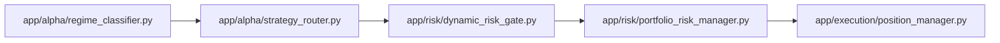
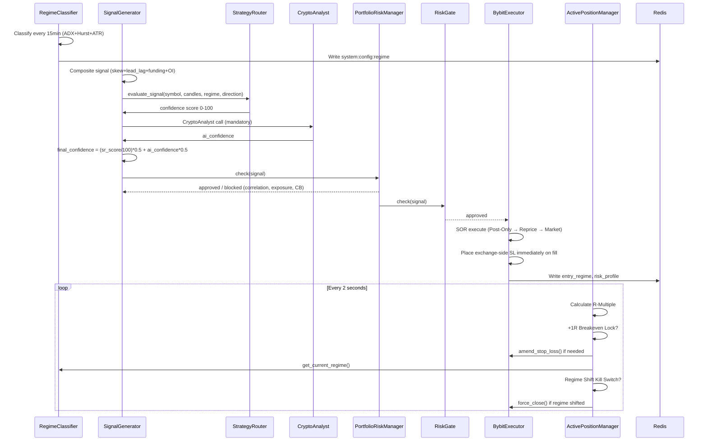

# Phase 6 Implementation Plan: Adaptive Multi-Strategy Engine
**Project:** `karsa-auto-session-manager`  
**Status:** Ready for execution — Phase 5 live-deployed
**Last Revised:** 2026-07-17 — WARP→WireGuard cleanup
**Environment:** Bybit **main URL** (live) via WireGuard VPN (gluetun sidecar). No testnet. $1 max-loss-per-position SL hard cap as safety boundary.

---

## 0. Pre-Work Checklist

Before writing a single line of code, confirm the following:

- [ ] Open Issues #10 and #11 in `CONTEXT.md §7` are discussed with the team (CircuitBreaker thresholds)
- [ ] `docs/DATA_MODEL.md` reviewed for any new fields needed (`entry_regime`, `initial_risk_per_unit`, `moved_to_breakeven`, `current_sl`, `risk_profile_json`)
- [ ] `docs/SYSTEM_CONSTANTS.md` updated with placeholder entries for all new Phase 6 thresholds before any code is written
- [ ] `graphify update .` run to baseline the current graph before changes

---

## 1. Scope Summary

Five new modules are being implemented. All are **additive** — they extend the existing pipeline without removing or replacing any existing safety systems.



| # | Module | File | Dependencies | Phase 6 Sub-Phase |
|:--|:---|:---|:---|:---|
| 1 | `RegimeClassifier` | `app/alpha/regime_classifier.py` | `app/alpha/ta_tools.py`, `app/data/ohlcv_fetcher.py`, Redis | 6.1 |
| 2 | `StrategyRouter` | `app/alpha/strategy_router.py` | `RegimeClassifier`, `GlobalState`, `ta_tools.py` | 6.2 |
| 3 | `DynamicRiskGate` | `app/risk/dynamic_risk_gate.py` | `RegimeClassifier` | 6.3 |
| 4 | `PortfolioRiskManager` | `app/risk/portfolio_risk_manager.py` | `position_store.py`, `sector_mapping.py`, `bybit_client.py`, Redis | 6.4 |
| 5 | `ActivePositionManager` | `app/execution/position_manager.py` | `bybit_client.py`, `state.py`, `RegimeClassifier` | 6.5 |

---

## 2. New Constants to Add to `SYSTEM_CONSTANTS.md`

Add these before implementing any module. Use `TODO: pending ratification` comments for Issues #10 and #11 values.

| Constant Name | Proposed Value | Module | Status |
|:---|:---|:---|:---|
| `REGIME_ADX_TREND_THRESHOLD` | `25` | `regime_classifier.py` | Confirmed (matches existing `regime.py:32`) |
| `REGIME_ADX_CHOP_THRESHOLD` | `20` | `regime_classifier.py` | Confirmed (matches existing `regime.py:33`) |
| `REGIME_HURST_MR_THRESHOLD` | `0.45` | `regime_classifier.py` | Confirmed (matches existing `regime.py:31`) |
| `REGIME_ATR_CHOP_PERCENTILE` | `80` | `regime_classifier.py` | Confirmed |
| `TREND_SCORE_BREAKOUT` | `30` | `strategy_router.py` | Confirmed |
| `TREND_SCORE_VOLUME` | `30` | `strategy_router.py` | Confirmed |
| `TREND_SCORE_GLOBAL_SYNC` | `40` | `strategy_router.py` | Confirmed |
| `RANGE_SCORE_BB_EDGE` | `40` | `strategy_router.py` | Confirmed |
| `RANGE_SCORE_WICK` | `40` | `strategy_router.py` | Confirmed |
| `RANGE_SCORE_RSI` | `20` | `strategy_router.py` | Confirmed |
| `CHOP_SCORE_LIQUIDITY_SWEEP` | `50` | `strategy_router.py` | Confirmed |
| `CHOP_SCORE_FUNDING_EXTREME` | `50` | `strategy_router.py` | Confirmed |
| `TREND_SIZE_MULT` | `1.0` | `dynamic_risk_gate.py` | Confirmed |
| `RANGE_SIZE_MULT` | `0.7` | `dynamic_risk_gate.py` | Confirmed |
| `CHOP_SIZE_MULT` | `0.3` | `dynamic_risk_gate.py` | Confirmed |
| `TREND_MAX_HOLD_MINS` | `1440` | `dynamic_risk_gate.py` | Confirmed |
| `RANGE_MAX_HOLD_MINS` | `240` | `dynamic_risk_gate.py` | Confirmed |
| `CHOP_MAX_HOLD_MINS` | `30` | `dynamic_risk_gate.py` | Confirmed |
| `APM_MONITOR_INTERVAL_S` | `2` | `position_manager.py` | Confirmed |
| `APM_ERROR_BACKOFF_S` | `5` | `position_manager.py` | Confirmed |
| `APM_RECONCILE_INTERVAL_S` | `300` | `position_manager.py` | Confirmed |
| `APM_BREAKEVEN_FEE_PCT` | `0.001` | `position_manager.py` | Confirmed |
| `APM_TREND_TRAIL_ATR_MULT` | `3.0` | `position_manager.py` | Confirmed |
| `APM_TREND_TRAIL_ACTIVATE_R` | `1.5` | `position_manager.py` | Confirmed |
| `APM_BREAKEVEN_LOCK_R` | `1.0` | `position_manager.py` | Confirmed |
| `PRM_MAX_SECTOR_POSITIONS` | `2` | `portfolio_risk_manager.py` | Confirmed |
| `PRM_MAX_GROSS_EXPOSURE_PCT` | TBD | `portfolio_risk_manager.py` | **Pending team ratification** |
| `PRM_MAX_NET_EXPOSURE_PCT` | TBD | `portfolio_risk_manager.py` | **Pending team ratification** |
| `PRM_DAILY_LOSS_LIMIT` | TBD (proposed: -3%) | `portfolio_risk_manager.py` | **Pending — Issue #11** |
| `PRM_MAX_CONSECUTIVE_LOSSES` | TBD (proposed: 4) | `portfolio_risk_manager.py` | **Pending — Issue #10** |
| `PRM_LOSS_PAUSE_MINUTES` | `60` | `portfolio_risk_manager.py` | Confirmed |

---

## 3. New DB Fields Required

Cross-reference with `docs/DATA_MODEL.md` before implementation. Add these columns to the `trades` table in `scripts/init_db.sql`:

```sql
-- New Phase 6 columns for trades table
ALTER TABLE trades ADD COLUMN entry_regime     VARCHAR(20);
ALTER TABLE trades ADD COLUMN initial_risk_per_unit  NUMERIC(20,8);
ALTER TABLE trades ADD COLUMN moved_to_breakeven     BOOLEAN DEFAULT FALSE;
ALTER TABLE trades ADD COLUMN current_sl             NUMERIC(20,8);
ALTER TABLE trades ADD COLUMN risk_profile_json      JSONB;
```

> ⚠️ These DDL changes must be reviewed against the current live `scripts/init_db.sql` and applied as a migration. Do not rely on `ALTER TABLE` on a running production DB without a backup and a down-migration script.

---

## 4. New Redis Keys

| Key | Type | TTL | Writer | Purpose |
|:---|:---|:---|:---|:---|
| `system:config:regime` | String | None | `RegimeClassifier` | Current market regime (already exists, re-owned by new classifier) |
| `position:{symbol}:risk_profile` | Hash | None | `DynamicRiskGate` | Serialized `RiskProfile` for open position |
| `position:{symbol}:entry_regime` | String | None | `BybitExecutor` | Regime at fill time (immutable) |
| `risk:portfolio_cb:daily_loss_fired` | String | None | `PortfolioRiskManager` | `0`/`1` — reset at UTC midnight |
| `risk:portfolio_cb:consecutive_loss_count` | String | None | `PortfolioRiskManager` | Current consecutive loss streak |
| `risk:portfolio_cb:blocked_until` | String | None | `PortfolioRiskManager` | ISO timestamp for entry block expiry |
| `risk:portfolio_cb:start_of_day_equity` | String | None | `PortfolioRiskManager` | Equity at UTC 00:00 |

---

## 5. Sub-Phase Implementation Plan

### Sub-Phase 6.1 — RegimeClassifier (The Hub)
**File:** `app/alpha/regime_classifier.py`  
**Effort:** ~4–6 hours  
**Deployment mode:** Shadow (log output only, existing `regime.py` still drives decisions)

#### Tasks
- [ ] Create `MarketRegime` enum: `TREND_BULL`, `TREND_BEAR`, `RANGE`, `CHOP`
- [ ] Implement `RegimeClassifier.classify(candles, orderbook_delta)` with the decision tree from `docs/architecture/adaptive_multi_strategy.md §3.3`
- [ ] Implement `_calculate_adx()` — can delegate to `ta_tools.py` if method exists
- [ ] Implement `_calculate_hurst()` — R/S method, windows `[10, 20, 40]`
- [ ] Implement `_calculate_atr_percentile()` — ATR(14) ranked against 100-bar ATR history
- [ ] Edge case handling: `< 50 candles → CHOP`, flat prices → `RANGE`, ADX exactly 25.0 is inclusive
- [ ] Write to Redis `system:config:regime` as `{"regime": "TREND_BULL", "adx": 27.3, "hurst": 0.58, "atr_pct": 65}`
- [ ] Add `get_current_regime(symbol)` async method (reads from Redis)
- [ ] Wire into `main.py` as a new background task (15-min refresh on BTC 1H candles)
- [ ] **Shadow mode:** Log what the new classifier says vs what existing `regime.py` says. Do NOT replace `regime.py` yet.

#### Tests (`tests/unit/test_regime_classifier.py`)
- [ ] All 4 regime outputs with deterministic candle fixtures
- [ ] Boundary: ADX = 24.9 → RANGE, ADX = 25.0 → TREND
- [ ] Boundary: Hurst = 0.45 → not RANGE, Hurst = 0.44 → RANGE
- [ ] Boundary: ATR percentile = 79 + ADX < 20 → not CHOP; ATR percentile = 81 + ADX < 20 → CHOP
- [ ] < 50 candles → CHOP
- [ ] All-flat candles → RANGE
- [ ] Redis unavailable → returns `CHOP` (conservative)

#### DoD Checklist
- [ ] `ruff`, `black`, `mypy --strict` pass
- [ ] > 90% unit coverage
- [ ] No `float` for any threshold comparisons — use `Decimal` or compare raw numpy arrays as appropriate
- [ ] Shadow mode running in Docker for at least 48h before advancing to 6.2

---

### Sub-Phase 6.2 — StrategyRouter (The Spokes)
**File:** `app/alpha/strategy_router.py`  
**Effort:** ~6–8 hours  
**Deployment mode:** Shadow (logs confidence scores, existing signal pipeline unchanged)  
**Depends on:** Sub-Phase 6.1 complete and stable in shadow mode

#### Tasks
- [ ] Implement `StrategyRouter.evaluate_signal(symbol, candles, regime, direction) → float`
- [ ] Implement `_score_trend_strategy()`: breakout check + volume surge + global sync check
  - Breakout: price > rolling 20-period high (long) or < rolling 20-period low (short)
  - Volume surge: current volume > 1.5× SMA(20) of volume
  - Global sync: `GlobalState.prices` for Binance + OKX both agree on directional move
- [ ] Implement `_score_range_strategy()`: BB extreme (2.5 StdDev) + wick rejection + RSI exhaustion
  - BB extreme: uses `ta_tools.calculate_bollinger_bands()` with std_dev=2.5
  - Wick rejection: current candle closed back inside bands after piercing
  - RSI exhaustion: RSI > 75 for short, RSI < 25 for long
- [ ] Implement `_score_chop_strategy()`: liquidity sweep detection + funding extreme
  - Liquidity sweep: orderbook delta reversal from `GlobalState.global_skew`
  - Funding extreme: `GlobalState.global_funding_avg` thresholds (calibrate in shadow mode)
- [ ] **Shadow mode:** Log `StrategyRouter` scores alongside the existing composite score. Compare. No execution change.

#### Tests (`tests/unit/test_strategy_router.py`)
- [ ] TREND_BULL: all 3 components fire → 100, only breakout → 30, only global_sync → 40
- [ ] RANGE: BB + wick → 80 (passes gate), BB alone → 40 (fails gate)
- [ ] CHOP: both fire → 100, only sweep → 50 (fails gate)
- [ ] TREND_BEAR direction scoring (SHORT entries)
- [ ] Mock `global_data` to test fakeout detection (Binance/OKX disagree with Bybit)
- [ ] Unknown regime → 0.0

#### DoD Checklist
- [ ] `ruff`, `black`, `mypy --strict` pass
- [ ] > 90% unit coverage
- [ ] Shadow mode logging for 48h minimum before 6.3

---

### Sub-Phase 6.3 — DynamicRiskGate
**File:** `app/risk/dynamic_risk_gate.py`  
**Effort:** ~3–4 hours  
**Deployment mode:** Initially in shadow mode; then wired to execution at 10% normal size  
**Depends on:** Sub-Phase 6.1 complete

#### Tasks
- [ ] Define `RiskProfile` dataclass with all fields from `docs/architecture/adaptive_multi_strategy.md §5.1`
- [ ] Implement `DynamicRiskGate.get_profile(regime: MarketRegime) → RiskProfile`
- [ ] Attach `RiskProfile` to signal object before risk gate (pass it into `executor_task`)
- [ ] Wire `RiskProfile.size_multiplier` into position sizing in `main.py`
- [ ] Wire `RiskProfile.max_hold_time_mins` into `ActivePositionManager` (sub-phase 6.5)
- [ ] Wire `RiskProfile.use_post_only` into `sor.py` (override the SOR behavior based on regime)
- [ ] Serialize `RiskProfile` to JSON and write to Redis `position:{symbol}:risk_profile` on fill
- [ ] Write `entry_regime` to Redis `position:{symbol}:entry_regime` on fill

#### Tests (`tests/unit/test_dynamic_risk_gate.py`)
- [ ] TREND profile: `size_multiplier=1.0`, `use_post_only=False`, `max_hold_time_mins=1440`
- [ ] RANGE profile: `size_multiplier=0.7`, `use_post_only=True`, `max_hold_time_mins=240`
- [ ] CHOP profile: `size_multiplier=0.3`, `use_post_only=True`, `max_hold_time_mins=30`
- [ ] Minimum notional check: `(base_size × multiplier × price) < $50` → skip trade
- [ ] `RiskProfile` serialization round-trip (to JSON and back)

---

### Sub-Phase 6.4 — PortfolioRiskManager
**File:** `app/risk/portfolio_risk_manager.py`  
**Effort:** ~6–8 hours  
**Deployment mode:** Wired into execution flow immediately (fail-safe defaults: BLOCK on unavailable data)  
**Depends on:** None (can be built in parallel with 6.1–6.3)

> ⚠️ Do not implement `PRM_DAILY_LOSS_LIMIT` or `PRM_MAX_CONSECUTIVE_LOSSES` numeric values until Issues #10 and #11 are resolved. Use a `raise NotImplementedError("Pending threshold ratification")` placeholder and skip those checks in code until confirmed.

#### Tasks
- [ ] Define `CheckResult` and `PRMResult` dataclasses
- [ ] Implement `PortfolioRiskManager.check(signal) → PRMResult`
- [ ] Implement `_check_correlation_trap()`: count open positions per `sector_mapping.get_sector(symbol)`, block if >= `PRM_MAX_SECTOR_POSITIONS` (BTC/ETH are anchors, not capped)
- [ ] Implement `_check_exposure_limits()`: fetch live mark prices, compute gross/net notional, compare to equity thresholds (thresholds from `SYSTEM_CONSTANTS.md` — use `TODO` until confirmed)
- [ ] Implement `_check_daily_loss_circuit_breaker()`: compare today's equity vs `start_of_day_equity` from Redis (skip if Issue #11 unresolved)
- [ ] Implement `_check_consecutive_loss_circuit_breaker()`: read last N closed trades from `trade_store`, count streak (skip if Issue #10 unresolved)
- [ ] Write CB state to Redis keys defined in §4 above
- [ ] Reset `daily_loss_fired` and `start_of_day_equity` at UTC 00:00:00 (add to scheduler or startup routine)
- [ ] **Wire into `main.py` executor_task**: `PortfolioRiskManager.check()` must be called BEFORE `risk_gate.check()`. Enforce this by code ordering.
- [ ] Implement fail-safe: any exception in PRM → log CRITICAL, return `PRMResult(approved=False, ...)`

#### Tests (`tests/unit/test_portfolio_risk_manager.py`)
- [ ] 2 L1 alts open, 3rd L1 signal → blocked
- [ ] 2 L1 alts open, BTC signal → allowed (anchor)
- [ ] 0 positions open → all checks pass
- [ ] Gross exposure projected at 81% vs 80% limit → blocked
- [ ] Net exposure projected beyond limit → blocked
- [ ] Redis unavailable → fail-safe BLOCK
- [ ] Bybit equity fetch fails → fail-safe BLOCK
- [ ] Correlation check: different sectors don't interfere

#### DoD Checklist
- [ ] `ruff`, `black`, `mypy --strict` pass
- [ ] > 90% coverage
- [ ] `PortfolioRiskManager.check()` is called BEFORE any other gate in `executor_task` — verified by code review and integration test
- [ ] Fail-safe returns BLOCK (never ALLOW) on data unavailability

---

### Sub-Phase 6.5 — ActivePositionManager (APM)
**File:** `app/execution/position_manager.py`  
**Effort:** ~8–10 hours  
**Deployment mode:** Wired at 10% position size with $1 SL cap initially  
**Depends on:** 6.1 (RegimeClassifier), 6.3 (DynamicRiskGate) complete

#### Tasks
- [ ] Implement `ActivePositionManager` class with `__init__(bybit_client, state_manager, regime_classifier, alert_service, logger)`
- [ ] Implement `start_monitoring()` main loop: `try/except Exception + await asyncio.sleep(APM_MONITOR_INTERVAL_S)`, error backoff `asyncio.sleep(APM_ERROR_BACKOFF_S)`
- [ ] Implement `_calculate_r_multiple(pos, live_price) → Decimal`: zero-division guard, LONG/SHORT asymmetry, reads `initial_risk_per_unit` from DB
- [ ] Implement `_move_stop_to_breakeven(pos)`:
  - Calculates `entry ± (entry × APM_BREAKEVEN_FEE_PCT)`
  - Calls `await executor.amend_stop_loss(symbol, new_sl)` — exchange-side
  - On failure: log CRITICAL + Telegram alert + retry once + force-close on second failure
  - Sets `moved_to_breakeven=True` in DB + Redis (prevent re-trigger)
- [ ] Implement `_manage_trend_trailing_stop(pos, live_price, r_multiple)`:
  - Activates only at `r_multiple >= APM_TREND_TRAIL_ACTIVATE_R`
  - Uses `3x ATR` Chandelier via `ta_tools.calculate_atr()`
  - Only amends if new SL is more protective than current SL (LONG: higher; SHORT: lower)
- [ ] Implement `_manage_time_exit(pos, max_minutes)`: compare `entry_timestamp` to `datetime.now(UTC)`
- [ ] Implement Regime Shift Kill Switch in `_manage_single_position()`: check `regime_classifier.get_current_regime()` vs `pos['entry_regime']`
- [ ] Implement `_force_close_position(pos, reason)`: cancel all → market close → update state → Telegram alert
- [ ] Implement `_reconcile_positions()`: compare internal state vs `executor.get_positions()`, fix ghost positions
- [ ] **Wire into `main.py`**: `asyncio.create_task(apm.start_monitoring())` at startup
- [ ] **Store `initial_risk_per_unit` at fill time** in `executor_task`: `initial_risk_per_unit = abs(fill_price - initial_sl_price)` as `Decimal`, written to `trades` table

#### Integration Tests (`tests/integration/test_apm.py`)
- [ ] Mock position at +0.9R → breakeven NOT triggered
- [ ] Mock position at +1.0R → `amend_stop_loss()` called once with correct new_sl
- [ ] Mock position at +1.0R with `moved_to_breakeven=True` → `amend_stop_loss()` NOT called again
- [ ] Mock RANGE position at +1.0R → `_scale_out_position()` called + SL amended
- [ ] Mock TREND position, regime shifts to RANGE → `_force_close_position()` called
- [ ] Mock RANGE position, 241 minutes held → time exit triggered
- [ ] `amend_stop_loss()` raises exception → retry once → second fail → force close
- [ ] Ghost reconciliation: internal has position, Bybit says flat → state corrected

#### DoD Checklist
- [ ] `ruff`, `black`, `mypy --strict` pass
- [ ] > 90% integration test coverage for all APM transitions
- [ ] `try/except + asyncio.sleep(5)` on ALL error paths in `start_monitoring()` — no tight infinite loops
- [ ] `amend_stop_loss()` is ALWAYS called for SL changes — no in-memory-only SL updates
- [ ] `moved_to_breakeven` flag written to DB before the cycle ends — not after

---

## 6. Wiring into `main.py`

The following changes to `app/main.py` are required across all sub-phases:

```python
# New tasks to create_task() at startup
asyncio.create_task(regime_classifier.run_classification_loop())  # 6.1
asyncio.create_task(portfolio_risk_manager.reset_daily_state_loop())  # 6.4 (UTC midnight reset)
asyncio.create_task(active_position_manager.start_monitoring())  # 6.5

# Updated executor_task call order (MANDATORY ordering):
# 1. portfolio_risk_manager.check(signal)  ← NEW (6.4)
# 2. risk_gate.check(signal)               ← existing
# 3. sector_cap.check(signal)              ← existing
# 4. sor.execute(signal, risk_profile)     ← existing + risk_profile added (6.3)
```

---

## 7. Data Flow (Updated with Phase 6)



---

## 8. Deployment Sequence

> **Environment: Bybit main URL (live). No testnet. $1 SL cap always active.**

| Week | Sub-Phases Active | Mode | Risk Control |
|:---|:---|:---|:---|
| 1 | 6.1 shadow | Shadow (log only) | Zero — no execution change |
| 2 | 6.1 + 6.2 shadow | Shadow (log only) | Zero — no execution change |
| 3 | 6.3 + 6.4 wired | Live at 10% size | $1 SL cap + `PRM_MAX_SECTOR_POSITIONS=2` |
| 4 | 6.5 (APM) wired | Live at 10% size | $1 SL cap + APM regime shift kill switch |
| 5 | Full Phase 6 | Live at 25% size | Full PRM + APM active |
| 6+ | Tune & observe | Full size | Monitor by regime: disable CHOP if net negative |

---

## 9. Testing Commands

```bash
# Unit tests for new Phase 6 modules
pytest tests/unit/test_regime_classifier.py -v
pytest tests/unit/test_strategy_router.py -v
pytest tests/unit/test_dynamic_risk_gate.py -v
pytest tests/unit/test_portfolio_risk_manager.py -v
pytest tests/integration/test_apm.py -v

# Full suite + linting (required before any merge)
pytest && ruff check . && black --check . && mypy --strict app/

# Coverage report
pytest --cov=app --cov-report=term-missing tests/
```

---

## 10. Definition of Done (Phase 6)

A sub-phase is done when ALL of the following are true:

- [ ] Module file exists in the planned location
- [ ] All tasks in the sub-phase checklist above are checked off
- [ ] All tests in the sub-phase test section pass with > 90% coverage
- [ ] `ruff check`, `black --check`, `mypy --strict app/` pass with 0 errors
- [ ] Shadow mode has run for ≥ 48h without errors (for 6.1 and 6.2 only)
- [ ] No `float` for money, no hardcoded secrets, no silent `except: pass`
- [ ] `docs/DATA_MODEL.md` updated if any new DB fields or Redis keys were added
- [ ] `docs/SYSTEM_CONSTANTS.md` updated with final confirmed threshold values
- [ ] `graphify update .` run after all code changes

---

## 11. Open Issues (Blocking Phase 6 Completion)

| Issue | Blocks | Action Required |
|:---|:---|:---|
| **CONTEXT.md #10** — Consecutive loss limit: 3 vs 4 | `PRM._check_consecutive_loss_circuit_breaker()` implementation | Team decision: confirm 4 or use existing 3 |
| **CONTEXT.md #11** — Daily loss % ordering: 3% portfolio CB vs 2% hard stop | `PRM._check_daily_loss_circuit_breaker()` implementation | Team decision: confirm 3% is correct and understand that hard stop fires first |
| **PRM exposure thresholds** — `PRM_MAX_GROSS_EXPOSURE_PCT` and `PRM_MAX_NET_EXPOSURE_PCT` | `PRM._check_exposure_limits()` | Team decision: set initial conservative values (e.g., 80% gross, 50% net) |
