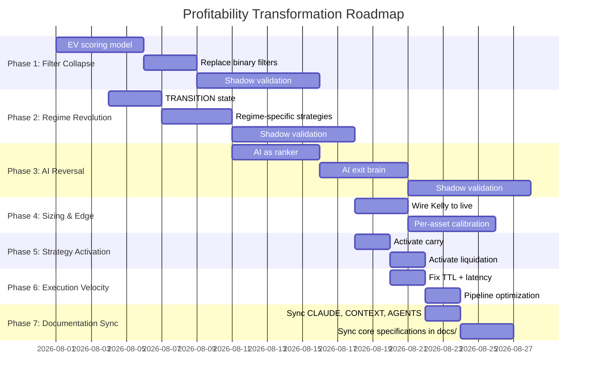

# 🎯 MASTER PLAN: Turning Karsa Into a Profitable Trading System

**Author:** Crypto Trader Persona (Roast-Driven Refactor)  
**Date:** 2026-07-31  
**Status:** BRAINSTORM → Awaiting Review  
**Prerequisite:** [crypto_trader_roast.md](./crypto_trader_roast.md) — the diagnosis this plan treats.

---

## The Problem (One Sentence)

Karsa has world-class architecture and position management but generates **almost zero trades** because its 25+ sequential filters, conservative regime classifier, and AI-as-veto-gate design systematically kill every profitable opportunity before execution.

## The Goal (One Sentence)

Transform Karsa from a "Don't Trade" machine into a **calibrated bet-placement engine** that takes 5-15 high-EV trades per day across 150+ symbols, with position sizing driven by Kelly Criterion and exits managed by the already-excellent APM.

---

## Plan Structure

This plan is organized into **7 phases**, ordered by **impact on profitability and documentation integrity**. Each phase is a separate markdown file with full implementation details.

| Phase | File | Title | Impact | Effort | Risk |
|:---:|---|---|:---:|:---:|:---:|
| 1 | [01_FILTER_COLLAPSE.md](./01_FILTER_COLLAPSE.md) | **Filter Collapse** — Replace 25 gates with EV-based scoring | 🔥🔥🔥🔥🔥 | Medium | Low |
| 2 | [02_REGIME_REVOLUTION.md](./02_REGIME_REVOLUTION.md) | **Regime Revolution** — Make every regime tradeable | 🔥🔥🔥🔥 | Medium | Medium |
| 3 | [03_AI_ROLE_REVERSAL.md](./03_AI_ROLE_REVERSAL.md) | **AI Role Reversal** — From veto gate to alpha ranker + exit brain | 🔥🔥🔥🔥 | High | Medium |
| 4 | [04_SIZING_AND_EDGE.md](./04_SIZING_AND_EDGE.md) | **Sizing & Edge** — Wire Kelly + per-asset calibration | 🔥🔥🔥 | Medium | Low |
| 5 | [05_STRATEGY_ACTIVATION.md](./05_STRATEGY_ACTIVATION.md) | **Strategy Activation** — Activate carry, liquidation, and cross-asset | 🔥🔥🔥 | Low | Low |
| 6 | [06_EXECUTION_VELOCITY.md](./06_EXECUTION_VELOCITY.md) | **Execution Velocity** — Fix TTL, latency, and throughput blockers | 🔥🔥 | Low | Low |
| 7 | [07_DOCUMENTATION_SYNCHRONIZATION.md](./07_DOCUMENTATION_SYNCHRONIZATION.md) | **Documentation Synchronization** — Align CLAUDE, CONTEXT, AGENTS & core `docs/` | 🔥🔥🔥 | Medium | Low |

---

## Guiding Principles

### 1. EV-Positive Beats "Safe"
Every trade should have a **positive expected value** at the moment of entry. Safety comes from position sizing and exchange-side SL — not from blocking trades.

### 2. The APM Is the Real Risk Manager
Your APM (breakeven lock, trailing stops, wick guard, CVD exhaustion, moon bags) already cuts losers fast and lets winners ride. **Trust it.** Stop trying to prevent losses at the signal level — that's the APM's job.

### 3. Measure First, Then Optimize
Before changing anything, add EV tracking to every rejected signal. You need to know: "Of the 1,000 signals I blocked today, how many would have been profitable?" Without this, you're optimizing blind.

### 4. Shadow Mode Is Your Lab
Every change in this plan should run in shadow mode first, generating simulated P&L against real market data. Graduate to live only after 2+ weeks of positive shadow EV.

### 5. Never Remove Safety — Redirect It
We're not removing risk management. We're moving it from "block the trade" to "size the trade appropriately." The PortfolioRiskManager, circuit breakers, and exchange-side SL remain untouched.

### 6. Synchronize Specifications Continuously
Document changes as soon as architecture shifts. Keep `CLAUDE.md`, `CONTEXT.md`, `AGENTS.md`, and `docs/` synchronized with current production invariants so developers never drift back into legacy patterns.

---

## Architecture: Before vs After

### Before (Current)
```
Signal → Filter1 → Filter2 → ... → Filter25 → Trade (maybe)
         ↓ REJECT   ↓ REJECT         ↓ REJECT
```
**Result:** ~0.05% of signals become trades. Most good opportunities are killed.

### After (This Plan)
```
Signal → EV Scorer → Rank Top N → AI Rank (if ambiguous) → Size by Kelly → Execute
                                                              ↓
                                                     PRM + Circuit Breaker
                                                     (size adjustment, not veto)
```
**Result:** Every signal gets an EV score. Top signals by EV are traded. Risk is managed via sizing, not blocking.

---

## Critical Constraints (Non-Negotiable)

These are from `AGENTS.md` and cannot be violated regardless of profitability:

1. ✅ Exchange-side SL on every position (Bybit `amend_stop_loss`)
2. ✅ PortfolioRiskManager runs before BybitExecutor (sizing adjustment, not removal)
3. ✅ No blocking the event loop (async everywhere)
4. ✅ No hardcoded secrets
5. ✅ AI calls via 9router proxy only (never in hot execution path)
6. ✅ `Decimal` for all money values
7. ✅ Circuit breaker cannot be bypassed
8. ✅ Shadow mode validation before live deployment
9. ✅ Core documentation (`CLAUDE.md`, `CONTEXT.md`, `AGENTS.md`, `docs/`) updated to match new system state

---

## Success Metrics

| Metric | Current (Estimated) | Target (Phase 1-2) | Target (Phase 3-7) |
|---|---|---|---|
| Trades per day | 0-1 | 5-10 | 10-20 |
| Signal-to-trade ratio | ~0.05% | ~2-5% | ~5-10% |
| Win rate | N/A (no trades) | ≥ 45% | ≥ 50% |
| Profit factor | N/A | ≥ 1.3 | ≥ 1.8 |
| Avg R:R per trade | N/A | ≥ 1.5:1 | ≥ 2:1 |
| Monthly return (risk-adjusted) | 0% | 3-5% | 5-10% |
| Max drawdown | N/A | ≤ 8% | ≤ 5% |
| Sharpe ratio (annualized) | N/A | ≥ 1.5 | ≥ 2.5 |
| Doc Alignment Coverage | Variable | 100% | 100% |

---

## Implementation Order



---

## Read Next

Start with **[Phase 1: Filter Collapse](./01_FILTER_COLLAPSE.md)** — it's the highest-impact change and the foundation for everything else.
