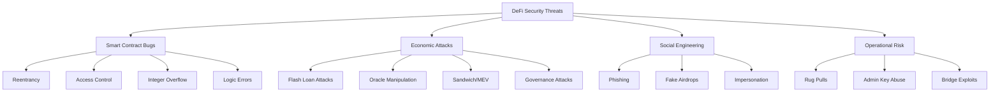

# 🏴‍☠️ DeFi Deep Dive: The Crypto Trader's Complete Alpha Handbook

> **Persona**: Professional on-chain crypto trader / DeFi liquidity engineer  
> **Date**: August 2026  
> **Scope**: Uniswap architecture, DEX pool mechanics, MEV landscape, airdrop farming, restaking, yield strategies, security, and on-chain analytics

---

## Table of Contents

1. [Uniswap Protocol Architecture (v2 → v3 → v4)](#1-uniswap-protocol-architecture)
2. [Uniswap GitHub Codebase Map](#2-uniswap-github-codebase-map)
3. [DEX Pool Mechanics & Mathematics](#3-dex-pool-mechanics--mathematics)
4. [Concentrated Liquidity Deep Dive](#4-concentrated-liquidity-deep-dive)
5. [Loss-Versus-Rebalancing (LVR) vs Impermanent Loss (IL)](#5-lvr-vs-impermanent-loss)
6. [MEV: The Invisible Tax](#6-mev-the-invisible-tax)
7. [Uniswap v4 Hooks: Programmable Liquidity](#7-uniswap-v4-hooks-programmable-liquidity)
8. [Airdrop Farming: The 2026 Meta](#8-airdrop-farming-the-2026-meta)
9. [Restaking & LRT Ecosystem](#9-restaking--lrt-ecosystem)
10. [Delta-Neutral & Yield Strategies](#10-delta-neutral--yield-strategies)
11. [Pendle: Yield Tokenization](#11-pendle-yield-tokenization)
12. [Cross-Chain Infrastructure](#12-cross-chain-infrastructure)
13. [Hyperliquid: The Perpetual DEX](#13-hyperliquid-the-perpetual-dex)
14. [On-Chain Analytics Toolkit](#14-on-chain-analytics-toolkit)
15. [DeFi Security & Risk Framework](#15-defi-security--risk-framework)
16. [LP Profitability Analysis Tools](#16-lp-profitability-analysis-tools)
17. [Complete Strategy Matrix](#17-complete-strategy-matrix)

---

## 1. Uniswap Protocol Architecture

### The Evolution Timeline

```
2018 ─── v1 ──► 2020 ─── v2 ──► 2021 ─── v3 ──► 2024-2025 ─── v4 (LIVE)
   │                │                │                    │
   │ Single pair     │ Factory-Pair   │ Concentrated       │ Singleton +
   │ ETH/token       │ Any ERC20      │ Liquidity          │ Hooks +
   │ only            │ x·y = k        │ Tick-based         │ Flash Accounting
```

### Architecture Comparison

| Feature | v2 | v3 | v4 |
| :--- | :--- | :--- | :--- |
| **Pool Deployment** | 1 contract per pair | 1 contract per pair | **Single `PoolManager`** for ALL pools |
| **Liquidity Model** | Full-range (`x·y = k`) | Concentrated (tick-based ranges) | Concentrated + Custom (via Hooks) |
| **Pool Creation Gas** | ~2.5M gas | ~4.5M gas | **~tens of thousands** (state update only) |
| **Multi-hop Routing** | Token transfers per hop | Token transfers per hop | **Internal accounting** (zero intermediate transfers) |
| **Fee Tiers** | Fixed 0.3% | 0.01% / 0.05% / 0.3% / 1% | **Dynamic** (via Hooks) or static |
| **Customization** | None | None | **Hooks** (arbitrary Solidity logic at lifecycle points) |
| **Storage** | Persistent (standard) | Persistent (standard) | **Transient** (EIP-1153) for flash accounting |
| **Oracle** | Built-in TWAP | Built-in TWAP | **Custom** (via Hooks) or none |

### v4 Core Design Pillars

#### 1. Singleton Architecture (`PoolManager.sol`)
All pools live inside ONE contract. Instead of deploying a new ERC-20 pair contract for every token combination:
- Pool creation = cheap state update (~99% gas reduction)
- Multi-hop swaps = internal ledger updates, no intermediate ERC-20 `transfer()` calls
- Reduces attack surface (single audited contract vs. thousands of cloned contracts)

#### 2. Flash Accounting (EIP-1153 Transient Storage)
```
┌──────────────────── Single Transaction ────────────────────┐
│                                                             │
│   unlock()                                                  │
│     ├── swap(ETH → USDC, Pool A)    → delta: +500 USDC    │
│     ├── swap(USDC → WBTC, Pool B)   → delta: -500 USDC    │
│     │                                  delta: +0.008 WBTC   │
│     └── settle()                                            │
│           Only NET transfers happen:                        │
│             User sends: ETH                                 │
│             User receives: WBTC                             │
│           (USDC never physically moves!)                    │
│                                                             │
└─────────────────────────────────────────────────────────────┘
```
- **Transient storage**: Data persists only within a single transaction, then is auto-cleared
- **Result**: Complex multi-token routes execute with minimal on-chain token movements
- Enables "try-then-settle" patterns impossible in previous versions

#### 3. Hooks (see [Section 7](#7-uniswap-v4-hooks-programmable-liquidity) for full deep-dive)

---

## 2. Uniswap GitHub Codebase Map

### Core Repositories

| Repository | Purpose | Key Contracts |
| :--- | :--- | :--- |
| [`Uniswap/v4-core`](https://github.com/Uniswap/v4-core) | Core pool logic, PoolManager, flash accounting | `PoolManager.sol`, `Pool.sol`, `Position.sol` |
| [`Uniswap/v4-periphery`](https://github.com/Uniswap/v4-periphery) | Higher-level integrations, hook base contracts | `BaseHook.sol`, `PositionManager.sol` |
| [`Uniswap/universal-router`](https://github.com/Uniswap/universal-router) | Unified swap router (v2+v3+v4+NFTs) | `UniversalRouter.sol` |
| [`Uniswap/permit2`](https://github.com/Uniswap/permit2) | Next-gen token approval system | `Permit2.sol` |
| [`uniswapfoundation/v4-template`](https://github.com/uniswapfoundation/v4-template) | Foundry boilerplate for Hook development | Template hook + test fixtures |
| [`fewwwww/awesome-uniswap-hooks`](https://github.com/fewwwww/awesome-uniswap-hooks) | Community-curated hook examples | Various hook POCs |

### Smart Order Routing Architecture

```
                    ┌─────────────────────┐
                    │   Uniswap Frontend  │
                    └────────┬────────────┘
                             │ API call
                    ┌────────▼────────────┐
                    │  Auto Router (SDK)  │   ← Off-chain: @uniswap/smart-order-router
                    │  Evaluates paths    │      Splits across v2/v3/v4 pools
                    │  across all pools   │      Optimizes for price + gas
                    └────────┬────────────┘
                             │ Encoded commands
                    ┌────────▼────────────┐
                    │  Universal Router   │   ← On-chain: single tx execution
                    │  (on-chain)         │      Uses Permit2 for approvals
                    └────────┬────────────┘
                             │
              ┌──────────────┼──────────────┐
              ▼              ▼              ▼
        ┌──────────┐  ┌──────────┐  ┌──────────────┐
        │  v2 Pool │  │  v3 Pool │  │ v4 PoolManager│
        └──────────┘  └──────────┘  └──────────────┘
```

### Permit2: Why It Matters
- **Problem**: Traditional ERC-20 `approve()` is a separate transaction (costs gas) and gives unlimited, permanent access
- **Solution**: `Permit2` uses signature-based, time-limited, amount-limited approvals
- **Benefit**: One `approve()` to `Permit2` contract → use across ALL Uniswap products (and third-party integrations) without additional on-chain approvals

---

## 3. DEX Pool Mechanics & Mathematics

### AMM Models Comparison

| AMM Model | Formula | Capital Efficiency | Best Use Case | Primary Risk |
| :--- | :--- | :--- | :--- | :--- |
| **Constant Product (Uniswap v2)** | $x \cdot y = k$ | Low (~0.1% active) | Long-tail tokens, new listings | High slippage on thin pools |
| **Constant Sum** | $x + y = k$ | Maximum (but breaks) | Only works for pegged assets | Drains completely on de-peg |
| **StableSwap (Curve)** | Hybrid of constant product + constant sum with amplification factor $A$ | High for pegged assets | Stablecoins (USDC/USDT), LSTs (stETH/ETH) | Asymmetric drain on de-peg |
| **Concentrated Liquidity (v3/v4)** | $L = \frac{\Delta y}{\Delta \sqrt{P}}$ within tick ranges | Very high (50-4000x vs v2) | Major pairs (ETH/USDC, BTC/ETH) | LVR, out-of-range stall |
| **Order Book (Hybrid DEX)** | Bid/ask matching | Highest | Perpetuals (Hyperliquid, dYdX) | Latency arbitrage |

### Constant Product Math (v2)

```
Before swap:
  Pool: 10 ETH × 30,000 USDC = k = 300,000,000

Trader buys 1 ETH:
  New ETH reserve: 10 - 1 = 9
  New USDC reserve: k / 9 = 33,333.33 USDC
  Trader pays: 33,333.33 - 30,000 = 3,333.33 USDC

Effective price: $3,333.33/ETH
Spot price was: $3,000/ETH
Slippage: +11.1% (!)
```

> [!WARNING]
> On thin v2 pools, even moderate trades cause massive slippage. This is why concentrated liquidity (v3/v4) was invented — it focuses capital where trading actually happens.

### How Fees Work

```
fee = 0.3%  (v2 standard)

Trader wants to buy 1 ETH:
  Input amount (USDC) × (1 - fee) → applied to constant product formula
  0.3% of the input is retained by the pool
  This grows k over time → LP profit
```

---

## 4. Concentrated Liquidity Deep Dive

### Tick System (v3/v4)

**Core formula**: $P(tick) = 1.0001^{tick}$

Each tick represents a 0.01% (1 basis point) price change. Liquidity can only be placed at multiples of the pool's **tick spacing**.

| Fee Tier | Tick Spacing | Price Granularity |
| :--- | :--- | :--- |
| 0.01% | 1 | Every basis point |
| 0.05% | 10 | Every 10 bps (~0.1%) |
| 0.3% | 60 | Every 60 bps (~0.6%) |
| 1% | 200 | Every 200 bps (~2%) |

### Capital Efficiency Gain

```
Uniswap v2 (full range):
  $1M liquidity spread across $0 → $∞
  Only ~$500 is "active" around current price

Uniswap v3 (concentrated):
  $1M liquidity concentrated in ±5% range
  Equivalent to ~$4M of v2 liquidity
  Capital efficiency: ~4000x at tightest ranges
```

### Position States

```
Price ←─────────────────────────────────────────────→

         [Lower Bound]  ← Your Range →  [Upper Bound]
              │                              │
              │    ✅ ACTIVE (earning fees)   │
              │    Position holds both tokens │
  ───────────────────────────────────────────────────
              │                              │
  ❌ OUT OF RANGE (LEFT)            ❌ OUT OF RANGE (RIGHT)
  Position is 100% Token B          Position is 100% Token A
  Earning ZERO fees                 Earning ZERO fees
  Suffering max IL                  Suffering max IL
```

> [!IMPORTANT]
> **The core trade-off**: Narrower range = higher fee yield when in-range, but higher probability of going out-of-range and incurring maximum IL + zero fees. Active management (or ALMs) is mandatory for serious LPs.

---

## 5. LVR vs Impermanent Loss

### Impermanent Loss (IL) — The Classic Metric

**What it measures**: The opportunity cost of LP'ing vs. simply holding the tokens.

**Formula** (for constant product AMM):
$$IL = 2 \cdot \frac{\sqrt{r}}{1 + r} - 1$$

Where $r$ = price ratio change (e.g., if ETH doubles: $r = 2$)

| Price Change | IL |
| :--- | :--- |
| ±0% (no change) | 0% |
| ±25% | -0.6% |
| ±50% | -2.0% |
| ±100% (2x) | -5.7% |
| ±200% (3x) | -13.4% |
| ±400% (5x) | -25.5% |

> [!NOTE]
> IL is called "impermanent" because it reverses if the price returns to entry. But if you withdraw at a diverged price, it becomes **permanent loss**.

### Loss-Versus-Rebalancing (LVR) — The Professional Metric

**What it measures**: The non-recoverable value extracted from LPs by arbitrageurs who exploit the staleness of AMM prices relative to the global market.

```
Timeline:
  t=0: AMM price = $3,000 (ETH/USDC), CEX price = $3,000
  t=1: CEX price jumps to $3,050 (news event)
  t=2: Arbitrageur buys ETH from AMM at $3,000-3,049 range
       → AMM price converges to $3,050
       → Arb pockets the spread
       → LP sold ETH "too cheap" by $25-50 per ETH

This value leak is LVR — it happens EVERY time there's
a price discrepancy, and it's NOT recoverable.
```

**Key difference from IL**:
- **IL** can reverse if prices return
- **LVR** is a permanent, ongoing cost of being a passive LP
- **LVR** scales with volatility and the square root of time
- **Fee revenue must exceed LVR** for LP'ing to be profitable

### Mitigation Strategies

| Strategy | How It Works | Complexity |
| :--- | :--- | :--- |
| **Dynamic Fee Hooks (v4)** | Increase swap fee during high volatility → capture more from arbs | Medium (Solidity) |
| **Automated Liquidity Managers (ALMs)** | Rebalance ranges proactively using volatility/OFI signals | Low (use Arrakis, Gamma, Bunni) |
| **MEV-Share / OFA** | Route arb profits back to LPs via order flow auctions | Low (protocol-level) |
| **Oracle-gated Swaps** | Only allow swaps when AMM price ≈ oracle price (reduces stale trades) | High (Hook development) |

---

## 6. MEV: The Invisible Tax

### The MEV Supply Chain (2026)

```
┌──────────────────────────────────────────────────────────┐
│                   MEV SUPPLY CHAIN                        │
├──────────────────────────────────────────────────────────┤
│                                                           │
│  User Tx ──► Mempool/Private RPC                          │
│                    │                                      │
│              ┌─────┴─────┐                                │
│              ▼           ▼                                │
│         Public       Private                              │
│         Mempool      (Flashbots, MEV Blocker)             │
│              │           │                                │
│              ▼           ▼                                │
│         Searchers    OFA (Order Flow Auction)              │
│         (bots)       ┌──────────────────┐                 │
│              │       │ Searchers bid    │                 │
│              │       │ for order flow   │                 │
│              │       │ User gets rebate │                 │
│              │       └────────┬─────────┘                 │
│              │                │                           │
│              ▼                ▼                           │
│         Block Builders                                    │
│         (assemble optimal block)                          │
│              │                                            │
│              ▼                                            │
│         Proposers/Validators                              │
│         (include block in chain)                          │
│                                                           │
└──────────────────────────────────────────────────────────┘
```

### Attack Taxonomy

#### 1. Sandwich Attack
```
Block ordering (manipulated by searcher):
  1. 🤖 Front-run: Bot buys ETH (pushes price UP)
  2. 👤 Victim tx: User buys ETH at inflated price
  3. 🤖 Back-run: Bot sells ETH (pockets spread)

Net effect: User gets worse execution
Bot profit: price impact × victim's trade size
```

#### 2. Just-In-Time (JIT) Liquidity
```
Single atomic block bundle:
  1. 🤖 Mint: Inject massive concentrated liquidity at current tick
  2. 👤 Large swap: Executes against JIT bot's liquidity
  3. 🤖 Burn: Remove liquidity immediately

Result: Bot earns ~95% of swap fees
        Passive LPs earn almost nothing from that swap
        (But user gets LESS slippage — controversial benefit)
```

#### 3. Backrun Arbitrage (CEX-DEX)
```
  CEX price moves → Arb bot detects discrepancy
  → Buys cheap on DEX → Sells expensive on CEX
  → DEX price converges to CEX
  
  This IS the LVR mechanism — it's "good" for price discovery
  but extracts value from LPs
```

### Protection Mechanisms (2026 State of the Art)

| Solution | How It Works | User Action |
| :--- | :--- | :--- |
| **Flashbots Protect** | Routes tx to private mempool, invisible to public searchers | Set custom RPC in wallet |
| **MEV Blocker** | OFA that refunds ~90% of MEV back to user | Set custom RPC in wallet |
| **CowSwap (CoW Protocol)** | Batch auction: matches orders peer-to-peer first, then routes remainder | Use CowSwap frontend |
| **SUAVE (Flashbots)** | Decentralized encrypted mempool — no single entity sees your tx | Coming / in development |
| **Uniswap v4 Hooks** | Protocol-level: dynamic fees, app-specific sequencing, MEV redistribution | For developers building pools |

> [!CAUTION]
> **In 2026, NOT using a private RPC is like broadcasting your trades on a billboard.** Always route through Flashbots Protect, MEV Blocker, or equivalent for any trade >$500.

---

## 7. Uniswap v4 Hooks: Programmable Liquidity

### Hook Lifecycle Callbacks

```
Pool Lifecycle with Hook Injection Points:

  initialize()
    ├── 🪝 beforeInitialize()
    └── 🪝 afterInitialize()

  addLiquidity()
    ├── 🪝 beforeAddLiquidity()
    └── 🪝 afterAddLiquidity()

  removeLiquidity()
    ├── 🪝 beforeRemoveLiquidity()
    └── 🪝 afterRemoveLiquidity()

  swap()
    ├── 🪝 beforeSwap()
    └── 🪝 afterSwap()

  donate()
    ├── 🪝 beforeDonate()
    └── 🪝 afterDonate()
```

### Hook Permission System
Hook permissions are encoded in the **address** of the hook contract itself. Specific bits in the address determine which callbacks the PoolManager will call.

```
Hook Address: 0x........XXXX
                         ^^^^
                         Permission bits determine:
                           - Which before/after callbacks are active
                           - Whether the hook can return custom deltas
                           - Whether fees are dynamic

To deploy a hook, you MUST mine a CREATE2 salt
that produces an address with the correct permission bits.
(Use HookMiner.sol from v4-periphery)
```

### Production Hook Examples

| Hook Type | Description | Callback Used | Alpha Opportunity |
| :--- | :--- | :--- | :--- |
| **Dynamic Volatility Fee** | Fee scales with realized volatility (e.g., 0.05% calm → 0.5% volatile) | `beforeSwap` | Captures arb profits back into pool → higher LP yield |
| **TWAMM** | Splits large orders across time to reduce price impact | `beforeSwap`, `afterSwap` | Institutional-grade execution without MEV |
| **On-chain Limit Orders** | Hold tokens in escrow, execute when price crosses target tick | `afterSwap` | True DEX limit orders without off-chain relayers |
| **Custom Oracle** | Track truncated/filtered price data for manipulation resistance | `afterSwap` | Resistant to flash loan price manipulation |
| **Liquidity Launchpad** | Bonding curve → Uniswap v4 pool migration at target market cap | `beforeInitialize` | Fair-launch token distribution |
| **MEV Redistribution** | Auction priority to searchers, redistribute profits to LPs | `beforeSwap` | LPs recapture LVR losses |

### Development Quick Start

```bash
# Clone the official v4 template
git clone https://github.com/uniswapfoundation/v4-template
cd v4-template

# Install dependencies (Foundry required)
forge install

# Run tests
forge test

# Your hook goes in src/Counter.sol (rename as needed)
# Tests go in test/Counter.t.sol
```

### Security Considerations for Hooks

> [!WARNING]
> **Hooks are external contracts with access to pool state during execution.** Vulnerabilities include:
> - **Reentrancy**: Hook callbacks that re-enter the PoolManager
> - **Access control**: Hooks that allow unauthorized parameter changes
> - **Accounting bugs**: Incorrect delta returns that drain pool funds
> - **Griefing**: Hooks that consume excessive gas or revert selectively
>
> **Always**: Use OpenZeppelin's Hooks Library, get audited (Trail of Bits, OpenZeppelin, Cyfrin), and test with Foundry fuzzing + Echidna invariant testing.

---

## 8. Airdrop Farming: The 2026 Meta

### The Paradigm Shift

```
2021-2023: "Spray & Pray"             2024-2025: "Points Meta"           2026: "Reputation + Quality"
┌──────────────────────┐         ┌──────────────────────┐         ┌──────────────────────┐
│ • Retroactive drops  │         │ • Points dashboards  │         │ • Wallet reputation  │
│ • Bridge once = free │   ──►   │ • TVL stacking       │   ──►   │ • AI-driven farming  │
│   money              │         │ • Sybil emerging     │         │ • Quality > quantity  │
│ • Sybil paradise     │         │ • Volume grinding    │         │ • Delta-neutral LP   │
└──────────────────────┘         └──────────────────────┘         └──────────────────────┘
```

### Tier 1 Airdrop Targets (August 2026)

| Ecosystem | Type | Strategy | Sybil Risk |
| :--- | :--- | :--- | :--- |
| **Monad** (Testnet/Early) | High-throughput EVM L1 | Interact with testnet dApps, maintain "Nad" Discord role, bridge early | Medium |
| **Berachain** | Proof-of-Liquidity L1 | Provide native liquidity, interact with ecosystem, bridge assets | Medium |
| **Base** (Coinbase L2) | EVM L2 | Sustained organic usage — consistent swaps, LPing, lending over months | Low |
| **Hyperliquid** | Perp DEX (own L1) | Trading volume + HLP vault deposits + HyperEVM ecosystem interaction | Low |
| **Symbiotic** | Restaking (no token yet!) | Deposit collateral, interact with shared markets (Core V2) | Low |
| **Prediction Markets** | Various | Create markets, take positions, provide liquidity | Low |

### Anti-Sybil Survival Checklist

> [!IMPORTANT]
> Post-LayerZero/Arbitrum/zkSync Sybil purges, projects now use sophisticated clustering algorithms. Follow these rules:

```
✅ DO:
  • Maintain organic gas usage (varied amounts, varied times)
  • Multi-month activity on each protocol (not "farm and forget")
  • Interact with 5+ categories: DEX, lending, bridges, governance, NFTs
  • Use Revoke.cash regularly to clean dangerous approvals
  • Fund wallets from different sources with time gaps
  • Hold meaningful balances (not dust-only wallets)

❌ DON'T:
  • Batch transactions at identical timestamps across wallets
  • Use identical swap amounts (e.g., always exactly 100 USDC)
  • Fund 10+ wallets from the same address in rapid succession
  • Have zero activity between farming windows
  • Use only one protocol on each chain
  • Leave wallets with <$1 balances after farming
```

### Capital-Efficient Airdrop Stacking

```
Single deposit → multiple airdrop qualifications:

  $10,000 ETH
       │
       ▼
  Stake to get stETH (Lido → already airdropped)
       │
       ▼
  Wrap to wstETH → Deposit into Symbiotic (Symbiotic points)
       │
       ▼
  Receive LRT receipt token → Deposit into Pendle (Pendle points)
       │
       ▼
  Get PT-wstETH → Use as collateral on Morpho (Morpho points)
       │
       ▼
  Borrow USDC → LP on Uniswap v4 hook pool on Base (Base activity)

  Total airdrop exposure: Symbiotic + Pendle + Morpho + Base
  From ONE initial $10,000 deposit
```

> [!CAUTION]
> **Risk**: Each layer adds smart contract risk. If Symbiotic's contract is exploited, you lose everything downstream. Never stack more layers than you can afford to lose.

---

## 9. Restaking & LRT Ecosystem

### Restaking Architecture (August 2026)

```
┌─────────────────────────────────────────────────────────┐
│                   RESTAKING STACK                        │
├─────────────────────────────────────────────────────────┤
│                                                          │
│  Layer 0: Ethereum PoS Validator (32 ETH staked)         │
│     ↓ restaked into                                      │
│  Layer 1: Restaking Protocol (EigenLayer / Symbiotic)    │
│     ↓ securing                                           │
│  Layer 2: AVS (Actively Validated Service)               │
│     Examples: EigenDA, bridges, oracles, rollups          │
│     ↓ revenue flows back                                 │
│  Layer 3: Operator → Staker rewards                      │
│                                                          │
│  ──── Liquid Restaking Tokens (LRTs) ────                │
│  eETH (Ether.fi) | ezETH (Renzo) | pufETH (Puffer)      │
│  These are "receipt tokens" for your restaked position    │
│  Can be used in DeFi (collateral, LP, Pendle)            │
│                                                          │
└─────────────────────────────────────────────────────────┘
```

### Current State (August 2026)

| Protocol | Market Share | Status | Key Development |
| :--- | :--- | :--- | :--- |
| **EigenLayer** | ~94% of restaking TVL ($15B+) | Dominant | Pivoting to EigenCloud (verifiable cloud); ELIP-012 redirects emissions to fee-generating AVSs |
| **Symbiotic** | Growing challenger | No token issued yet | Modular, any ERC-20 as collateral, Core V2 shared markets |
| **Karak → OpenGDP** | Rebranded | Pivoted away from retail restaking | Now focused on real-world economic execution (stablecoin settlement) |

### LRT Critical Developments

> [!WARNING]
> **Ether.fi is exiting EigenLayer.** As of August 2026, <1% of Ether.fi's assets remain restaked with EigenLayer. Plans to fully disconnect by Q4 2026. This signals the LRT sector may be entering a structural contraction phase.

| Risk Factor | Description |
| :--- | :--- |
| **Cascading Risk** | Exploit in one LRT contract can cascade through entire DeFi stack (e.g., Kelp DAO exploit, April 2026) |
| **Slashing** | Live since April 2025 — your restaked ETH can be slashed for AVS faults (not just Ethereum faults) |
| **EIGEN Token Pressure** | Continuous unlock events + uncertain revenue model → significant price decline from 2024 highs |

---

## 10. Delta-Neutral & Yield Strategies

### Funding Rate Arbitrage (Cash-and-Carry)

```
The "Bread and Butter" Delta-Neutral Strategy:

  ┌─────────────────────────────────────────────────────┐
  │                                                      │
  │  LEG 1 (Spot):    Buy 1 BTC at $65,000   (+delta)   │
  │                                                      │
  │  LEG 2 (Perp):    Short 1 BTC perpetual   (-delta)  │
  │                                                      │
  │  NET DELTA:        ≈ 0 (market neutral)              │
  │                                                      │
  │  PROFIT SOURCE:   Funding rate payments              │
  │                   (longs pay shorts in bull market)   │
  │                   Typically 0.01-0.05% per 8 hours    │
  │                   = 10-50% APR annualized             │
  │                                                      │
  └─────────────────────────────────────────────────────┘
```

### Strategy Matrix

| Strategy | Expected APR | Complexity | Key Risk |
| :--- | :--- | :--- | :--- |
| **Funding Rate Arb** | 10-50% | Medium | Rate flips negative; liquidation on short leg |
| **Basis Trade** (Spot vs. Quarterly Futures) | 5-20% | Low | Basis can widen before convergence |
| **LP + Hedge** (Provide LP + Short underlying) | 15-40% | High | Imperfect hedge; funding costs on short |
| **Pendle PT** (Fixed Yield) | 5-15% | Low | Smart contract risk; opportunity cost |
| **Pendle YT** (Yield Speculation) | -100% to +500% | High | YT goes to zero at maturity if yields drop |
| **HLP Vault** (Hyperliquid) | 10-30% | Low | Vault drawdowns (5-15% in volatile periods) |
| **LRT Stacking** | Base yield + points | Medium | Cascading smart contract risk; slashing |

### Risk Management for Delta-Neutral Strategies

```
CRITICAL CHECKS (every 8 hours):
  ✅ Funding rate still positive?
  ✅ Short leg collateral > maintenance margin?
  ✅ Basis hasn't inverted?
  ✅ No exchange withdrawal freeze?
  ✅ Hedge ratio still balanced after price moves?

AUTOMATIC EXITS:
  ⚠️ Funding rate negative for 3 consecutive periods → unwind
  ⚠️ Short leg < 2x maintenance margin → add collateral or close
  ⚠️ Exchange announces maintenance → move to cold storage
```

---

## 11. Pendle: Yield Tokenization

### Core Mechanics

```
Yield-Bearing Asset (e.g., stETH, eETH, sDAI)
              │
              ▼
      ┌───────────────┐
      │  Pendle SY    │  ← Standardized Yield wrapper
      │  (Wrapped)    │
      └───────┬───────┘
              │
      ┌───────┴───────┐
      ▼               ▼
┌──────────┐   ┌──────────┐
│    PT     │   │    YT     │
│ Principal │   │  Yield    │
│  Token    │   │  Token    │
│           │   │           │
│ = Zero-   │   │ = Right   │
│   coupon  │   │   to ALL  │
│   bond    │   │   future  │
│           │   │   yield   │
│ Buy at    │   │ until     │
│ discount  │   │ maturity  │
│ → fixed   │   │           │
│   yield   │   │ → yield   │
│   at      │   │   specul- │
│   maturity│   │   ation   │
└──────────┘   └──────────┘
```

### Practical Strategy Examples

**Scenario: stETH yielding 3.5% APR, Pendle maturity in 6 months**

| Strategy | Action | Outcome |
| :--- | :--- | :--- |
| **Lock Fixed Yield** | Buy PT-stETH at 0.97 (3% discount) | At maturity, redeem 1:1 for stETH → locked 3% fixed return regardless of rate changes |
| **Bet Yields Rise** | Buy YT-stETH at 0.03 per unit | If stETH yield rises to 5%, YT value increases → leveraged yield exposure |
| **LP in Pendle AMM** | Provide PT + SY liquidity | Earn swap fees from yield traders with lower IL risk (PT→SY convergence at maturity) |

### Pendle Boros (2026 Update)
- **New product**: Trade perpetual funding rates as a yield instrument
- Allows yield traders to speculate on or hedge against funding rate volatility directly

---

## 12. Cross-Chain Infrastructure

### Protocol Comparison (August 2026)

| Protocol | Architecture | Key Mechanism | Market Position |
| :--- | :--- | :--- | :--- |
| **LayerZero** | Messaging layer | OFT (burn-and-mint) token standard | ~87% of cross-chain token transfer volume |
| **Stargate** | Liquidity transport (on LayerZero) | Unified native asset pools | Primary "bridge" for native asset transfers |
| **Wormhole** | Generalized messaging | Supports tokens, NFTs, cross-chain app logic | #2 messaging protocol, broad chain support |
| **Chainlink CCIP** | Institutional messaging | Institutional-grade security, token transfers | Gaining institutional adoption (e.g., WBTC) |

### OFT Standard (Omnichain Fungible Token)

```
Traditional Bridge:
  Chain A: Lock 100 USDC in bridge contract
  Chain B: Mint 100 "Wrapped-Bridge-USDC"
  Problem: Fragmented liquidity, bridge-specific wrapped tokens

OFT Standard:
  Chain A: Burn 100 OFT-USDC
  Chain B: Mint 100 OFT-USDC
  Result: Unified global supply, no wrapped tokens,
          no liquidity fragmentation
```

### Bridge Security Risks

> [!CAUTION]
> Bridges have been the single largest source of DeFi exploits historically (Wormhole $320M, Ronin $600M, Nomad $190M). In 2026:
> - Always verify bridge audit status
> - Use bridges with configurable security (LayerZero DVNs)
> - Never bridge more than you can afford to lose in a single tx
> - Monitor bridge contract TVL — declining TVL = red flag

---

## 13. Hyperliquid: The Perpetual DEX

### Architecture

```
┌────────────────────────────────────────────────────┐
│              HYPERLIQUID L1 BLOCKCHAIN              │
│                                                     │
│  ┌─────────────────┐    ┌─────────────────────┐    │
│  │  Perp DEX       │    │  HyperEVM           │    │
│  │  (Order Book)   │    │  (Smart Contracts)   │    │
│  │                 │    │                      │    │
│  │  - Fully on-chain│    │  - EVM compatible   │    │
│  │  - 200ms blocks │    │  - DeFi ecosystem    │    │
│  │  - Zero gas fees│    │  - Token launches    │    │
│  │  - 100+ markets │    │                      │    │
│  └─────────────────┘    └─────────────────────┘    │
│                                                     │
│  ┌─────────────────────────────────────────────┐   │
│  │              HLP VAULT                       │   │
│  │  User deposits USDC → vault market-makes     │   │
│  │  Revenue: spreads (~60%) + liquidations (~25%)│   │
│  │           + funding capture (~15%)            │   │
│  │  Risk: vault drawdowns in volatile markets    │   │
│  │  Lock-up: 4 days                              │   │
│  └─────────────────────────────────────────────┘   │
│                                                     │
└────────────────────────────────────────────────────┘
```

### Fee Structure

| Tier | 14-Day Volume | Taker Fee | Maker Fee |
| :--- | :--- | :--- | :--- |
| Base | < $5M | 0.045% | 0.015% |
| VIP 1 | $5M+ | 0.040% | 0.012% |
| VIP 2 | $25M+ | 0.035% | 0.010% |
| VIP 3 | $100M+ | 0.030% | 0.008% |
| MM | Approved | Custom | Custom (often rebate) |

**Fee Optimization**:
- $HYPE staking → up to 40% fee discount
- Referral codes → 4% lifetime discount
- Spot volume counts 2x toward tier calculation
- **Zero gas fees** on all trades

---

## 14. On-Chain Analytics Toolkit

### The Professional Stack

```
┌────────────────────── RESEARCH WORKFLOW ──────────────────────┐
│                                                                │
│  MACRO (What's happening in DeFi?)                             │
│  ├── DeFiLlama → TVL, protocol fees, yield discovery           │
│  ├── CryptoQuant → Exchange flows, NUPL, miner metrics         │
│  └── Token Terminal → Protocol revenue, P/E ratios             │
│                                                                │
│  WALLET TRACKING (Who's buying?)                               │
│  ├── Nansen → "Smart Money" labels, entity clustering          │
│  ├── Arkham → Visual entity analytics, Intel Exchange           │
│  └── DeBank → Social feed, DeFi portfolio of tracked wallets   │
│                                                                │
│  POOL ANALYSIS (Is LP'ing profitable?)                         │
│  ├── Revert Finance → Track your LP positions, IL, fee APR     │
│  ├── APY Vision → Pool screening, IL monitoring                │
│  └── Metrix Finance → Backtest LP strategies (v3/v4)           │
│                                                                │
│  CUSTOM RESEARCH (Deep dives)                                  │
│  ├── Dune Analytics → SQL-based, custom dashboards             │
│  ├── Flipside Crypto → SQL + community bounties                │
│  └── Nansen Query → Direct blockchain data SQL access           │
│                                                                │
│  PERSONAL PORTFOLIO                                            │
│  ├── DeBank → Multi-chain DeFi position tracker                │
│  ├── Zerion → Wallet + trading + portfolio dashboard           │
│  └── Zapper → DeFi position aggregation + zaps                 │
│                                                                │
└────────────────────────────────────────────────────────────────┘
```

### Key On-Chain Signals for Traders

| Signal | Data Source | Interpretation |
| :--- | :--- | :--- |
| **Exchange Net Flow (7d)** | CryptoQuant, Nansen | Net inflow = sell pressure; Net outflow = accumulation |
| **Whale Wallet Clusters** | Arkham, Nansen | Track institutional wallets — follow sustained flows, not single txs |
| **TVL Trends** | DeFiLlama | Rising TVL = capital inflow / confidence; Falling = capital flight |
| **Protocol Revenue** | Token Terminal | Real revenue > token emissions = sustainable protocol |
| **Active Addresses** | Dune, Flipside | Growing = organic adoption; Declining = hype fading |
| **NUPL** (Net Unrealized Profit/Loss) | CryptoQuant | >0.75 = euphoria (sell zone); <0 = capitulation (buy zone) |
| **Stablecoin Supply** | DeFiLlama | Growing stablecoin supply = capital waiting on sidelines |

---

## 15. DeFi Security & Risk Framework

### Threat Model



### Security Toolkit

| Category | Tool | Purpose |
| :--- | :--- | :--- |
| **Token Scanner** | [De.Fi Scanner](https://de.fi) | Analyze contract for honeypot, governance risks |
| **Honeypot Check** | [Honeypot.is](https://honeypot.is) | Simulate buy/sell to detect sell restrictions |
| **Approval Audit** | [Revoke.cash](https://revoke.cash) | Revoke dangerous token approvals |
| **Liquidity Verification** | [UNCX](https://uncx.network) | Check if liquidity is locked/burned |
| **Wallet Clustering** | [Bubble Maps](https://bubblemaps.io) | Visualize suspicious token distribution |
| **Static Analysis** | [Slither](https://github.com/crytic/slither) | Find vulnerabilities without execution (for devs) |
| **Fuzzing** | [Foundry Fuzz](https://book.getfoundry.sh/forge/fuzz-testing) / [Echidna](https://github.com/crytic/echidna) | Stress-test with random inputs (for devs) |
| **Runtime Monitoring** | [Hypernative](https://hypernative.io) / [Tenderly](https://tenderly.co) | Real-time exploit detection & alerting |

### Pre-Trade Security Checklist

```
Before interacting with ANY new protocol:

□ 1. Audit Status
     ├── Verified on auditor's website (not just PDF from project)?
     ├── Audited by reputable firm? (Trail of Bits, OpenZeppelin,
     │   Cyfrin, Spearbit, Zellic)
     └── Multiple audits or bug bounty program active?

□ 2. Contract Analysis
     ├── Verified source code on Etherscan/Blockscout?
     ├── Ran through De.Fi Scanner / Honeypot.is?
     ├── Owner can't mint unlimited tokens?
     ├── Owner can't freeze/blacklist your address?
     └── No proxy upgradability without timelock?

□ 3. Liquidity Health
     ├── Liquidity locked (check UNCX)?
     ├── LP > $500K for any meaningful trade?
     └── No single wallet holds >20% of supply (Bubble Maps)?

□ 4. Operational Red Flags
     ├── Team is doxxed or backed by known VCs?
     ├── Contract deployed > 30 days ago?
     ├── Active community (not just bot-filled Telegram)?
     └── Protocol revenue visible on DeFiLlama/Token Terminal?

□ 5. Wallet Hygiene
     ├── Using a separate "farming" wallet (not main holdings)?
     ├── Revoked unnecessary approvals (Revoke.cash)?
     └── Hardware wallet for anything > $10K?
```

---

## 16. LP Profitability Analysis Tools

### Tool Comparison

| Tool | Best For | Free Tier | Key Feature |
| :--- | :--- | :--- | :--- |
| **Revert Finance** | Tracking YOUR LP positions | Yes | Granular fee/IL breakdown per position |
| **APY Vision** | Pool discovery & screening | Yes | Cross-protocol yield comparison |
| **Metrix Finance** | Backtesting LP strategies | Yes | Simulate v3/v4 ranges against historical data |
| **Dune Analytics** | Custom deep-dive research | Yes (limited) | Raw SQL access to blockchain data |
| **DeFiLlama** | Macro yield discovery | Yes | TVL + protocol fee aggregation across all chains |

### LP Profitability Formula

```
Net LP Return = Fee Revenue - Impermanent Loss - Gas Costs - LVR

Where:
  Fee Revenue = (Your Liquidity Share) × (Pool Volume) × (Fee Rate)
  IL = f(price_change, range_width)  — see IL table in Section 5
  Gas = rebalance_count × avg_gas_cost
  LVR = f(volatility, time, liquidity_depth)

Rule of Thumb:
  If Fee APR > 2 × Realized Volatility → LP is likely profitable
  If Fee APR < Realized Volatility → LP is likely losing to LVR
```

---

## 17. Complete Strategy Matrix

### By Risk Profile

| Profile | Strategies | Expected APR | Max Drawdown | Time Commitment |
| :--- | :--- | :--- | :--- | :--- |
| **Conservative** | Pendle PT, stablecoin LP (Curve), basis trade | 5-15% | <5% | Weekly rebalance |
| **Moderate** | Funding rate arb, broad-range LP, HLP vault, LRT stacking | 15-30% | 5-15% | Daily monitoring |
| **Aggressive** | Concentrated LP, YT speculation, JIT liquidity, hook development | 30-100%+ | 15-50%+ | Continuous |

### By Market Regime

| Regime | Best Strategies | Avoid |
| :--- | :--- | :--- |
| **Bull (High Funding)** | Funding rate arb, perp shorting for yield, YT buying | Fixed yield (opportunity cost) |
| **Range-Bound** | Concentrated LP (tight ranges), stablecoin farming, PT buying | Directional YT bets |
| **Bear (Negative Funding)** | PT (fixed yield), stablecoin LP, reduce leverage | Funding rate arb (you'd pay), wide-range LP |
| **High Volatility** | Dynamic fee hook pools, options vaults, reduce LP exposure | Tight concentrated LP (constant out-of-range) |

### The Complete DeFi Trader's Daily Dashboard

```
┌─────────────────── MORNING ROUTINE ───────────────────┐
│                                                        │
│  06:00  Check funding rates (Hyperliquid, Binance)     │
│         → If negative 3 consecutive: unwind arb        │
│                                                        │
│  06:15  Check LP positions (Revert Finance)            │
│         → Any positions out-of-range? Rebalance?       │
│         → Fee APR still > 2x vol? Keep position        │
│                                                        │
│  06:30  Check portfolio health (DeBank)                │
│         → Collateral ratios on lending positions        │
│         → Any liquidation risks approaching?           │
│                                                        │
│  07:00  Check whale flows (Nansen/Arkham)              │
│         → Major exchange inflows? Reduce exposure      │
│         → Smart money accumulating? Note for research  │
│                                                        │
│  07:30  Check airdrop dashboards                       │
│         → Points accumulation on target protocols      │
│         → New protocols worth farming?                 │
│                                                        │
│  08:00  Check DeFiLlama                                │
│         → TVL trends on key protocols                  │
│         → New yield opportunities?                     │
│                                                        │
│  08:30  Execute any pending rebalances/claims          │
│         → Always via Flashbots Protect RPC             │
│         → Revoke unnecessary approvals                 │
│                                                        │
└────────────────────────────────────────────────────────┘
```

---

## Glossary

| Term | Definition |
| :--- | :--- |
| **AMM** | Automated Market Maker — smart contract that algorithmically prices assets using a mathematical formula instead of an order book |
| **APM** | Active Position Manager — manages open positions with trailing stops, breakeven locks |
| **AVS** | Actively Validated Service — a service secured by restaked ETH through EigenLayer |
| **CEX** | Centralized Exchange (Binance, Coinbase, Bybit) |
| **DEX** | Decentralized Exchange (Uniswap, Curve, Hyperliquid) |
| **EIP-1153** | Ethereum Improvement Proposal for transient storage opcodes (TSTORE/TLOAD) |
| **IL** | Impermanent Loss — LP opportunity cost vs. holding |
| **JIT** | Just-In-Time liquidity — MEV strategy of minting/burning liquidity within a single block |
| **LRT** | Liquid Restaking Token — tokenized receipt for restaked ETH (eETH, ezETH) |
| **LVR** | Loss-Versus-Rebalancing — non-recoverable cost of adverse selection from arbitrageurs |
| **MEV** | Maximal Extractable Value — profit extracted by reordering, inserting, or censoring transactions |
| **OFA** | Order Flow Auction — mechanism where searchers bid for the right to fill user transactions |
| **OFT** | Omnichain Fungible Token — LayerZero standard for cross-chain native tokens |
| **PT** | Principal Token (Pendle) — zero-coupon bond component of yield-bearing asset |
| **SOR** | Smart Order Router — algorithm that finds optimal trade execution path |
| **TWAMM** | Time-Weighted AMM — splits large orders over time to reduce impact |
| **TWAP** | Time-Weighted Average Price — manipulation-resistant price feed |
| **TVL** | Total Value Locked — total capital deposited in a protocol |
| **YT** | Yield Token (Pendle) — represents right to future yield until maturity |

---

> *This document is a research reference for educational purposes. DeFi involves significant risks including smart contract vulnerabilities, market volatility, regulatory uncertainty, and potential loss of capital. Always DYOR and never invest more than you can afford to lose.*
