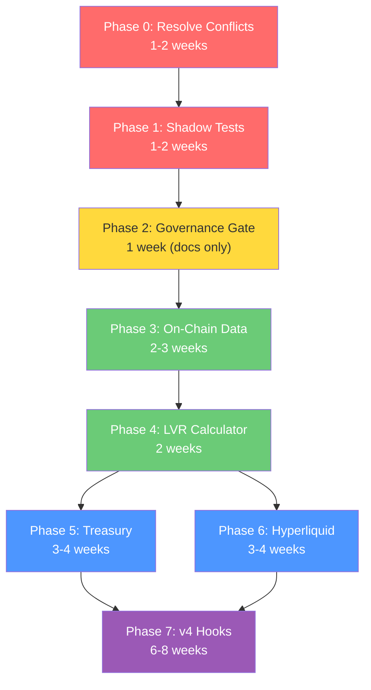

# KASM v3.0 Hybrid Intelligence — Implementation Plan

**Source Document:** `docs/plan/refinement_defi.md`  
**Analysis:** `docs/plan/refinement_defi_analysis.md` (analysis artifact)  
**Created:** 2026-08-07  
**Status:** DRAFT — Requires operator approval before any Phase execution begins

---

## Overview

This plan transforms KASM from a CEX-only perpetuals bot (v2.1) into a **Hybrid Intelligence Trading System (v3.0)** that operates across CEX, on-chain DEX, and DeFi yield venues. The plan is split into **8 phases** across 3 macro-stages:

```
┌───────────────────────────────────────────────────────────────────────┐
│                        MACRO-STAGE A                                 │
│                "Finish What We Started" (v2.1 → v2.2)               │
│                                                                       │
│   Phase 0: Resolve Open Conflicts & Complete v2.1 Backlog            │
│   Phase 1: Shadow System Tests & Stability Proof                     │
│                                                                       │
├───────────────────────────────────────────────────────────────────────┤
│                        MACRO-STAGE B                                 │
│                "Read the Chain" (v2.2 → v2.5)                        │
│                                                                       │
│   Phase 2: Governance Gate — Ratify DeFi Scope Expansion             │
│   Phase 3: On-Chain Data Ingestion (Read-Only)                       │
│   Phase 4: LVR Calculator & Gas-Adjusted EV Scoring                  │
│                                                                       │
├───────────────────────────────────────────────────────────────────────┤
│                        MACRO-STAGE C                                 │
│             "Write to the Chain" (v2.5 → v3.0)                       │
│                                                                       │
│   Phase 5: Treasury Automation (Idle Capital → Yield)                │
│   Phase 6: Multi-Venue Execution (Hyperliquid Integration)           │
│   Phase 7: On-Chain Liquidity Engineering (Uniswap v4 Hooks)        │
│                                                                       │
└───────────────────────────────────────────────────────────────────────┘
```

> [!IMPORTANT]
> **This plan is criteria-gated, not date-gated.** No phase begins until the previous phase's exit criteria pass. Estimated durations are provided for planning, not as commitments.

---

## MACRO-STAGE A: "Finish What We Started"

### Phase 0: Resolve Open Conflicts & Complete v2.1 Backlog

**Goal:** Clear the v2.1 backlog so the system has a clean, stable, conflict-free foundation to build DeFi features on.

**Estimated Duration:** 1–2 weeks

#### 0.1 Resolve Open Doc Conflicts

These are `CONTEXT.md` §7 items that **must** be ratified before any new scope is added.

| Conflict | Docs | Resolution Action |
| :--- | :--- | :--- |
| Issue #6: Symbol count (5 vs 35 vs 60) | `MVP_SCOPE.md` §3.B vs `SYSTEM_CONSTANTS.md` §14 vs `crypto_universe.py` | Decision: Accept ~60 dynamic universe. Rewrite `MVP_SCOPE.md` §3.B. Correct `SYSTEM_CONSTANTS.md` §14 claim. |
| Issue #10: Consecutive loss threshold (3 vs 4) | `RISK_AND_RUNBOOK.md` §2 vs `portfolio_risk_manager.md` | Decision: Confirm 3 = soft pause (signal gen), 4 = portfolio CB. Document as intentional layering. |
| Issue #11: Portfolio CB daily loss (3% vs 2%) | `portfolio_risk_manager.md` vs `RISK_AND_RUNBOOK.md` §2 | Decision: 2% = 4-hour cooldown (existing), 2.5% = portfolio CB entry block. Fix numeric ordering so portfolio CB can fire. |
| Issue #12: WARP → WireGuard doc cleanup | 15+ docs still reference "WARP" | Action: Create ADR-009 documenting WARP → WireGuard migration. Coordinated find-and-replace pass. |

**Deliverables:**
- [ ] `CONTEXT.md` §7 Issues #6, #10, #11 marked RESOLVED with ratified values
- [ ] ADR-009 written for WARP → WireGuard migration
- [ ] All 15+ docs updated with WireGuard/gluetun terminology

#### 0.2 Complete v2.1 Backlog (MVP_SCOPE §7)

Per `ROADMAP.md` Phase 4.5, the following items from `MVP_SCOPE.md` §7 remain:

| Item | Scope | Effort | Module |
| :--- | :--- | :--- | :--- |
| ~~Phase 5: Wire executor_task → sor.execute()~~ | ~~Unblock execution chain~~ | ~~30 min~~ | ~~Done per ROADMAP~~ |
| ~~Phase 6: Dynamic universe scoring~~ | ~~universe_scorer.py~~ | ~~4-5h~~ | ~~Done per ROADMAP~~ |
| ~~Phase 7: Multi-timeframe confirmation~~ | ~~multi_tf.py~~ | ~~2-3h~~ | ~~Done per ROADMAP~~ |
| ~~Phase 8: AI CryptoAnalyst mandatory~~ | ~~Remove toggle~~ | ~~1-2h~~ | ~~Done per ROADMAP~~ |
| ~~Phase 9: Trade memory injection~~ | ~~trade_memory.py~~ | ~~2-3h~~ | ~~Done per ROADMAP~~ |
| ~~Phase 10: Sector diversity cap~~ | ~~sector_cap.py~~ | ~~2-3h~~ | ~~Done per ROADMAP~~ |

> [!NOTE]
> Per `ROADMAP.md` Phase 4.5, all sub-phases (4.5.1–4.5.6) are marked ✅ Done. However, `MVP_SCOPE.md` §7 still shows Phases 5–10 as 🔴 TODO — this is the Issue #6-style discrepancy where one doc claims resolution that another doesn't reflect. **Action:** Verify each is truly wired end-to-end, then update `MVP_SCOPE.md` §7 to match `ROADMAP.md`.

**Deliverables:**
- [ ] `MVP_SCOPE.md` §7 updated — all statuses aligned with `ROADMAP.md`
- [ ] Verified: `executor_task` calls `sor.execute()` end-to-end on live Bybit

---

### Phase 1: Shadow System Tests & Stability Proof

**Goal:** Achieve the test coverage baseline required by `DEFINITION_OF_DONE.md` §3.L and `AGENTS.md` §5 before adding new complexity.

**Estimated Duration:** 1–2 weeks

#### 1.1 Shadow System Unit Tests (ZERO exist today)

Per `AGENTS.md` §5 ("Shadow system — flag gap"), these tests are mandatory:

| Test Suite | Coverage Target | Key Assertions |
| :--- | :--- | :--- |
| `test_shadow_executor.py` | `ShadowExecutor` | Fee asymmetry (maker 0.02% vs taker 0.055%), slippage calculation (0.05%), pending limit state machine, order ID generation |
| `test_shadow_apm.py` | `ShadowAPM` | `worst_price_seen` wick detection, funding rate deduction timing (8h boundary), `PENDING→OPEN` state transition, TTL expiry (600s) |
| `test_shadow_store.py` | `ShadowPositionStore` + `ShadowTradeStore` | `shadow_trades` table round-trip matches `DATA_MODEL.md`, Redis key namespace isolation (`shadow:position:*` never collides with `position:*`) |
| `test_shadow_integration.py` | End-to-end | Shadow mode skips reconciliation + position_reconciler when `SHADOW_MODE_ENABLED=true`; mode switching doesn't leave orphan state |

#### 1.2 Stability Proof

Run full pipeline on live Bybit (main URL, $1 SL cap) for **7 consecutive days**:
- Zero unhandled exceptions
- Zero state divergences
- All 250+ existing tests pass
- Shadow tests (new) pass
- `ruff check .`, `black --check .`, `mypy --strict app/` clean

**Exit Criteria for Phase 1:**
- [ ] Shadow test suite written and passing (≥90% coverage on `ShadowExecutor`, `ShadowAPM`, `ShadowPositionStore`)
- [ ] 7-day live stability proof completed
- [ ] All linting/typing tools pass

---

## MACRO-STAGE B: "Read the Chain"

### Phase 2: Governance Gate — Ratify DeFi Scope Expansion

**Goal:** Formally ratify the DeFi scope expansion through the governance process so that subsequent phases are authorized.

**Estimated Duration:** 1 week (doc work, operator review)

> [!CAUTION]
> **This phase produces ZERO code.** It is purely a governance and documentation phase. Per `MVP_SCOPE.md` §2: *"If it is not explicitly listed in the IN SCOPE section, we do not code it."* DeFi features require explicit ratification.

#### 2.1 Create ADR-010: CEX-Only → Hybrid Intelligence Decision

**File:** `docs/adr/ADR-010-hybrid-intelligence.md`

Contents:
- Decision: Expand KASM from CEX-only to Hybrid Intelligence (CEX + DEX + DeFi yield)
- Context: CEX-only edge shrinking in 2026; LVR capture, idle capital yield, and multi-venue execution as new alpha sources
- Rationale: Leverages existing RegimeClassifier, EV scoring, and PRM architecture
- Consequences: New dependencies (Ethereum node, Hyperliquid API, Flashbots), new risk vectors (smart contract risk, gas costs, MEV), new data models
- Supersedes: `MVP_SCOPE.md` §4 explicit rejections of Multi-Exchange Execution and Grafana dashboards

#### 2.2 Update Locked Docs

| Document | Changes Required |
| :--- | :--- |
| `MVP_SCOPE.md` | Add new §8 "DeFi Scope Expansion (v3.0)" — explicitly lists new in-scope items. Update §4 to note which rejections are superseded by ADR-010. |
| `ARCHITECTURE.md` | Add `app/defi/` to §4 directory map. Add Layer 5 (On-Chain Liquidity) to system diagram. Document single-process constraints for EVM WS feeds. |
| `DATA_MODEL.md` | Add new Pydantic models, Redis keys, Postgres tables (see §2.3 below) |
| `DEFINITION_OF_DONE.md` | Add new §3.M "DeFi Components" checklist (see §2.4 below) |
| `RISK_AND_RUNBOOK.md` | Add new §7 "On-Chain Failure Modes" runbook entries (see §2.5 below) |
| `ROADMAP.md` | Extend Phase 8 with DeFi sub-phases (Phases 8.1–8.5 mapping to this plan's Phases 3–7) |

#### 2.3 New Data Model Additions (for `DATA_MODEL.md`)

**New Pydantic Models:**

```python
class OnChainPriceState(BaseModel):
    """Real-time DEX pool price for LVR calculation."""
    symbol: str
    pool_address: str
    dex_price: Decimal           # sqrtPriceX96 → human-readable
    tick: int
    liquidity: Decimal
    fee_tier: int                 # e.g., 3000 = 0.3%
    block_number: int
    timestamp: datetime

class LVROpportunity(BaseModel):
    """Detected CEX-DEX price discrepancy."""
    symbol: str
    cex_mid_price: Decimal        # Consensus of ≥2 CEX books
    dex_price: Decimal
    spread_bps: Decimal           # Basis points
    estimated_gas_cost: Decimal   # In USD
    net_ev: Decimal               # Spread - gas - slippage
    is_actionable: bool           # net_ev > threshold
    timestamp: datetime

class TreasuryAllocation(BaseModel):
    """Active idle capital deployment."""
    venue: str                    # "pendle_pt", "hlp_vault", "funding_arb"
    amount_usdc: Decimal
    entry_timestamp: datetime
    expected_apy: Decimal
    maturity: Optional[datetime]  # For Pendle PT
    current_value: Decimal
    pnl: Decimal
    status: str                   # "ACTIVE", "PENDING_EXIT", "CLOSED"

class DeFiWhitelistEntry(BaseModel):
    """Audited protocol registry for PRM."""
    protocol_name: str
    chain_id: int
    contract_addresses: list[str]
    audit_firm: str
    audit_date: datetime
    max_tvl_exposure_pct: Decimal  # Max % of equity to deploy
    risk_tier: str                 # "BLUE_CHIP", "ESTABLISHED", "EXPERIMENTAL"
```

**New Redis Keys:**

| Key Pattern | Type | TTL | Description |
| :--- | :--- | :--- | :--- |
| `onchain:price:{pool_address}` | String | 30s | Latest DEX pool price state |
| `onchain:gas:gwei` | String | 15s | Current gas price in gwei |
| `treasury:active:{venue}` | String | None | Active treasury allocation state |
| `treasury:total_deployed` | String | None | Total idle capital deployed (Decimal string) |
| `defi:whitelist:{protocol}` | String | None | Audited protocol whitelist entry |
| `lvr:opportunity:{symbol}` | String | 60s | Latest LVR calculation for symbol |

**New Postgres Tables:**

```sql
-- Treasury allocation tracking
CREATE TABLE treasury_allocations (
    id UUID PRIMARY KEY DEFAULT gen_random_uuid(),
    venue VARCHAR(50) NOT NULL,
    amount_usdc DECIMAL(20,8) NOT NULL,
    entry_timestamp TIMESTAMPTZ NOT NULL DEFAULT NOW(),
    exit_timestamp TIMESTAMPTZ,
    expected_apy DECIMAL(10,6),
    realized_yield DECIMAL(20,8),
    status VARCHAR(20) NOT NULL DEFAULT 'ACTIVE'
        CHECK (status IN ('ACTIVE', 'PENDING_EXIT', 'CLOSED', 'FAILED')),
    tx_hash VARCHAR(66),
    metadata JSONB
);

-- On-chain interaction audit log
CREATE TABLE defi_interactions (
    id UUID PRIMARY KEY DEFAULT gen_random_uuid(),
    timestamp TIMESTAMPTZ NOT NULL DEFAULT NOW(),
    protocol VARCHAR(50) NOT NULL,
    chain_id INTEGER NOT NULL,
    action VARCHAR(30) NOT NULL,  -- 'LP_ADD', 'LP_REMOVE', 'SWAP', 'DEPOSIT', 'WITHDRAW'
    tx_hash VARCHAR(66),
    gas_used INTEGER,
    gas_cost_usd DECIMAL(20,8),
    status VARCHAR(20) NOT NULL CHECK (status IN ('PENDING', 'CONFIRMED', 'REVERTED', 'FAILED')),
    details JSONB
);

-- LVR opportunity log (for calibration)
CREATE TABLE lvr_opportunities (
    id UUID PRIMARY KEY DEFAULT gen_random_uuid(),
    timestamp TIMESTAMPTZ NOT NULL DEFAULT NOW(),
    symbol VARCHAR(20) NOT NULL,
    cex_mid_price DECIMAL(20,8) NOT NULL,
    dex_price DECIMAL(20,8) NOT NULL,
    spread_bps DECIMAL(10,4) NOT NULL,
    gas_cost_usd DECIMAL(20,8),
    net_ev DECIMAL(20,8),
    was_actionable BOOLEAN NOT NULL,
    was_executed BOOLEAN DEFAULT FALSE
);
```

**New Prometheus Metrics:**

| Metric Name | Type | Labels | Description |
| :--- | :--- | :--- | :--- |
| `karsa_onchain_price_staleness_seconds` | Gauge | `pool_address` | Seconds since last DEX price update |
| `karsa_lvr_spread_bps` | Histogram | `symbol` | CEX-DEX spread distribution |
| `karsa_lvr_opportunities_total` | Counter | `symbol`, `actionable` | LVR opportunity detection count |
| `karsa_treasury_deployed_usdc` | Gauge | `venue` | Currently deployed idle capital per venue |
| `karsa_treasury_yield_usdc` | Counter | `venue` | Cumulative yield earned per venue |
| `karsa_gas_cost_usd` | Histogram | `action` | Gas cost per on-chain interaction |
| `karsa_defi_tx_total` | Counter | `protocol`, `status` | On-chain transaction count by outcome |

#### 2.4 New DoD Checklist: §3.M DeFi Components

```markdown
### M. DeFi Components (v3.0)
- [ ] All financial values use `decimal.Decimal` — including gas costs, yield rates, TVL.
- [ ] On-chain transactions NEVER use public mempool — Flashbots Protect / MEV Blocker enforced at the transport layer.
- [ ] Smart contract interactions only with `DeFiWhitelistEntry`-registered protocols (PRM blocks unregistered).
- [ ] Gas price checked before any on-chain tx — if gas > configured gwei ceiling, tx is deferred, not submitted.
- [ ] All on-chain interactions logged to `defi_interactions` Postgres table with tx_hash.
- [ ] EVM WebSocket disconnection does NOT affect CEX trading pipeline — failure isolation enforced.
- [ ] Treasury Manager respects global circuit breaker — if CB fires, all treasury positions enter graceful exit.
- [ ] On-chain position recovery: if process crashes, treasury allocations can be reconciled from on-chain state.
- [ ] Mainnet fork tests (Foundry/Hardhat) exist for all smart contract interactions.
- [ ] Nonce management: concurrent on-chain txs use proper nonce sequencing, no duplicate nonce errors.
```

#### 2.5 New Runbook Entries: §7 On-Chain Failure Modes

| Failure Mode | Detection | Operator Action |
| :--- | :--- | :--- |
| Ethereum node disconnected | `onchain:price:*` TTL expires (>30s stale) | CEX trading continues. LVR module pauses. Treasury positions protected by on-chain logic. Alert Telegram. |
| Flashbots bundle fails to land | `defi_interactions` row with `status=FAILED` | Retry with higher priority fee (1 retry). If 2nd fails, abort and alert. Never fall back to public mempool. |
| Gas price spike (>100 gwei) | `onchain:gas:gwei` exceeds ceiling | Defer all non-urgent on-chain ops. Treasury exits are urgent → allowed with gas warning. |
| Pendle PT maturity approaching (<24h) | Scheduled check against `treasury_allocations.maturity` | Auto-exit PT position and return USDC to idle pool. |
| Hyperliquid API rate-limited | HTTP 429 response from HL API | Fall back to Bybit-only execution. Alert Telegram. Retry HL after backoff. |
| v4 Hook oracle update fails | Oracle update tx reverts or is stale >5min | Hook pool operates on last known regime. KASM logs CRITICAL. Manual review required before resuming oracle pushes. |
| Smart contract exploit detected | Abnormal TVL drop on DeFiLlama (>20% in 1h) for whitelisted protocol | Emergency: Pull all capital from affected protocol. Block future interactions. Alert Telegram. |

**Exit Criteria for Phase 2:**
- [ ] ADR-010 written and approved by operator
- [ ] All 6 locked docs updated with DeFi additions
- [ ] No new open conflicts introduced
- [ ] Operator sign-off on the updated scope

---

### Phase 3: On-Chain Data Ingestion (Read-Only)

**Goal:** Add Ethereum/L2 price data feeds to the Sensorium in **read-only** mode. No capital deployed on-chain.

**Estimated Duration:** 2–3 weeks

#### 3.1 New Module: `app/data/onchain_feed.py`

```
app/data/
├── ccxt_manager.py          # (existing) CEX WS feeds
├── normalizer.py            # (existing) Exchange data normalization
├── onchain_feed.py          # [NEW] EVM pool price subscriber
├── onchain_normalizer.py    # [NEW] DEX data → OnChainPriceState
└── gas_tracker.py           # [NEW] Gas price monitoring
```

**Key design decisions:**
- Uses `web3.py` async WebSocket provider for Ethereum/Base/Arbitrum pool events
- Subscribes to Uniswap v3/v4 `Swap` events for top traded pools (ETH/USDC, WBTC/ETH)
- Converts `sqrtPriceX96` → human-readable price using `Decimal` math
- Writes to `onchain:price:{pool_address}` Redis keys (30s TTL)
- **Failure isolation:** Runs as a separate `asyncio.Task` with independent error handling. If the Ethereum node dies, CEX pipeline is unaffected.

**Gas Tracker (`app/data/gas_tracker.py`):**
- Polls `eth_gasPrice` every 15 seconds
- Writes to `onchain:gas:gwei` Redis key
- Used by future phases for gas-breakeven calculations

#### 3.2 New Module: `app/data/defi_telemetry.py`

**External data polling (REST, not WS):**
- DeFiLlama TVL velocity: poll every 5 minutes for protocol TVL changes
- Smart Money clustering: daily snapshot from Arkham/Nansen API (if API keys available, otherwise skip gracefully)
- Feed results into `universe_scorer.py` as additional scoring dimensions

**Important:** These are REST API calls that MUST use `aiohttp` (never blocking `requests`). Polling intervals are deliberately slow (5min+) to avoid rate limits and event loop congestion.

#### 3.3 Integration with Existing Pipeline

```
┌─────────────────────────────────────────────────────┐
│ GlobalState (existing)                               │
│   prices: {binance, okx, bybit}                     │
│   + onchain_prices: {uniswap_eth_usdc, ...}  ← NEW │
│   + gas_gwei: Decimal                         ← NEW │
│   + tvl_velocity: {protocol: change_pct}      ← NEW │
└─────────────────────────────────────────────────────┘
```

- `GlobalState` extended with optional `onchain_prices` dict
- All downstream consumers (Alpha, Risk) treat on-chain data as **advisory** — it informs EV scoring but doesn't gate CEX trades
- If on-chain data is unavailable, system degrades gracefully to CEX-only mode (existing behavior)

**Testing:**
- Unit tests for `sqrtPriceX96` → Decimal conversion (known fixtures)
- Unit tests for gas tracker Redis write/read
- Integration test: on-chain feed failure doesn't crash CEX pipeline
- Mainnet fork test: verify Uniswap pool event parsing against real pool state

**Exit Criteria for Phase 3:**
- [ ] `onchain_feed.py` successfully subscribes to ≥2 Uniswap pools on Ethereum mainnet
- [ ] `gas_tracker.py` continuously writes gas prices to Redis
- [ ] `defi_telemetry.py` polls DeFiLlama without errors for 7 days
- [ ] CEX trading pipeline operates normally with on-chain feeds enabled and disabled
- [ ] All new tests pass; existing 250+ tests unaffected
- [ ] `ruff`, `black`, `mypy --strict` clean

---

### Phase 4: LVR Calculator & Gas-Adjusted EV Scoring

**Goal:** Build the LVR Sniper Module and integrate gas-aware EV scoring into the Alpha Bridge. Still **read-only / shadow-only** — no on-chain execution.

**Estimated Duration:** 2 weeks

#### 4.1 New Module: `app/alpha/lvr_calculator.py`

```python
class LVRCalculator:
    """
    Compares CEX consensus mid-price against DEX pool ticks.
    Calculates extractable LVR spread and gas-adjusted net EV.

    Rules (from refinement_defi.md §IV.3 - Oracle Manipulation):
    - Requires consensus of ≥2 CEX order books (Binance + OKX mid-price)
    - DEX price from on-chain feed (Phase 3)
    - Net EV = spread_bps - gas_cost_bps - estimated_slippage_bps
    """
```

**Math:**
```
cex_consensus = (binance_mid + okx_mid) / 2
dex_price = onchain_feed.get_price(pool_address)
spread_bps = abs(cex_consensus - dex_price) / cex_consensus * 10000

gas_cost_usd = gas_gwei * gas_limit * eth_price / 1e9
gas_cost_bps = gas_cost_usd / trade_notional * 10000

net_ev_bps = spread_bps - gas_cost_bps - slippage_bps
is_actionable = net_ev_bps > MIN_LVR_THRESHOLD_BPS
```

- All calculations use `Decimal`
- Logs every opportunity to `lvr_opportunities` Postgres table
- In this phase: detection and logging only — **no execution**

#### 4.2 Composite EV Adjuster

Extend `app/alpha/ev_scorer.py` with a gas-aware component:

```python
# Existing 9 components (unchanged):
# regime 0.20, momentum 0.20, microstructure 0.15, funding 0.10,
# spread 0.10, multi_tf 0.10, historical 0.08, conviction 0.05, oi 0.02

# NEW: Gas adjustment (applied as a post-score modifier, not a 10th component)
if venue == "DEX":
    gas_adjusted_ev = raw_ev - (gas_cost_bps / MAX_EV_BPS)
    # An EV of 0.60 on DEX might become 0.40 after gas → REJECTED
else:  # CEX (Bybit, Hyperliquid)
    gas_adjusted_ev = raw_ev  # No gas adjustment for CEX venues
```

#### 4.3 Shadow-Only Validation

- LVR opportunities are calculated and logged but **never trigger execution**
- Shadow mode can simulate LVR trades for paper-PnL tracking
- 30-day calibration period: compare theoretical LVR captures vs. actual CEX-DEX convergence to validate the model before deploying capital

**Exit Criteria for Phase 4:**
- [ ] LVR calculator produces actionable signals on live data
- [ ] Gas-adjusted EV correctly blocks low-spread DEX opportunities
- [ ] 30-day shadow log shows positive theoretical LVR edge (net of gas)
- [ ] Unit tests for LVR math with known price fixtures
- [ ] No impact on existing CEX trading pipeline

---

## MACRO-STAGE C: "Write to the Chain"

> [!WARNING]
> **Phases 5–7 deploy real capital on-chain.** Each phase must pass its exit criteria and receive explicit operator sign-off before proceeding. Shadow validation is mandatory before any live capital deployment.

### Phase 5: Treasury Automation (Idle Capital → Yield)

**Goal:** Route idle USDC into conservative, blue-chip yield venues when the Quant EV Engine reports no actionable setups.

**Estimated Duration:** 3–4 weeks

#### 5.1 New Module: `app/defi/treasury_manager.py`

```
app/defi/                    # [NEW DIRECTORY - per ADR-010]
├── __init__.py
├── treasury_manager.py      # Active Treasury Manager
├── pendle_client.py         # Pendle PT interaction (web3.py)
├── hlp_client.py            # Hyperliquid HLP vault deposit/withdraw
├── whitelist_registry.py    # DeFi protocol whitelist management
└── evm_router.py            # MEV-shielded transaction submission
```

**Treasury Manager Logic:**

```
Every 5 minutes (NOT every 2 seconds like APM):
  1. Check: Is idle USDC > MIN_TREASURY_THRESHOLD?
  2. Check: Has EV Engine reported "dry market" for > IDLE_COOLDOWN_MINUTES?
  3. Check: Is global circuit breaker clear?
  4. Check: Is gas price < MAX_DEPLOY_GAS_GWEI?
  5. If all pass → select venue by priority:
     a. Pendle PT (fixed yield, lowest risk, most audited)
     b. Hyperliquid HLP (variable yield, zero gas)
     c. Funding Rate Arb (requires active management)
  6. Deploy via whitelist-checked, MEV-shielded path
  7. Log to treasury_allocations table
```

**Critical constraints:**
- Total deployed across all venues ≤ `MAX_TREASURY_PCT` of equity (configurable, start at 30%)
- Individual venue ≤ `MAX_VENUE_PCT` (start at 15%)
- Pendle PT: only maturity dates >30 days out (avoid maturity timing risk)
- HLP vault: respect 4-day lock-up period in exit calculations
- All amounts use `Decimal` — including yield calculations

#### 5.2 EVM Transaction Router: `app/defi/evm_router.py`

**The most safety-critical new module.** All on-chain transactions flow through this single gateway.

```python
class EVMRouter:
    """
    Mandatory MEV-shielded transaction submission.

    INVARIANT: This is the ONLY module allowed to call send_raw_transaction.
    All other modules submit via self.evm_router.submit().

    Rules from refinement_defi.md §IV.1:
    - NEVER broadcast via public RPC
    - ALL txs routed through Flashbots Protect or MEV Blocker
    - Gas ceiling check before submission
    - Nonce management with retry logic
    """

    async def submit(self, tx: Transaction) -> TxReceipt:
        # 1. Check gas ceiling
        # 2. Get and lock nonce
        # 3. Sign tx
        # 4. Submit via Flashbots Protect RPC (NEVER public)
        # 5. Wait for confirmation
        # 6. Log to defi_interactions table
        # 7. Release nonce lock
```

#### 5.3 Rollout Strategy

| Week | Scope | Capital at Risk |
| :--- | :--- | :--- |
| 1–2 | Pendle PT only, shadow mode (no real deposits) | $0 |
| 3 | Pendle PT live, micro capital ($100 max) | $100 |
| 4 | If stable: Pendle PT + HLP vault, limited capital ($500 max) | $500 |

**Exit Criteria for Phase 5:**
- [ ] Treasury Manager correctly identifies idle periods and deploys capital
- [ ] Pendle PT deposit/withdrawal works on mainnet with $100
- [ ] HLP vault deposit/withdrawal works with $100
- [ ] EVM Router enforces Flashbots-only routing (verified by checking tx inclusion method)
- [ ] Global circuit breaker correctly triggers treasury exit
- [ ] All treasury operations logged in `treasury_allocations` and `defi_interactions`
- [ ] 14-day live operation with positive yield, zero failed txs

---

### Phase 6: Multi-Venue Execution (Hyperliquid Integration)

**Goal:** Add Hyperliquid as a second execution venue for perpetual futures.

**Estimated Duration:** 3–4 weeks

#### 6.1 New Module: `app/execution/hyperliquid_client.py`

```
app/execution/
├── bybit_client.py              # (existing) Bybit REST/WS
├── sor.py                       # (existing) 3-step SOR → EXTENDED
├── hyperliquid_client.py        # [NEW] Hyperliquid REST/WS client
└── multi_venue_sor.py           # [NEW] Multi-venue Smart Order Router
```

**Multi-Venue SOR Logic:**

```python
class MultiVenueSOR:
    """
    Extends existing SOR to route between Bybit and Hyperliquid.

    Venue selection criteria:
    1. If signal is "mean-reversion" + holding period <4h → prefer Hyperliquid
       (200ms blocks, zero gas, maker rebates)
    2. If signal is "breakout" + larger size → prefer Bybit
       (deeper liquidity, established infrastructure)
    3. Always check: is venue healthy? (API responsive, within rate limits)
    4. Fallback: if preferred venue is degraded → route to other

    INVARIANT: Exchange-side SL placed immediately on fill
               (applies to BOTH venues — AGENTS.md non-negotiable rule)
    """
```

**Key Hyperliquid integration points:**
- REST API for order placement (no WS trading API needed initially)
- WS for position/fill updates
- Fee tier tracking (14-day rolling volume)
- $HYPE staking awareness for fee discounts (read-only initially)

#### 6.2 PortfolioRiskManager Extension

The PRM must now track positions across both venues:

```python
# Existing: check correlation within Bybit positions only
# Updated: check correlation across ALL venues
async def check(self, signal: TradingSignal, venue: str) -> RiskDecision:
    all_positions = (
        await self.bybit_positions() +
        await self.hyperliquid_positions()  # NEW
    )
    # Correlation, gross/net exposure calculated across unified book
```

#### 6.3 Rollout Strategy

| Week | Scope | Capital at Risk |
| :--- | :--- | :--- |
| 1–2 | Hyperliquid read-only (market data, account info) | $0 |
| 3 | Shadow mode: simulate Hyperliquid fills alongside Bybit | $0 |
| 4 | Live: micro-size orders ($50 max per trade) | $50 per trade |

**Exit Criteria for Phase 6:**
- [ ] Hyperliquid client successfully places/cancels/amends orders
- [ ] Exchange-side SL placed on Hyperliquid immediately on fill
- [ ] Multi-venue SOR correctly routes based on signal characteristics
- [ ] PRM calculates cross-venue correlation and exposure
- [ ] 7-day shadow comparison: Hyperliquid vs Bybit fill quality (slippage, latency)
- [ ] 7-day live operation on Hyperliquid with micro capital, zero issues

---

### Phase 7: On-Chain Liquidity Engineering (Uniswap v4 Hooks)

**Goal:** Deploy a KASM-controlled Uniswap v4 Hook that dynamically adjusts pool fees based on regime classification.

**Estimated Duration:** 6–8 weeks (longest phase — includes Solidity development and auditing)

> [!CAUTION]
> **This phase involves deploying custom smart contracts to Ethereum mainnet.** This is the highest-risk phase in the entire plan. Mandatory external audit before any mainnet deployment.

#### 7.1 Hook Architecture

```
Off-Chain (KASM Python Process)          On-Chain (Ethereum/Base)
┌──────────────────────────┐            ┌──────────────────────────┐
│ RegimeClassifier         │            │ KASMDynamicFeeHook.sol   │
│   → TREND/RANGE/CHOP    │──push──►   │   beforeSwap():          │
│                          │  (via      │     fee = readOracle()   │
│ Regime Oracle Pusher     │  EVM       │     if TREND: fee=1.00%  │
│   → Signs + submits     │  Router)   │     if RANGE: fee=0.05%  │
│     regime update tx     │            │     if CHOP:  fee=0.30%  │
└──────────────────────────┘            └──────────────────────────┘
```

#### 7.2 Development Phases

| Sub-Phase | Scope | Environment |
| :--- | :--- | :--- |
| 7.1 | Solidity hook development (Foundry) | Local |
| 7.2 | Foundry test suite (fuzz + invariant) | Local |
| 7.3 | Testnet deployment (Sepolia/Base Sepolia) | Testnet |
| 7.4 | Off-chain Regime Oracle Pusher integration | Testnet |
| 7.5 | External audit (Trail of Bits / OpenZeppelin) | — |
| 7.6 | Mainnet deployment with micro liquidity ($1K) | Mainnet |
| 7.7 | Scale: increase LP capital based on performance | Mainnet |

#### 7.3 Smart Contract Safety Requirements

- Hook MUST use OpenZeppelin Hooks Library as base
- Foundry fuzz testing: 10,000 runs minimum per function
- Echidna invariant testing: fee can never exceed MAX_FEE_BPS
- Regime Oracle: only KASM's authorized signer can push updates
- Emergency pause: owner can freeze hook to default fee if oracle is compromised
- All Solidity code in separate repo (not in KASM Python monorepo)

**Exit Criteria for Phase 7:**
- [ ] Hook passes external security audit with zero critical findings
- [ ] Testnet: 30 days of operation with KASM regime pushes
- [ ] Mainnet: 14 days with $1K LP capital, positive fee yield
- [ ] Regime Oracle Pusher correctly reflects KASM's classifier state
- [ ] Emergency pause tested and verified on testnet
- [ ] Gas costs for oracle updates documented and within budget

---

## Infrastructure Requirements

| Component | Provider Options | Estimated Monthly Cost | Phase Needed |
| :--- | :--- | :--- | :--- |
| Ethereum Node (Archive) | Alchemy Growth / Infura / Self-hosted Geth | $49–199/mo | Phase 3 |
| Base/Arbitrum Node | Alchemy (free tier may suffice for read-only) | $0–49/mo | Phase 3 |
| Flashbots Protect RPC | Free (public endpoint) | $0 | Phase 5 |
| Hyperliquid API | Free (rate-limited) | $0 | Phase 6 |
| DeFiLlama API | Free (public, rate-limited) | $0 | Phase 3 |
| Nansen/Arkham API | Paid tiers ($100–500/mo) | Optional | Phase 3 |
| Smart Contract Audit | Trail of Bits / OpenZeppelin | $15K–50K (one-time) | Phase 7 |

---

## Risk Register

| Risk | Likelihood | Impact | Mitigation |
| :--- | :--- | :--- | :--- |
| Ethereum node instability crashes CEX pipeline | Medium | Critical | Failure isolation: separate asyncio Task with independent error handling. CEX pipeline operates independently. |
| Flashbots bundle consistently fails to land | Low | High | 2-retry policy with escalating priority fee. If both fail, abort. Never fall back to public mempool. |
| Gas costs exceed yield from Treasury Manager | Medium | Medium | Gas ceiling + minimum yield threshold. If net yield < 0 for 7 days, auto-pause Treasury Manager. |
| Hyperliquid API breaking changes | Low | Medium | Pin API version. Maintain Bybit-only fallback. Monitor HL changelog. |
| v4 Hook exploit | Low | Critical | External audit mandatory. Emergency pause function. Micro LP capital ($1K) until 90-day stability proof. |
| Scope creep during implementation | High | Medium | Each phase has strict exit criteria. No Phase N+1 work until Phase N is signed off. |

---

## Summary: Phase Dependencies & Timeline Estimate



| Macro-Stage | Phases | Estimated Duration | Risk to Live Capital |
| :--- | :--- | :--- | :--- |
| **A: Finish v2.1** | 0 + 1 | 2–4 weeks | None (existing system) |
| **B: Read the Chain** | 2 + 3 + 4 | 5–6 weeks | None (read-only) |
| **C: Write to the Chain** | 5 + 6 + 7 | 12–16 weeks | Progressive ($100 → $500 → $1K) |
| **Total** | All | **~20–26 weeks** | Controlled, phase-gated |

> [!NOTE]
> Phases 5 and 6 can run in parallel after Phase 4 completes, since they target different venues (DeFi yield vs. Hyperliquid perps) with independent codepaths. Phase 7 requires both to stabilize first.
