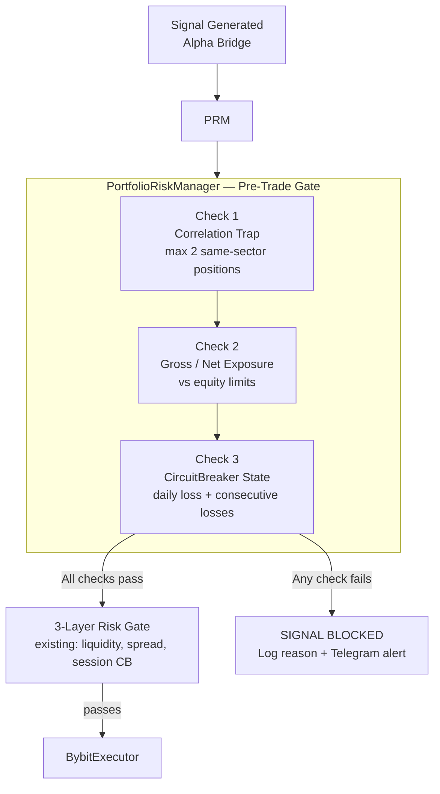

# Portfolio Risk Manager & Circuit Breaker
**Document:** `docs/risk/portfolio_risk_manager.md`  
**Status:** Draft — Phase 6  
**Supersedes:** `docs/plan/potofolio_risk_manager.md` (promoted from plan to authoritative spec)

---

## 1. Overview

The existing **3-Layer Risk Gate** (`app/risk/gates.py`) operates at the *individual signal* level: it checks liquidity, spread health, and the per-session -2% hard stop before any single trade. This is necessary but not sufficient.

The **Portfolio Risk Manager (PRM)** operates at the *portfolio* level. It runs before the existing Risk Gate and adds three additional pre-trade checks:

1. **Correlation Trap Prevention** — prevents concentrated exposure in a single correlated sector
2. **Gross/Net Exposure Limits** — prevents the portfolio from becoming directionally over-leveraged
3. **Circuit Breaker State** — enforces daily loss limits and consecutive loss counts across all trades



> ⚠️ `PortfolioRiskManager` is a **hard gate**. A failed check is not a warning — it is a rejection. The signal is discarded and logged. The bot does NOT enter the trade.

---

## 2. Execution Order (Mandatory)

The call sequence at entry is strictly ordered:

```python
# In executor_task or equivalent — DO NOT reorder

# 1. Portfolio-level gate (NEW)
prm_result = await portfolio_risk_manager.check(signal)
if not prm_result.approved:
    logger.info(f"PRM blocked signal: {prm_result.reason}")
    return

# 2. Existing 3-layer risk gate
gate_result = await risk_gate.check(signal)
if not gate_result.approved:
    return

# 3. Existing sector diversity cap
if sector_cap.at_cap(signal.symbol):
    return

# 4. Execute
await sor.execute(signal)
```

Violating this order (calling `sor.execute()` before `portfolio_risk_manager.check()`) is a **non-negotiable rule** — see `AGENTS.md` §2.

---

## 3. Check 1 — Correlation Trap Prevention

### 3.1 The Problem

Cryptocurrencies are highly correlated during stress events. In a broad market selloff (e.g., BTC drops -10%), L1s, DeFi tokens, and AI tokens typically follow. If the bot opens 4 or 5 simultaneous LONG positions across different altcoin symbols, it is effectively making a single large leveraged bet that "altcoins go up."

**The correlation trap occurs when:** A 3rd (or more) position is opened in the same correlated group, turning three individual trades into one large correlated bet.

### 3.2 Correlated Groups

Correlation groups are derived from `app/data/sector_mapping.py`. The default groupings:

| Group | Symbols | Max Concurrent Positions |
|:---|:---|:---|
| BTC Majors | BTC | Unlimited (anchor, not capped) |
| ETH Majors | ETH | Unlimited (anchor, not capped) |
| Layer 1 Alts | SOL, BNB, ADA, AVAX, DOT, ... | **2** |
| Layer 2 | ARB, OP, MATIC, ... | **2** |
| DeFi | UNI, AAVE, CRV, ... | **2** |
| AI Tokens | FET, AGIX, RNDR, ... | **2** |
| Meme | DOGE, SHIB, PEPE, ... | **2** |
| RWA | ONDO, LINK, ... | **2** |

*Stablecoins are excluded from all groups (no perpetuals traded).*

> The cap of **2** per sector is the maximum. If 2 SOL and 1 AVAX are already open (L1 group = 2 SOL + 1 AVAX = 3), the PRM should have blocked the 3rd entry. If sector_mapping and portfolio tracking are ever inconsistent, fail-safe to BLOCK.

### 3.3 Implementation Logic

```python
async def _check_correlation_trap(self, signal) -> CheckResult:
    """
    Block if opening this position would create a 3rd+ concurrent position
    in the same correlated sector.
    """
    sector = sector_mapping.get_sector(signal.symbol)

    # BTC and ETH majors are anchors — not subject to sector cap
    if sector in ('BTC_MAJOR', 'ETH_MAJOR'):
        return CheckResult(approved=True)

    open_positions = await self.position_store.list_all()
    sector_positions = [
        pos for pos in open_positions
        if sector_mapping.get_sector(pos['symbol']) == sector
    ]

    MAX_SECTOR_POSITIONS = 2   # Reference: SYSTEM_CONSTANTS.md

    if len(sector_positions) >= MAX_SECTOR_POSITIONS:
        return CheckResult(
            approved=False,
            reason=f"Correlation trap: {sector} already has "
                   f"{len(sector_positions)}/{MAX_SECTOR_POSITIONS} positions open."
        )

    return CheckResult(approved=True)
```

> `MAX_SECTOR_POSITIONS = 2` must be defined in `SYSTEM_CONSTANTS.md` and referenced there — do not hardcode the integer inline.

---

## 4. Check 2 — Gross and Net Exposure Limits

### 4.1 Definitions

**Gross Exposure:** The total notional value of *all* open positions (long + short), regardless of direction.

```text
gross_exposure = Σ |position_notional|   for all open positions
              = Σ |quantity × mark_price|
```

**Net Exposure:** The net directional bias of the portfolio.

```text
net_exposure = Σ (long_notional) − Σ (short_notional)
```

A portfolio that is 100% long has `net_exposure = gross_exposure`. A market-neutral portfolio has `net_exposure ≈ 0`.

### 4.2 Limits

| Limit | Proposed Threshold | Variable Name |
|:---|:---|:---|
| Max Gross Exposure | 80% of account equity | `MAX_GROSS_EXPOSURE_PCT` |
| Max Net Exposure | 50% of account equity | `MAX_NET_EXPOSURE_PCT` |

> ⚠️ **These thresholds are PROPOSED and require team ratification before implementation.** They are not yet in `SYSTEM_CONSTANTS.md`. Log them as TODO until confirmed.

### 4.3 Implementation Logic

```python
async def _check_exposure_limits(self, signal, account_equity: Decimal) -> CheckResult:
    """
    Block if adding this position would breach gross or net exposure limits.
    account_equity is fetched from Bybit REST API (not cached — live balance).
    """
    open_positions     = await self.position_store.list_all()
    proposed_notional  = signal.size * signal.price

    current_gross = Decimal('0')
    current_net   = Decimal('0')

    for pos in open_positions:
        mark_price = await self.executor.get_mark_price(pos['symbol'])
        notional   = Decimal(str(pos['quantity'])) * Decimal(str(mark_price))
        current_gross += abs(notional)
        if pos['side'] == 'LONG':
            current_net += notional
        else:
            current_net -= notional

    projected_gross = current_gross + proposed_notional
    projected_net   = current_net + (proposed_notional if signal.side == 'LONG' else -proposed_notional)

    max_gross = account_equity * MAX_GROSS_EXPOSURE_PCT  # from SYSTEM_CONSTANTS
    max_net   = account_equity * MAX_NET_EXPOSURE_PCT    # from SYSTEM_CONSTANTS

    if projected_gross > max_gross:
        return CheckResult(
            approved=False,
            reason=f"Gross exposure limit: projected {projected_gross:.2f} > max {max_gross:.2f}"
        )

    if abs(projected_net) > max_net:
        return CheckResult(
            approved=False,
            reason=f"Net exposure limit: projected |{projected_net:.2f}| > max {max_net:.2f}"
        )

    return CheckResult(approved=True)
```

---

## 5. Check 3 — Circuit Breaker

The Portfolio-level `CircuitBreaker` is **separate from** the existing per-session `-2% hard stop` in `app/risk/circuit_breaker.py`. They operate at different scopes:

| | Existing Hard Stop | New Portfolio CircuitBreaker |
|:---|:---|:---|
| **Scope** | Per-session unrealized + realized PnL | Portfolio daily PnL across all trades |
| **Trigger** | -2% from session equity | -3% from start-of-day equity |
| **Action** | HARD STOP: flatten all, halt bot | HALT new entries, let existing positions be managed |
| **Consecutive losses** | 3 consecutive → 60-min soft stop | 4 consecutive → 60-min new-entry block |
| **Module** | `app/risk/circuit_breaker.py` | `app/risk/portfolio_risk_manager.py` (new) |

> ⚠️ **Issue #11 (OPEN):** The -3% portfolio CB threshold is logically *higher* than the -2% hard stop. This means the hard stop will fire before the portfolio CB can. The intended ordering must be confirmed by the team. See `CONTEXT.md` §7 Issue #11.

> ⚠️ **Issue #10 (OPEN):** The consecutive loss limit of 4 here vs 3 in the existing soft stop must be confirmed. See `CONTEXT.md` §7 Issue #10.

### 5.1 Daily Loss CircuitBreaker

```python
async def _check_daily_loss_circuit_breaker(self, account_equity: Decimal) -> CheckResult:
    """
    Block all new entries if today's portfolio PnL has dropped below the threshold.

    THRESHOLD: -3% of start-of-day equity.
    IMPORTANT: This threshold is PENDING team ratification (CONTEXT.md Issue #11).
    Do not hardcode — reference SYSTEM_CONSTANTS.PORTFOLIO_DAILY_LOSS_LIMIT.
    """
    start_of_day_equity = await self.state.get_start_of_day_equity()
    if start_of_day_equity is None:
        # No baseline set yet — cannot check. Conservative default: allow.
        return CheckResult(approved=True)

    todays_pnl_pct = (account_equity - start_of_day_equity) / start_of_day_equity

    # PORTFOLIO_DAILY_LOSS_LIMIT is negative (e.g., Decimal("-0.03"))
    if todays_pnl_pct <= PORTFOLIO_DAILY_LOSS_LIMIT:  # from SYSTEM_CONSTANTS
        return CheckResult(
            approved=False,
            reason=f"Daily loss CB: today's PnL {todays_pnl_pct:.2%} ≤ limit {PORTFOLIO_DAILY_LOSS_LIMIT:.2%}"
        )

    return CheckResult(approved=True)
```

**Start-of-day equity** is recorded in Redis at UTC 00:00:00 (or on first trade of the day if the bot starts mid-day). It is reset at the next UTC midnight.

### 5.2 Consecutive Loss CircuitBreaker

```python
async def _check_consecutive_loss_circuit_breaker(self) -> CheckResult:
    """
    Block new entries if N consecutive losing trades have been closed.

    THRESHOLD: 4 consecutive losses.
    IMPORTANT: Pending team ratification (CONTEXT.md Issue #10).
    Reference: SYSTEM_CONSTANTS.PORTFOLIO_MAX_CONSECUTIVE_LOSSES
    Block duration: 60 minutes from the Nth loss timestamp.
    """
    recent_trades = await self.trade_store.get_recent_closed_trades(limit=5)
    if not recent_trades:
        return CheckResult(approved=True)

    consecutive_losses = 0
    for trade in recent_trades:  # Most recent first
        if trade['pnl'] < Decimal('0'):
            consecutive_losses += 1
        else:
            break   # Streak broken

    if consecutive_losses >= PORTFOLIO_MAX_CONSECUTIVE_LOSSES:  # from SYSTEM_CONSTANTS
        # Check if the 60-minute cooldown has elapsed since the last loss
        last_loss_time = recent_trades[0]['closed_at']
        elapsed_mins   = (datetime.now(timezone.utc) - last_loss_time).total_seconds() / 60

        if elapsed_mins < 60:
            return CheckResult(
                approved=False,
                reason=f"Consecutive loss CB: {consecutive_losses} losses, "
                       f"cooldown {60 - elapsed_mins:.0f}min remaining"
            )

    return CheckResult(approved=True)
```

### 5.3 Circuit Breaker State in Redis

The PRM writes its CB state to Redis so other components can observe it:

| Redis Key | Type | Writer | Description |
|:---|:---|:---|:---|
| `risk:portfolio_cb:daily_loss_fired` | String (`0`/`1`) | PRM | Set to `1` when daily loss CB fires; reset at UTC midnight |
| `risk:portfolio_cb:consecutive_loss_count` | String (int) | PRM | Current consecutive loss streak |
| `risk:portfolio_cb:blocked_until` | String (ISO timestamp) | PRM | Timestamp until which new entries are blocked (consecutive CB) |
| `risk:portfolio_cb:start_of_day_equity` | String (Decimal) | PRM | Equity at UTC 00:00 for daily PnL calculation |

---

## 6. PRM Result Model

```python
from dataclasses import dataclass
from decimal import Decimal

@dataclass
class CheckResult:
    approved: bool
    reason:   str = ""   # Empty string if approved

@dataclass
class PRMResult:
    approved:            bool
    correlation_result:  CheckResult
    exposure_result:     CheckResult
    circuit_breaker_result: CheckResult

    @property
    def reason(self) -> str:
        """Returns the first failing check's reason, or empty string if approved."""
        for result in [self.correlation_result, self.exposure_result, self.circuit_breaker_result]:
            if not result.approved:
                return result.reason
        return ""
```

---

## 7. Fail-Safe Behavior

If the PRM cannot retrieve the data it needs to make a decision (Redis unavailable, Bybit balance fetch fails, Postgres query fails), the default behavior is **BLOCK (fail-safe, not fail-open)**:

```python
async def check(self, signal) -> PRMResult:
    try:
        account_equity = await self.executor.get_account_equity()
    except Exception as e:
        self.logger.error(f"PRM: Failed to fetch account equity: {e}")
        return PRMResult(
            approved=False,
            correlation_result=CheckResult(True),
            exposure_result=CheckResult(False, "Equity unavailable — blocking (fail-safe)"),
            circuit_breaker_result=CheckResult(True),
        )
    # ... proceed with checks
```

The rationale: when the PRM can't verify portfolio health, the safest action is to not open a new position.

---

## 8. Integration with Existing Risk Infrastructure

### 8.1 What the PRM Does NOT Replace

The PRM is additive. It does not replace or weaken:

- The **Kill Switch** (`/kill_karsa` Telegram command + `/tmp/KILL_KARSA` file) — still the highest priority override
- The **existing Circuit Breaker** in `app/risk/circuit_breaker.py` — the `-2%` hard stop still fires independently
- The **3-Layer Risk Gate** in `app/risk/gates.py` — liquidity, spread, and per-session breaker still checked after PRM passes
- The **Sector Diversity Cap** in `app/risk/sector_cap.py` — the per-sector position cap still applies (distinct from PRM's correlation check)

> Note: The PRM's correlation check and the existing `sector_cap.py` overlap partially. The `sector_cap` cap applies to all position types; the PRM correlation check is specifically scoped to altcoin/correlated groups. During implementation, assess whether `sector_cap.py` can be consolidated into the PRM or whether they serve sufficiently different purposes to remain separate.

### 8.2 What the PRM Adds

| Existing Infrastructure | PRM Addition |
|:---|:---|
| No portfolio-level awareness | Gross/Net exposure limits |
| Sector cap (max 2/sector) | Correlation trap check (with explicit sector group logic) |
| Per-session -2% hard stop | Daily portfolio -3% loss limit (pending ratification) |
| 3-consecutive-loss soft stop | 4-consecutive-loss portfolio CB (pending ratification) |

---

## 9. Prometheus Metrics (New — Phase 6)

> Proposed additions — flag against `docs/METRICS_DICTIONARY.md` before implementing.

| Metric Name | Type | Labels | Description |
|:---|:---|:---|:---|
| `asm_prm_check_total` | Counter | `result` (approved/blocked), `reason` | PRM check outcomes |
| `asm_prm_gross_exposure` | Gauge | — | Current portfolio gross exposure in USDT |
| `asm_prm_net_exposure` | Gauge | — | Current portfolio net directional exposure in USDT |
| `asm_prm_consecutive_losses` | Gauge | — | Current consecutive losing trade count |
| `asm_prm_daily_pnl_pct` | Gauge | — | Today's portfolio PnL as % of start-of-day equity |
| `asm_prm_circuit_breaker_active` | Gauge | `type` (daily_loss/consecutive) | 1 if CB is active, 0 otherwise |

---

## 10. Testing Requirements

Per `docs/TESTING_STRATEGY.md` and `AGENTS.md` §5:

| Test Scenario | Required Assertion |
|:---|:---|
| 2 L1 alts open, 3rd L1 alt signal | PRM blocks the 3rd — `CheckResult.approved == False` |
| 1 L1 alt open, BTC signal | PRM allows — BTC is an anchor, not sector-capped |
| Gross exposure at 79% of equity | PRM allows |
| Gross exposure at 81% of equity after proposed trade | PRM blocks |
| Today's PnL = -3.0% of start-of-day equity | Daily loss CB fires — PRM blocks |
| Today's PnL = -1.5% | CB does not fire — PRM allows |
| 4 consecutive losing trades, 30 min ago | Consecutive CB fires (still in 60-min cooldown) |
| 4 consecutive losing trades, 65 min ago | Consecutive CB cooldown elapsed — PRM allows |
| Redis unavailable during check | PRM fails safe — blocks signal |
| Bybit balance fetch fails | PRM fails safe — blocks signal |
